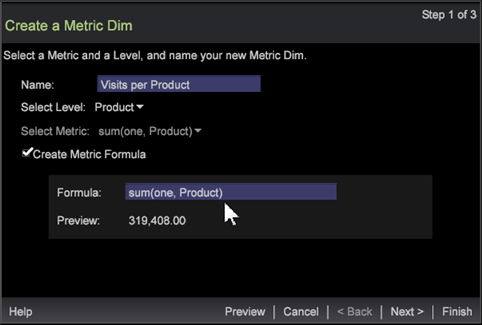

# Metrik-Dim-Assistent{#metric-dim-wizard}

Erstellen Sie Dimensionen, die von Metrikattributen (Metrik-DIS) definiert werden, mit einem Assistenten, der Sie Schritt für Schritt vornimmt. Testen Sie dann das neue Metrikkennzeichen, zeigen Sie es in der Vorschau an und speichern Sie es in Ihrer Dimensionsliste.

Ein Metrik-Dim konvertiert eine Metrik in eine neue Dimension. Beispielsweise zeigt ein Metrik-Dim, der auf einer Metrik aus Seitenansichten und Besucherebene basiert, Dimensionselemente basierend auf der Gesamtanzahl der Seitenansichten für jeden Besucher an. Damit können Sie eine aktuell definierte Metrik, die auf Dimensionselementen basiert, erweitern, um sie als neue Dimension zu erstellen und zu speichern.

## Schritt 1: Dimension und Metrik auswählen {#section-58b6ea7bbba5487ba1a3c264aa3dcb95}

1. Öffnen Sie den Metrik-Dim-Assistenten.

   Klicken Sie in einem Arbeitsbereich mit der rechten Maustaste und wählen Sie &quot; **[UICONTROL-Werkzeuge]** &quot;> &quot; **[UICONTROL-Metrikfilter erstellen&quot;]**.

1. Benennen Sie den Metrikstempel.

   Standardmäßig wird das Feld &quot;Name&quot;basierend auf der Ebene- und Metrikauswahl automatisch gefüllt.

1. Wählen Sie eine Dimensionsebene aus.

   Die Dimensionsebene ist die übergeordnete Dimension, die alle Elementwerte enthält, um die Eingabe zu filtern und einen Dimensionstyp zu definieren.

   Zu den Dimensionsebenen gehören:

   * Clickthrough
   * Treffer
   * Product
   * Besuch
   * Besucher

1. Wählen Sie eine Metrik aus.

   Wählen Sie eine vordefinierte Metrik aus, um sie zu erweitern und als Metrik zu speichern.

   

1. (Optional) Erstellen Sie eine Metrikformel.

   Klicken Sie auf das Feld, um eine benutzerspezifische Metrikformel einzugeben. Der berechnete Wert für die Vorschau wird angezeigt und überprüft den Ausdruck.

   

   Sie können Ihren eigenen [Metrikausdruck](https://docs.adobe.com/content/help/en/data-workbench/using/client/qry-lang-syntx/c-syntx-mtrc-exp.html) hinzufügen oder einen anderen Metrik-Editor oder eine Visualisierung ausschneiden und einfügen. Syntaxfehler, Formelfehler, nicht definierte Filter und andere Fehler werden im Assistenten gemeldet.

1. Klicken Sie auf **[!UICONTROL Next]**.

## Schritt 2: Buckets formatieren und festlegen {#section-5bddf3cd306545d7806a501637f80f77}

1. Wählen Sie ein Format für den neuen Metrikdim.

   

   Das Format definiert, wie die Metrik dargestellt wird, wenn sie in einer Visualisierung geöffnet wird. Diese Formate sind ausgewählte [Printf-Standards](http://www.cplusplus.com/reference/cstdio/printf/), wie nachfolgend definiert:

   ```
   %[flags][width][.precision][length][specifier]
   % 0.2lf = % _ [flags] 0 [width] .2 [.precision] l [length] f[ specifier]
   ```

   Im **[!UICONTROL Preview]** Feld wird ein Wert basierend auf der ausgewählten Metrik und dem ausgewählten Format angezeigt.

1. Bucket-Zählungsausdruck hinzufügen.

   Sie können eine Metrik mit verschiedenen Bereichen oder Behältern definieren. Hiermit werden Untergruppen von Elementen basierend auf der Größe zurückgegeben, z. B. [0-4], [5-10],...). Elemente der Dimensionsebene beziehen sich auf die Elemente, deren Bereich den Wert der Metrik enthält. Siehe Beschreibung des Behälterausdrucks unter [Syntax für Dimensionsausdrücke](https://docs.adobe.com/content/help/en/data-workbench/using/client/qry-lang-syntx/c-syntx-dim-exp.html).

1. Klicken Sie auf , **[!UICONTROL Preview]** um die Tabelle mit den Metrik-Dim-Werten vor dem Speichern zu öffnen.

   

   Die Metrikwerte der Tabellendetails pro Metrik dim.

1. Klicken Sie auf **[!UICONTROL Show in Dimension Menu]** , um die neu erstellte Dimension der Registerkarte &quot; **Dimension** &quot;im **Finder** hinzuzufügen.

1. Klicken Sie auf **[!UICONTROL Next]**.

## Schritt 3: Fertigstellen und Speichern {#section-d9043235b18a425f9de0db668d4b1683}

1. Wählen Sie diese Option, um den Metrik-Dim-Editor, die Diagrammvisualisierung oder die Tabelle nach dem Speichern zu starten.

   | Feld | Beschreibung |
   |---|---|
   | **[!UICONTROL Launch Metric Dim Editor]** | Öffnen Sie den Metrik-Dim-Editor. |
   | **[!UICONTROL Launch Graph]** | Starten Sie eine PNG-Grafik der Tabelle. |
   | **[!UICONTROL Launch Table]** | Starten Sie eine Tabelle im Arbeitsbereich mit Werten in Spalten, die die Werte der neuen Metrik dim im Vergleich zu den Werten der ausgewählten Metrik auflisten. |

1. Klicken **[!UICONTROL Finish]** und speichern.

   Daraufhin wird ein Dialogfeld zum Speichern geöffnet, in dem Sie die Datei speichern können. Die ausgewählten Optionen zum Anzeigen von Werten werden im Arbeitsbereich geöffnet.

