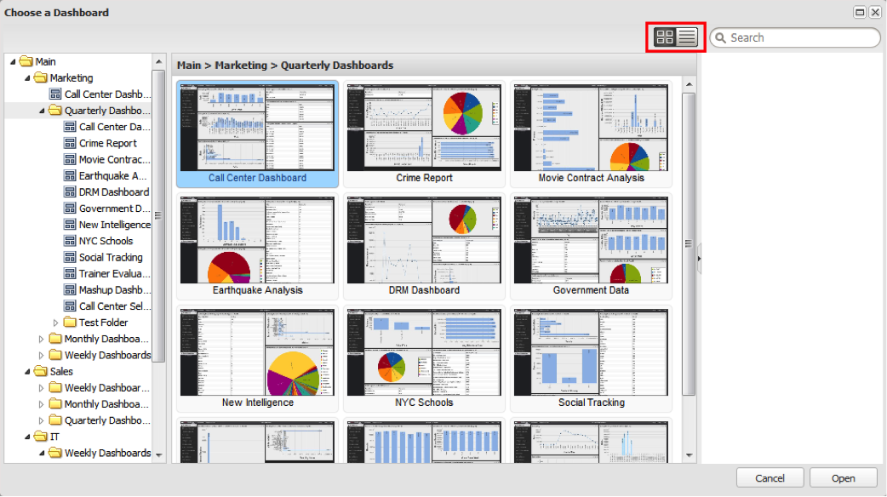

# Dashboard-Browseransichten{#dashboard-browser-views}

Erläutert die Miniaturansicht und die Listenansicht.

Es gibt zwei Ansichten, die für die Navigation in Dashboards im Dashboard-Browser verwendet werden können: die Miniaturansicht und die Listenansicht. Die Miniaturansicht bietet Miniaturansichten von Dashboards während des Durchsuchens, während die Listenansicht eine detailliertere, tabellenbasierte Ansicht der verfügbaren Dashboards darstellt.

## Miniaturansicht {#section-b522ce5e6e184ef9a0e1b9a42f7a9ae0}

Die Miniaturansicht bietet eine Galerie mit Miniaturansichten, die den Dashboards entsprechen, auf die Sie Zugriff haben. Wenn in einer Miniaturansicht ein Standardsymbol angezeigt wird, wenden Sie sich an Ihren Administrator, um eine Miniaturansicht für dieses Dashboard einzurichten. Über die Symbole links neben der Suchleiste können Sie zwischen Miniaturansicht- und Listenansicht wechseln.

In der Miniaturansicht wird im linken Navigationsbereich des Dashboard-Browsers die Ordnerhierarchie angezeigt, die die Speicherung von Dashboards organisiert. Um den Inhalt eines Ordners anzuzeigen, klicken Sie auf den Ordner, um dessen Inhalt als Miniaturansichten im mittleren Bereich des Dashboard-Browsers anzuzeigen. Wenn auf dieser Ordnerebene keine Dashboards gespeichert sind, wird die Meldung &quot;An dieser Stelle befinden sich keine Dashboards&quot;im mittleren Fenster angezeigt.

Sie können auch Unterordner durchsuchen, indem Sie auf den Pfeil links neben dem gewünschten Ordner klicken. Dadurch wird eine Liste mit Unterordnern und Dashboards innerhalb des ausgewählten Ordners erweitert. Wenn Sie einen Ordner auswählen, der mindestens ein Dashboard enthält, zeigt das mittlere Bedienfeld eine Miniaturansicht für jede der Dashboards an, die sich auf der Ebene dieser Auswahl befinden. Der Titel des mittleren Bereichs ändert sich ebenfalls, um den Pfad des ausgewählten Ordners anzugeben.

Sie können dann das gewünschte Dashboard auswählen, indem Sie darauf klicken. Nachdem Sie auf eine Dashboard-Miniaturansicht geklickt haben, werden die Details zum Dashboard im rechten Rahmen angezeigt. Die Dashboard-Details enthalten eine Miniaturansicht des ausgewählten Dashboards, dessen Name, eine kurze Beschreibung, den Inhaber, das Erstellungsdatum, das Datum der letzten Änderung, die Profile, die zum Kompilieren der Daten verwendet werden, Sichtbarkeitssteuerelemente und eine Auswahl von Vorgängen.

## Listenansicht{#section-aa79d51168a7430ea2816413dc6cc73a} erkennen 

Die Listenansicht enthält tabellenbasierte Informationen zu den Dashboards, auf die Sie Zugriff haben. Jede Zeile in der Tabelle der Listenansicht stellt ein eindeutiges Dashboard dar. Durch Klicken auf Spaltenüberschriften können Sie die Tabelle in absteigender oder aufsteigender Reihenfolge nach dieser Spalte sortieren.

Wenn Sie auf einen Dashboard-Eintrag klicken, werden die Details des Dashboards im rechten Bereich des Dashboard-Browsers angezeigt. Um zwischen Ansichten zu wechseln, wählen Sie die gewünschte Ansichtsoption erneut aus.
