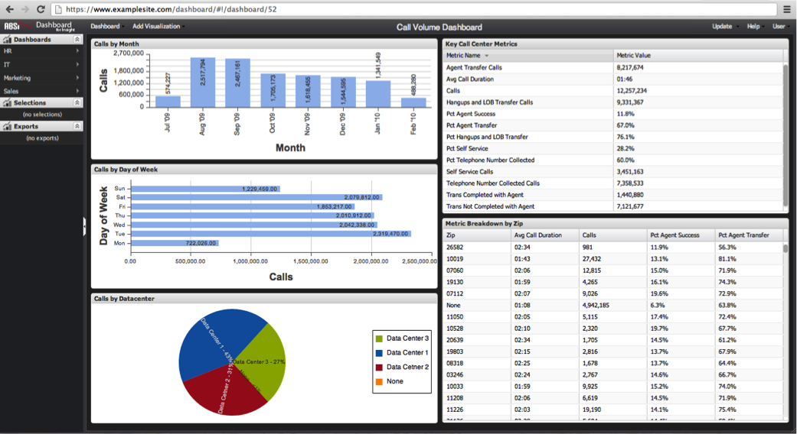

# Dashboard-Hyperlink{#dashboard-hyperlink}

Die dritte Möglichkeit, ein Dashboard zu öffnen, ist der Hyperlink eines Dashboards.

Jedes Dashboard verfügt über einen eindeutigen Hyperlink, über den das Dashboard über die Adressleiste des Browsers geöffnet werden kann. Dashboard-Hyperlinks können auch für Lesezeichen und die Freigabe per E-Mail verwendet werden.

Wenn Sie einen Hyperlink zu einem Dashboard haben, geben Sie ihn einfach in die Adressleiste des Browsers ein und navigieren Sie zum Link. Sie werden zur Dashboard-Site weitergeleitet und aufgefordert, sich anzumelden (falls Sie noch nicht angemeldet sind). Nach der Anmeldung wird das Dashboard in der Benutzeroberfläche geladen.

>[!NOTE]
>
>Sie werden mit einer Meldung aufgefordert, wenn das Dashboard nicht mehr vorhanden ist oder Sie nicht über die erforderlichen Berechtigungen zum Zugriff auf das Dashboard verfügen.

