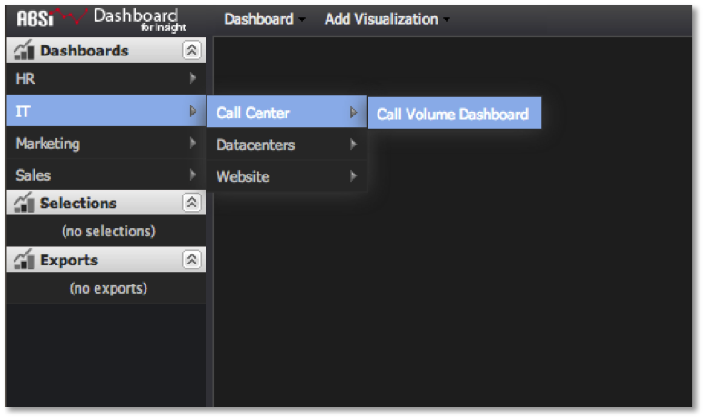

# Menü für Schnellzugriff{#quick-access-menu}

Eine der einfachsten Methoden zum Öffnen eines Dashboards ist die Verwendung des Schnellzugriffsmenüs auf der linken Navigationsleiste der Dashboard-Oberfläche.

Wenn Sie den Cursor über ein Ordnermenü (mit dem Pfeil nach rechts gekennzeichnet) bewegen, wird dessen Inhalt erweitert und Sie können schnell durch die Ordnerhierarchie des Dashboards navigieren, um das gewünschte Dashboard zu finden. Durch Klicken auf den Menüpunkt des Dashboards (gekennzeichnet durch den Dashboard-Titel und keinen Pfeil nach rechts) wird das Dashboard für die Anzeige und Analyse geöffnet.

Diese Methode ist ideal, wenn Sie den Namen und die Position des Dashboards kennen, das Sie öffnen möchten. Wenn Sie sich nicht sicher sind, welchen Namen und/oder Speicherort das Dashboard hat, hilft Ihnen der Dashboard-Browser beim Suchen und Öffnen des Dashboards.

