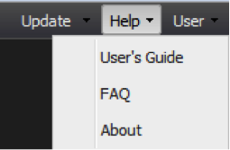

# Hilfemenü{#help-menu}

Über das Dropdown-Menü Hilfe können Sie auf die Produktdokumentation des Dashboards zugreifen

* **[!UICONTROL User’s Guide]** - Durch Auswahl der Option &quot;Benutzerhandbuch&quot;aus dem Dropdown-Menü &quot;Hilfe&quot;gelangen Sie zu einem Weblink, über den Sie jederzeit auf dieses Dokument zugreifen können.
* **[!UICONTROL FAQ]** - Die FAQs bieten Ihnen eine Liste häufig gestellter Fragen und Antworten, die sich speziell auf das Dashboard beziehen. Dieser Abschnitt dient als Kurzanleitung für allgemeine Benutzerprobleme.
* **[!UICONTROL About]** - Der Abschnitt Info enthält Systeminformationen, einschließlich Versionsnummer und Rechtsvereinbarung. Es enthält auch die Zeichenfolge &quot;user-agent&quot;, eine nützliche Information, die Sie bei der Suche nach technischer Unterstützung erhalten können.

## Zusätzliche Unterstützung {#section-c211c01637984e10918fd2367c097b60}

Wenden Sie sich an Ihren Systemadministrator, um weitere Unterstützung bei technischen Problemen oder Problemen mit der Softwareleistung zu erhalten. Um den Abwicklungsprozess zu erleichtern, sollten Sie folgende Informationen bereitstellen:

* Benutzername für Ihr Adobe Data Workbench-Dashboard
* Webbrowser-Typ und -Version
* Name und Version des Betriebssystems
* Versionsnummer des Dashboards
* Ausführliche Erläuterung des Problems, mit dem Sie konfrontiert sind
* Screenshots der Ausgabe (sofern möglich)
