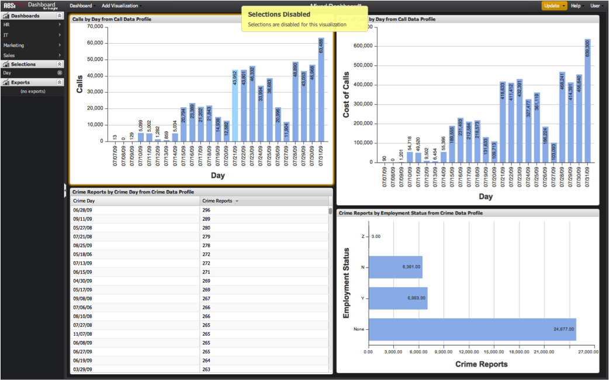

# Profilübergreifende Auswahlen{#cross-profile-selections}

Sie können Daten aus mehreren Profilen in einem Dashboard visualisieren.

In einigen Fällen kann eine Auswahl aus einer Visualisierung auch auf Visualisierungen aus einem anderen Profil angewendet werden. Wenn Sie z. B. Visualisierungen aus einem **[!UICONTROL Call Center]**Profil und einem **[!UICONTROL Website Traffic]**-Profil auf einem Dashboard erstellen, können Sie einen Monat für die Zielgruppe auswählen, damit die Daten in allen Visualisierungen gleichzeitig in diesem Monat segmentiert werden, obwohl es sich dabei um komplett verschiedene Datensätze handelt.

Wenn Visualisierungen aus mehreren Profilen in einem Dashboard vorhanden sind, können Sie eine Visualisierung auswählen, wenn die Dimension dieser Visualisierung auch auf allen anderen Profilen auf dem Bildschirm vorhanden ist. Die Auswahl wird jedoch deaktiviert, wenn eine Dimension nicht global in allen anderen Visualisierungen auf dem Bildschirm gefunden wird und die Benutzer eine **[!UICONTROL Selections Disabled]**-Meldung sehen.

>[!NOTE]
>
>Auch wenn Dimensionen denselben Namen für mehrere Profil verwenden können, haben sie möglicherweise nicht dieselbe Bedeutung. Es ist wichtig, jede Dimension zu untersuchen, um festzustellen, ob sie für die Auswahl über mehrere Profil hinweg geeignet ist.
