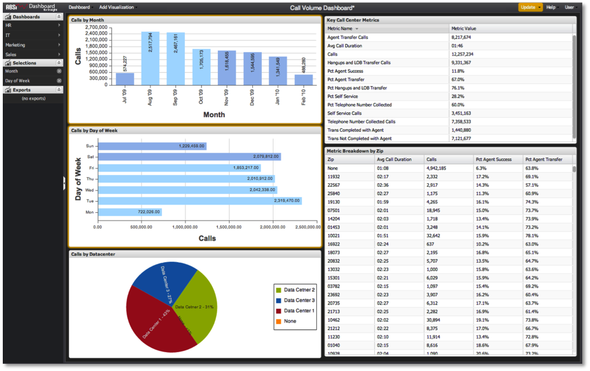

# Auswahl innerhalb des Dashboards{#making-selections-within-the-dashboard}

{{eol}}

Daten innerhalb eines Dashboards können einfach durch die Verwendung von Auswahlen segmentiert und untersucht werden.

Auswahlen werden durch Klicken auf bestimmte Elemente in Visualisierungen durchgeführt, um zu ermitteln, wie die Daten im Dashboard segmentiert werden sollen. Wenn Sie eine Auswahl in einer Visualisierung treffen, werden die Daten in den anderen Visualisierungen im Dashboard segmentiert. Eine beliebige Anzahl von Auswahlmöglichkeiten kann jederzeit getroffen, angepasst oder entfernt werden. Dadurch wird der Benutzer dazu ermutigt, mit den Daten zu interagieren, um analytische Informationen abzuleiten.

Beim Speichern eines Dashboards wird der Status aller Auswahlen beim Speichern beibehalten. Ebenso werden beim Laden eines Dashboards alle Auswahlen, die während des Speichervorgangs beibehalten wurden, beim Laden des Dashboards wirksam.

Sie können eine Auswahl treffen, indem Sie in einer der Visualisierungen eines Dashboards auf ein oder mehrere Datenelemente klicken. Datenelemente werden durch Balken in Balkendiagrammen, Spalten in Spaltendiagrammen, Zeilen in einer Tabelle usw. dargestellt. Auswahlen werden hervorgehoben, während sie vorgenommen werden. Durch die Auswahl innerhalb einer Visualisierung erhalten die Visualisierung einen orangefarbenen Rahmen. Die genaue Methode zum Erstellen von Auswahlen hängt von der verwendeten Visualisierung ab.

Für jede Auswahl, die über eine Visualisierung vorgenommen wurde, wird auch ein Eintrag im Menü &quot;Auswahlen&quot;angezeigt. Dieser Eintrag wird unter Verwendung des ausgewählten Dimensionsnamens aufgelistet, wobei pro Visualisierung ein Eintrag für eine Auswahl angezeigt wird.

>[!NOTE]
>
>Visualisierte Daten werden nicht automatisch bei jeder Auswahl aktualisiert. Nachdem Sie die gewünschte Auswahl getroffen haben, müssen Sie stattdessen eine Aktualisierung starten, um die Daten zu segmentieren und Ihre Visualisierungen zu aktualisieren.
