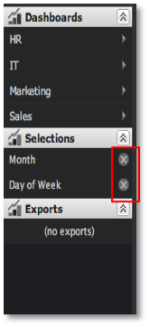

# Entfernen von Auswahlen{#removing-selections}

Auswahlmöglichkeiten können jederzeit entfernt werden.

Klicken Sie einfach auf das Symbol **[!UICONTROL X]** innerhalb des entsprechenden Auswahlelements im Menü Auswahlen .

Wenn die Auswahl einer Visualisierung gesperrt ist, wird ein kleines Vorhängeschlosssymbol angezeigt, das das **[!UICONTROL X]** -Symbol ersetzt. Gesperrte Auswahlen können nicht entfernt werden, ohne die Visualisierung zuerst zu entsperren.

