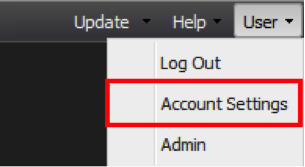

# Verwaltung von Benutzerkonten{#user-account-management}

Informationen zum Zugriff auf Ihre Kontoeinstellungen und zum Ändern Ihres Kennworts.

## Zugriff auf Ihre Kontoinformationen {#section-7c39e79d8d6445059c9a6237e140bc6a}

Um auf Ihre Kontoinformationen zuzugreifen, wählen Sie im Menü &quot;Benutzer&quot;die Option &quot;Kontoeinstellungen&quot;.

Daraufhin wird ein Fenster mit Details zu Ihren Kontoinformationen angezeigt. Dazu gehören Ihr Benutzername, Ihre E-Mail-Adresse, Ihre Gruppenmitgliedschaft und die für Sie verfügbaren Profile. Um sicherzustellen, dass Ihr Profil korrekt konfiguriert wurde und Sie Zugriff auf alle Ihre Daten-Profil haben, können Sie die Profil überprüfen, die im Abschnitt &quot;Zugriff gewährt zu&quot;aufgeführt sind. Wenn Ihnen Profile fehlen, wenden Sie sich an Ihren Administrator.

## Ändern des Kennworts {#section-4ba1ee3d5d584455a1a77e992b7b876c}

Um Ihr Passwort zu ändern, rufen Sie zunächst Ihre Kontoinformationen auf. Um auf Ihre Kontoinformationen zuzugreifen, wählen Sie **[!UICONTROL Account Settings]** aus dem Menü **[!UICONTROL User]**. Klicken Sie auf **[!UICONTROL Change Password]**.
