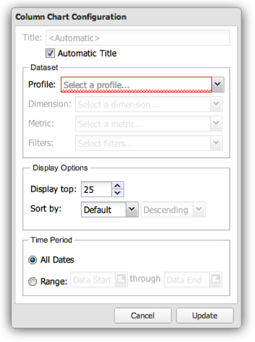

# Konfigurieren von Visualisierungen{#configuring-visualizations}

Zeigt an, wie Sie Titel, Profil, Dimension, Metrik, Filter, Anzeige oben, Sortieren nach und Zeitraum konfigurieren.

Jede Visualisierung auf der Dashboard-Arbeitsfläche verfügt über eine eigene Konfiguration. Wenn eine Visualisierung zum ersten Mal zur Dashboard-Arbeitsfläche hinzugefügt wird, wird ihr Konfigurationsfenster automatisch angezeigt. Nach der Konfiguration kann die Visualisierung jederzeit geändert werden, indem Sie auf das Zahnradsymbol oben rechts im Visualisierungsfenster klicken.

>[!NOTE]
>
>Die Konfigurationsoptionen variieren je nach Typ der angezeigten Visualisierung geringfügig.

## Visualisierungstitel {#section-0414844283d745ae912e85f8ea14a51d}

In diesem Feld können Sie den Titel anpassen, der oben in der Visualisierung angezeigt wird. Standardmäßig ist der Titel auf **[!UICONTROL Automatic Title]** gesetzt, wodurch automatisch ein Titel für das Visualisierungsfenster generiert wird. Durch Deaktivieren der Schaltfläche **[!UICONTROL Automatic Title]** können Sie einen beliebigen Titel in dieses Feld einfügen. (Dieses Feld gilt für alle Visualisierungen.)

## Profil {#section-16eb0def0a2d4eb289f5bb9200d14754}

In diesem Feld können Sie auswählen, aus welchem Profil Sie Daten visualisieren möchten. Wenn Sie auf das Dropdown-Menü klicken, erhalten Sie eine Liste der Profile, auf die Sie Zugriff haben. (Dieses Feld gilt nicht für Rich-Text-Visualisierungen.)

Profile sind in Data Workbench definierte Datensätze, die Daten über eine bestimmte Domäne sowie Dimensionen, Metriken und Filter enthalten, die die Daten begleiten. Ein Profil wird oft für einen bestimmten Zweck entwickelt (z. B. für Marketing- oder Website-Traffic).

>[!NOTE]
>
>Es werden nur die Profile angezeigt, für die Ihnen Zugriff gewährt wurde. Weitere Informationen finden Sie unter Zugangssteuerung.

## Dimension {#section-4ebb8c4308a146c3a35c7ac7ab6b579f}

Ermöglicht die Auswahl der Dimension, die Sie visualisieren möchten. Die Liste wird aus der Liste der Dimensionen gefüllt, die für das im Feld Profil ausgewählte Profil verfügbar sind. Klicken Sie auf die gewünschte Dimension und dann auf die Schaltfläche Auswählen . (Dieses Feld gilt nicht für Metrik-Legenden und Rich-Text-Visualisierungen.)

Dimensionen sind Kategorien von ähnlichen Datentypen. Die Dimension Wochentage besteht beispielsweise aus den folgenden Datenelementen: Sonntag, Montag, Dienstag, Mittwoch, Donnerstag, Freitag und Samstag. Dimensionen zeigen, was gemessen wird.

## Metrik(en) {#section-7d46f2f1b9fe4e539b5eb0a0dc6e5ad3}

Hier können Sie die zu visualisierenden Metriken auswählen. Metriken sind quantitative Objekte und werden durch einen quantifizierbaren Ausdruck definiert. Beispielsweise werden Seitenansichten pro Sitzung vom Ausdruck der Anzahl der Seitenansichten dividiert durch die Anzahl der Sitzungen abgeleitet. Metriken beantworten die Frage &quot;Wie viele?&quot;

Einzelmetrik-Visualisierungen verfügen über ein einzelnes Metrikauswahlfenster:

Visualisierungen mit mehreren Metriken verfügen über ein Fenster zur Auswahl mehrerer Metriken:

Die Liste wird aus der Liste der Metriken gefüllt, die aus dem im Feld Profil ausgewählten Profil verfügbar sind.

Klicken Sie auf die gewünschten Metriken und dann auf **[!UICONTROL Select]**. (Dieses Feld gilt nicht für Rich-Text-Visualisierungen.)

## Filter {#section-f8619ae2f8e54735a2c1b0fbb8bb1281}

Wählen Sie die Filter aus, die Sie auf Ihre Visualisierung anwenden möchten. Im Fenster der Filterauswahl können Sie mehrere Filter aus der Filterliste auswählen. Die Liste wird aus der Liste der Filter gefüllt, die für das im Feld Profil ausgewählte Profil verfügbar sind. Klicken Sie auf den gewünschten Filter und dann auf **[!UICONTROL Select]**.

>[!NOTE]
>
>Hier angewendete Filter werden nur auf die entsprechende Visualisierung angewendet, nicht auf das gesamte Dashboard. Dies ist nützlich für den Vergleich der Ergebnisse zweier verschiedener Visualisierungen mit verschiedenen angewendeten Filtern.

## Display Tops {#section-7ce71cb0fa6446998b710b427e68b133}

Visualisierungen im Dashboard dienen nicht zur Anzeige der Gesamtheit der Daten. Vielmehr können Sie damit die Anzahl der Dimensionselemente festlegen, die in der Visualisierung angezeigt werden sollen. Dadurch wird die höchste Anzahl von Dimensionen abhängig vom unten angegebenen Sortierwert angezeigt. (Dieses Feld gilt nicht für Tabellen, Metriklegenden und Rich-Text-Visualisierungen.)

## Ordnen nach {#section-f686249e20444359bff87c00cc2ba29f}

Auf diese Weise können Sie festlegen, wie die Daten sortiert werden sollen, wenn sie in der Visualisierung angezeigt werden. (Dieses Feld gilt nicht für Tabellen, Metriklegenden und Rich-Text-Visualisierungen.) Es gibt mehrere Sortieroptionen:

* **[!UICONTROL Default]** - Gibt die nicht sortierten Daten basierend auf der in Data Workbench gespeicherten Sortierreihenfolge zurück. Dies ist die Option, die für zeitbasierte Daten wie Stunde, Tag, Woche oder Monat verwendet werden kann.
* **[!UICONTROL Dimension]** -Sortieren Sie die Daten nach dem alphanumerischen Dimensionswert.
* **[!UICONTROL Metric]** - Sortieren Sie die Daten basierend auf dem Metrikwert und eignen sich gut für die schnelle Visualisierung der Top-Dimensionen.
* **[!UICONTROL Descending]** - Sortieren Sie die Daten in absteigender Reihenfolge.
* **[!UICONTROL Ascending]** - Sortieren Sie die Daten in aufsteigender Reihenfolge.

## Zeitraum {#section-6220368e9e524b46ac735add6ab9edb0}

Mit dieser Visualisierung können Sie das gewünschte Start- und/oder Enddatum der Daten festlegen, die in der Visualisierung angezeigt werden sollen.

Durch Auswahl von **[!UICONTROL All Dates]**wird der gesamte im Profil verfügbare Datumsbereich angezeigt.

Wenn Sie **[!UICONTROL Range]** auswählen, werden nur die Daten angezeigt, die innerhalb eines bestimmten Bereichs liegen. Zur Eingabe des Datumsbereichs können Sie das Start- und/oder Enddatum eingeben oder eine Kalendereingabe verwenden, indem Sie das Kalendersymbol auswählen.

(Dieses Feld gilt nicht für Rich-Text-Visualisierungen.)

>[!NOTE]
>
>Hier angewendete Datumsbereiche werden nur auf die entsprechende Visualisierung angewendet, nicht auf das gesamte Dashboard. Dies ist nützlich für den Vergleich der Ergebnisse zweier verschiedener Visualisierungen mit verschiedenen angewendeten Datumsbereichen.

