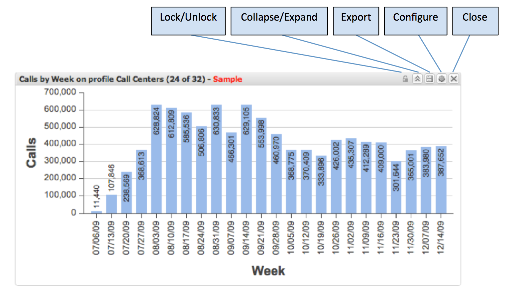

# Bearbeiten von Visualisierungen{#manipulating-visualizations}

Im Tool-Menü der Visualisierung können Sie bestimmte Vorgänge für die Visualisierung schnell durchführen. Wenn Sie den Cursor über eines der Symbole im Visualisierungs-Tool-Menü platzieren, erhalten Sie eine Erläuterung der Funktion dieses Symbols.

