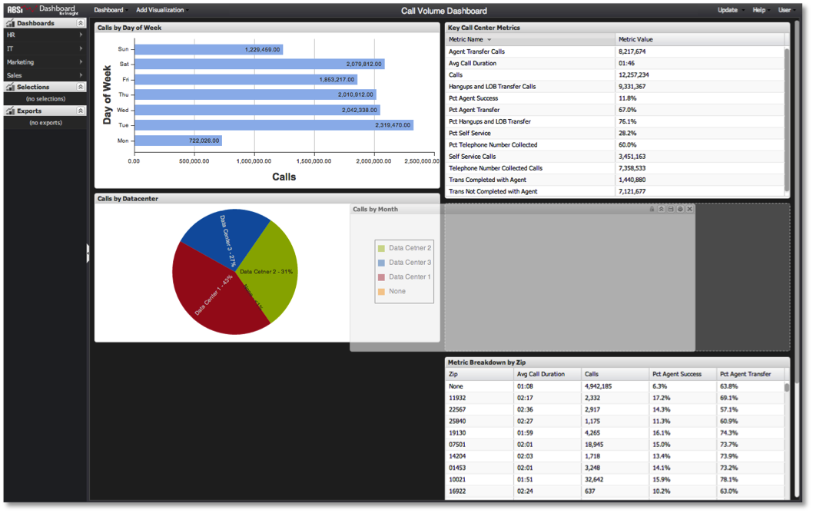

# Verschieben von Visualisierungen{#moving-visualizations}

Visualisierungen können einfach innerhalb der Dashboard-Arbeitsfläche verschoben und neu angeordnet werden.

Um eine Visualisierung zu verschieben, klicken Sie einfach auf die Titelleiste der Visualisierung, ziehen Sie die Visualisierung und legen Sie sie an einer anderen Stelle auf der Dashboard-Arbeitsfläche ab. Die Dashboard-Arbeitsfläche hilft bei der Positionierung der Visualisierung, indem Platz für sie am gewünschten Ort geschaffen wird. Bestehende Visualisierungen werden automatisch nach oben oder unten verschoben, um Platz für die Verschiebung der Visualisierung zu schaffen, um Überschneidungen zu vermeiden.

