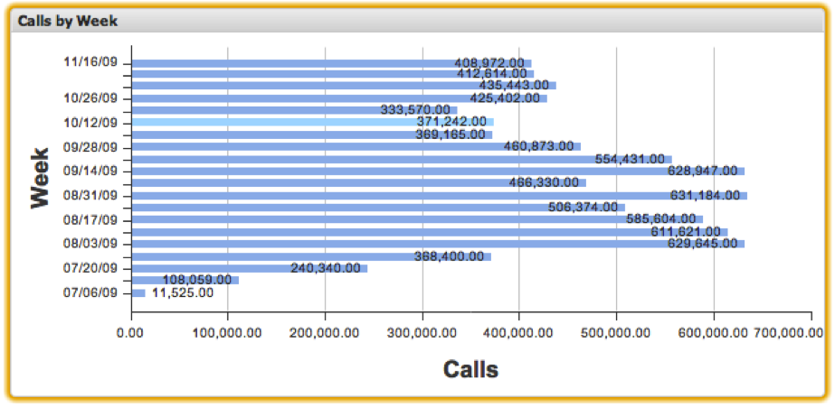

# Balkendiagramme{#bar-charts}

Mit Balkendiagrammvisualisierungen können Sie Metrik- und Dimensionsdaten visualisieren, wobei jedes Datenelement als horizontaler Balken im Diagramm dargestellt wird. Balkendiagramme ermöglichen die gleichzeitige Anzeige von bis zu 200 eindeutigen Datenelementen im Diagramm. Die Dimensionswerte werden entlang der Y-Achse beschriftet, während die Metrikinkremente entlang der X-Achse beschriftet werden. Die Leiste für jeden Dimensionswert wird mit seinem exakten Metrikwert beschriftet.

