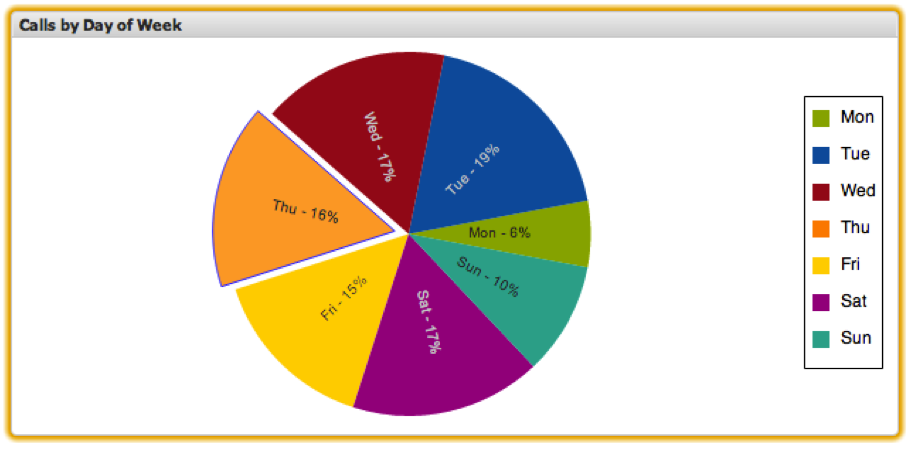

# Tortendiagramm{#pie-chart}

{{eol}}

Mit Kreisdiagrammvisualisierungen können Sie relative Prozentwerte der Metrikwerte für eine begrenzte Anzahl von Dimensionen anzeigen. Ein Tortendiagramm ermöglicht die gleichzeitige Anzeige von bis zu 20 eindeutigen Datenelementen. Jeder Keil des Kuchens stellt eine Dimension im Datensatz zusammen mit seinem Prozentsatz dar. Jeder Prozentsatz wird relativ zu den Metrikwerten der anderen im Tortendiagramm angezeigten Dimensionen berechnet, was möglicherweise nicht unbedingt der gesamte Datensatz ist.

Sie können die Auswahl in Tortendiagrammen vornehmen, indem Sie auf einen bestimmten Keil klicken.

