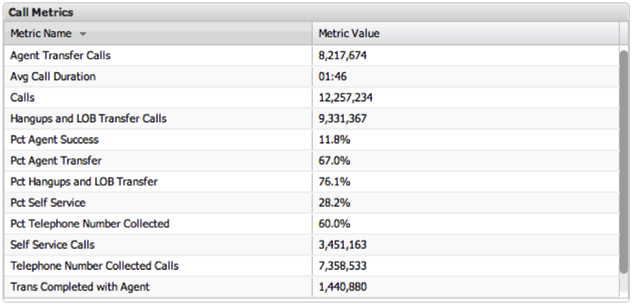

# Metriklegenden{#metric-legends}

Mit Visualisierungen der Metriklegende können Sie Metriksummen in einem tabellarischen Format anzeigen. Die erste Spalte enthält den Metriknamen, während die zweite Spalte den Metrikwert enthält. Eine Bildlaufleiste wird angezeigt, wenn nicht alle Zeilen gleichzeitig im Fenster angezeigt werden können.

In der Metriklegende können keine Auswahlen vorgenommen werden, da kein bestimmter Dimensionswert angezeigt wird.

