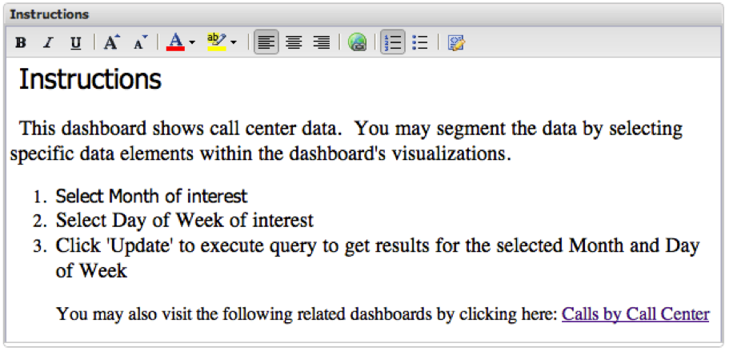

# Rich-Text{#rich-text}

Mit der Rich-Text-Visualisierung können Sie textbasierte Informationen in das Dashboard einbetten. Dies ist hilfreich, um Beschreibungen, Hyperlinks oder Informationen zu Anweisungen bereitzustellen. In der Symbolleiste zur Textformatierung am oberen Rand des Rich-Text-Fensters können Sie das Textformat im Textkörper des Fensters ändern.

Um dem Rich-Text-Fenster Text hinzuzufügen, platzieren Sie den Cursor in den Textkörper des Rich-Text-Fensters und beginnen Sie mit der Eingabe. Um Text im Rich-Text-Fenster zu bearbeiten, verwenden Sie die Symbolleiste zur Textformatierung oben in diesem Fenster.
