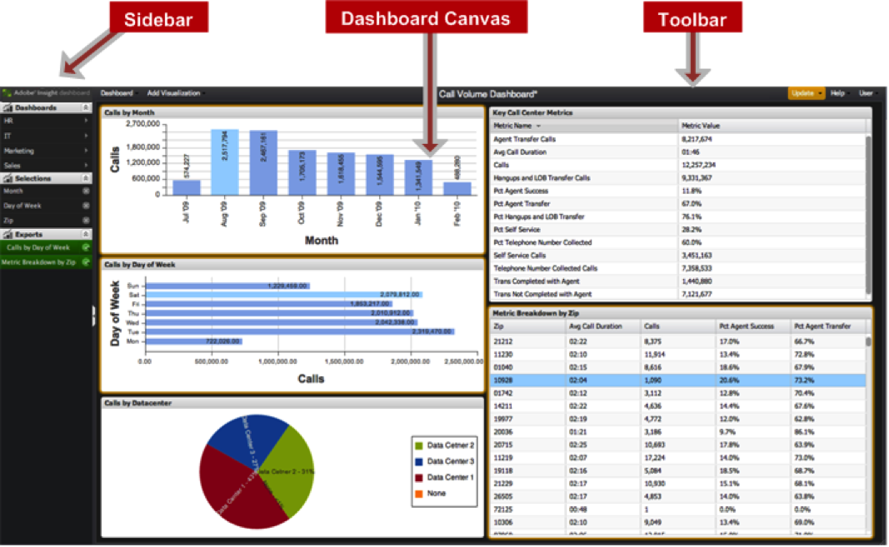

# Dashboard-Benutzeroberfläche{#dashboard-user-interface}

Das Data Workbench-Dashboard enthält eine Seitenleiste und eine Symbolleiste mit Funktionsmenüs und eine Dashboard-Arbeitsfläche, auf der Sie Datenvisualisierungen anzeigen können.

## Dashboard-Arbeitsfläche {#section-39c9352f5e8d407e8d76c7f2e6267b3d}

Die Dashboard-Arbeitsfläche ist der Bereich der Oberfläche, der zum Erstellen und Interagieren mit Visualisierungen verwendet wird.

| Begriff | Definition |
|---|---|
| Visualisierungen | Gerenderte Daten, die grafisch basierend auf einem Satz konfigurierter Kriterien definiert wurden. Mehrere Visualisierungen bilden ein Dashboard. |

## Seitenleiste {#section-12e155c782e74851b0dbaa00c40deb8c}

Die linke Seitenleiste bietet schnellen Zugriff und eine schnelle Sichtbarkeit für definierte Menüs:

| Menü | Definition |
|---|---|
| Schnellzugriffsmenü | Ein Flyout-Menü zum schnellen Öffnen von Dashboards. |
| Auswahlmenü | Listet alle aktuellen Auswahlen innerhalb des Dashboards auf, wobei zusätzliche Details bereitgestellt werden und die Möglichkeit besteht, Auswahlen jederzeit zu entfernen. |
| Menü &quot;Exportieren&quot; | Listet alle ausstehenden oder abgeschlossenen Exporte auf und ermöglicht so das Abrufen des Exports nach Abschluss. |

## Symbolleiste {#section-f1c7d5b7fb37473f93cc533a7376c167}

Die obere Symbolleiste bietet Zugriff auf diese spezifischen Menüs. Außerdem wird der Titel des derzeit geöffneten Dashboards angezeigt.

| Menü | Definition |
|---|---|
| Dashboard-Menü | Ein Dropdownmenü zum Öffnen, Erstellen, Speichern und Exportieren von Dashboards. |
| Menü &quot;Visualisierung hinzufügen&quot; | Ein Dropdown-Menü zum Hinzufügen von Visualisierungen zum Dashboard. |
| Dashboard-Titel | Zeigt den Titel des aktuellen Dashboards an. |
| Aktualisierungsmenü | Durch Klicken auf den **[!UICONTROL Update]** Indikator wird das aktuelle Dashboard aktualisiert, wobei alle neuen Auswahlen und/oder Konfigurationsänderungen berücksichtigt werden. Das Menü bietet die Möglichkeit, den **[!UICONTROL Query-to]** Parameter anzupassen, sowie einige erweiterte Funktionen für Administratoren. |
| Hilfe-Menü | Über dieses Dropdownmenü können Sie auf den Abschnitt &quot;Benutzerhandbuch&quot;, &quot;FAQ&quot;und &quot;Info&quot;der Anwendung zugreifen. |
| Benutzermenü | Ein Dropdown-Menü zum Abmelden, zum Zugriff auf Kontoeinstellungen und zum Zugriff auf den Verwaltungsbereich (nur für Administratoren). |

