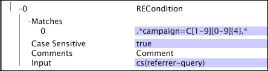

# Prüfbedingungen{#test-operation-conditions}

Informationen zu Testbedingungen, einschließlich Vergleichen, nicht leer, Bereich, regulärer Ausdruck und Zeichenfolgenübereinstimmung.

* [Vergleichen](../../../../home/c-dataset-const-proc/c-conditions/c-test-ops/c-test-op-con.md#section-fb2bdb3838504099b324b9838cdeeaac)
* [Nicht leer](../../../../home/c-dataset-const-proc/c-conditions/c-test-ops/c-test-op-con.md#section-1decb9d887894073a1b6b3d985729ac8)
* [Bereich](../../../../home/c-dataset-const-proc/c-conditions/c-test-ops/c-test-op-con.md#section-1db31583bb09418b8f49481a897b08a6)
* [Regulärer Ausdruck](../../../../home/c-dataset-const-proc/c-conditions/c-test-ops/c-test-op-con.md#section-ae9c016502cb44128760c58f2d2d5297)
* [Zeichenfolgenübereinstimmung](../../../../home/c-dataset-const-proc/c-conditions/c-test-ops/c-test-op-con.md#section-f8d132085c6b4500bfbe4515b848142f)

## Vergleichen {#section-fb2bdb3838504099b324b9838cdeeaac}

Die [!DNL Compare] Bedingung vergleicht Zeichenfolgen oder numerische Werte. Beim Vergleich von Zeichenfolgenwerten können Sie angeben, ob die Groß-/Kleinschreibung beachtet werden soll.

Die Parameter der [!DNL Compare] Bedingung sind in der folgenden Tabelle beschrieben:

<table id="table_05B1FBB2AED242D99081E62BE2FBEC60"> 
 <thead> 
  <tr> 
   <th colname="col1" class="entry"> Parameter </th> 
   <th colname="col2" class="entry"> Beschreibung </th> 
   <th colname="col3" class="entry"> Standardeinstellung </th> 
  </tr> 
 </thead>
 <tbody> 
  <tr> 
   <td colname="col1"> Groß-/Kleinschreibung </td> 
   <td colname="col2">True oder false. Wird nur verwendet, wenn der Typ  LEXISCHist. Bei der Einstellung "false"werden Groß- und Kleinbuchstaben als gleich betrachtet. </td> 
   <td colname="col3"> true (wahr) </td> 
  </tr> 
  <tr> 
   <td colname="col1"> Kommentare </td> 
   <td colname="col2"> Optional. Hinweise zur Bedingung. </td> 
   <td colname="col3"> Kommentare </td> 
  </tr> 
  <tr> 
   <td colname="col1"> Eingabe A </td> 
   <td colname="col2"> Der erste der beiden zu vergleichenden Werte. Dieser Wert stellt den linken Operanden in der Bedingung dar. </td> 
   <td colname="col3"> </td> 
  </tr> 
  <tr> 
   <td colname="col1"> Eingabe B </td> 
   <td colname="col2"> Der zweite der beiden zu vergleichenden Werte. Dieser Wert stellt den richtigen Operanden in der Bedingung dar. </td> 
   <td colname="col3"> </td> 
  </tr> 
  <tr> 
   <td colname="col1"> Vorgang </td> 
   <td colname="col2"> 
Der Vergleichsvorgang. Die verfügbaren Operationen (und ihre Bedeutung) lauten wie folgt: 
     <ul id="ul_74F3C298E9CC4FE89897BA0052A9EB9F"> 
      <li id="li_1605FA73474E404A84056D40E7082623"> = oder == (Eingabe A = Eingabe B) </li> 
      <li id="li_F694A262ED7A4787B2A68B877339620C"> &lt;&gt; oder != (Eingabe A ist nicht gleich Eingabe B) </li> 
      <li id="li_1A75437E23B64BEB92297E1C771092B0"> &lt; (Eingabe A ist kleiner als Eingabe B) </li> 
      <li id="li_B80ED6BE9DEA41FE84BC6BA3B7759276"> &lt;= (Eingabe A ist kleiner oder gleich Eingabe B) </li> 
      <li id="li_93148F34065F489E8E198DFB9F9F0E70"> &gt; (Eingabe A ist größer als Eingabe B) </li> 
      <li id="li_8A98EE9AED2445429805169040BB253D"> &gt;= (Eingabe A ist größer oder gleich Eingabe B) </li> 
     </ul> 
 </td> 
   <td colname="col3"> = </td> 
  </tr> 
  <tr> 
   <td colname="col1"> Typ </td> 
   <td colname="col2">Die Art des vorzunehmenden Vergleichs. Verfügbare Typen sind  LEXISCH,  NUMERISCHund  DATETIME. Beschreibungen der Typen finden Sie unter <a href="../../../../home/c-dataset-const-proc/c-conditions/c-test-ops/c-test-types.md#concept-a9fca97a2f03464cb0cbab8b5f809d0a"> Testtypen für Testvorgänge</a>. </td> 
   <td colname="col3">  LEXISCH </td> 
  </tr> 
 </tbody> 
</table>

In diesem Beispiel wird eine [!DNL Compare] Bedingung verwendet, um die Variable zu definieren [!DNL Log Entry Condition]. Während der Data Workbench-Server jeden Ereignisdatensatz liest, werden die numerischen Werte x-age und 55 verglichen. Wenn x-age bei einem gegebenen Protokolleintrag kleiner als oder gleich 55 ist, wird der Protokolleintrag in den Dataset-Aufbau einbezogen.

## Nicht leer {#section-1decb9d887894073a1b6b3d985729ac8}

Die [!DNL Not Empty] Bedingung prüft, ob ein Feld einen Wert enthält oder leer ist. Die Bedingung ist für jeden Protokolleintrag erfüllt, dessen Wert für das [!DNL Input] Feld nicht leer ist.

Die Parameter der [!DNL Not Empty] Bedingung sind in der folgenden Tabelle beschrieben:

| Parameter | Beschreibung | Standardeinstellung |
|---|---|---|
| Kommentare | Optional. Hinweise zur Bedingung. | Kommentare |
| Eingabe | Der Name des Felds im Protokolleintrag, das auf Inhalt überprüft werden soll. |  |

In diesem Beispiel wird als Eingabe ein x-beliebiges Feld verwendet und geprüft, ob das Feld nicht leer ist. Die Bedingung ist erfüllt, wenn das Feld ausgefüllt wird.

## Bereich {#section-1db31583bb09418b8f49481a897b08a6}

Die [!DNL Range] Bedingung nimmt ein Eingabefeld und bestimmt, ob der Wert dieses Felds, einschließlich, innerhalb der angegebenen minimalen (Min) und maximalen (Max) Parameterwerte fällt.

Die Parameter der [!DNL Range] Bedingung sind in der folgenden Tabelle beschrieben:

<table id="table_1587D8D333804FC28024C0DFC2F2D4D3"> 
 <thead> 
  <tr> 
   <th colname="col1" class="entry"> Parameter </th> 
   <th colname="col2" class="entry"> Beschreibung </th> 
   <th colname="col3" class="entry"> Standardeinstellung </th> 
  </tr> 
 </thead>
 <tbody> 
  <tr> 
   <td colname="col1"> Groß-/Kleinschreibung </td> 
   <td colname="col2">True oder false. Wird nur verwendet, wenn der  Typ  LEXISCHist. Bei der Einstellung "false"werden Groß- und Kleinbuchstaben als gleich betrachtet. </td> 
   <td colname="col3"> true (wahr) </td> 
  </tr> 
  <tr> 
   <td colname="col1"> Kommentare </td> 
   <td colname="col2"> Optional. Hinweise zur Bedingung. </td> 
   <td colname="col3"> Kommentare </td> 
  </tr> 
  <tr> 
   <td colname="col1"> Eingabe </td> 
   <td colname="col2"> Der Name des Felds im Protokolleintrag, der als Eingabe verwendet werden soll. </td> 
   <td colname="col3"> </td> 
  </tr> 
  <tr> 
   <td colname="col1"> Min </td> 
   <td colname="col2"> 
Untere Grenze des Bereichs. 
 
 Der Wert dieses Parameters muss ein Literalwert oder eine Zeichenfolge sein - kein Feldname. Wenn Sie ein Datum für dieses Feld verwenden, müssen Sie eine Zeitzone angeben. Eine Liste der unterstützten Zeitzonenabkürzungen finden Sie unter <a href="../../../../home/c-dataset-const-proc/c-time-zone.md#concept-9b540ec3e770490d94e9d5a985765477"> Zeitzonencodes</a>. 
 </td> 
   <td colname="col3"> </td> 
  </tr> 
  <tr> 
   <td colname="col1"> Max. </td> 
   <td colname="col2"> 
Obere Grenze des Bereichs. 
 
 
Hinweis: Der Wert dieses Parameters muss ein Literalwert oder eine Zeichenfolge sein - kein Feldname. Wenn Sie ein Datum für dieses Feld verwenden, müssen Sie eine Zeitzone angeben. Eine Liste der unterstützten Zeitzonenabkürzungen finden Sie unter <a href="../../../../home/c-dataset-const-proc/c-time-zone.md#concept-9b540ec3e770490d94e9d5a985765477"> Zeitzonencodes</a>. 
 
 </td> 
   <td colname="col3"> </td> 
  </tr> 
  <tr> 
   <td colname="col1"> Typ </td> 
   <td colname="col2">Die Art des vorzunehmenden Vergleichs. Verfügbare Typen sind  LEXISCH,  NUMERISCHund  DATETIME. Beschreibungen der Typen finden Sie unter <a href="../../../../home/c-dataset-const-proc/c-conditions/c-test-ops/c-test-types.md#concept-a9fca97a2f03464cb0cbab8b5f809d0a"> Testtypen für Testvorgänge</a>. </td> 
   <td colname="col3"> </td> 
  </tr> 
 </tbody> 
</table>

In diesem Beispiel wird eine [!DNL Range] Bedingung verwendet, um die Variable zu definieren [!DNL Log Entry Condition]. Während der Data Workbench-Server jeden [!DNL event data] Datensatz liest, werden die numerischen Werte x-age und 55 verglichen. Wenn für einen gegebenen Protokolleintrag x-age mindestens 55 ist, wird der Protokolleintrag in den Datenasetaufbau einbezogen. In diesem Beispiel wird dieselbe Funktion wie im [!DNL Compare] Bedingungsbeispiel ausgeführt. Siehe [Vergleichen](../../../../home/c-dataset-const-proc/c-conditions/c-test-ops/c-test-op-con.md#section-fb2bdb3838504099b324b9838cdeeaac).

>[!NOTE]
>
>Wenn der Parameter &quot;Min.&quot;oder &quot;Max.&quot;leer gelassen wird, ersetzt der Data Workbench-Server die verfügbaren Werte für die minimale oder maximale Ganzzahl. Der Mindestwert ist null (0) und der Höchstwert unendlich.

## Regulärer Ausdruck {#section-ae9c016502cb44128760c58f2d2d5297}

Der [!DNL Regular Expression] Bedingungstest verwendet die Musterübereinstimmung mit regulären Ausdrücken (siehe [Reguläre Ausdrücke](../../../../home/c-dataset-const-proc/c-reg-exp.md#concept-070077baa419475094ef0469e92c5b9c)), um zu ermitteln, ob der Wert des angegebenen Eingabefelds eine Zeichenfolge enthält, die mit einem der im Parameter Übereinstimmungen angegebenen Muster übereinstimmt.

Wenn die Eingabe ein Vektor von Zeichenfolgen ist, wird nur der erste Wert im Vektor für den Test verwendet. Die [!DNL Regular Expression] Bedingung führt vollständige Zeichenfolgenvergleiche durch. Wenn Sie Unterzeichenfolgen identifizieren möchten, müssen Sie &quot;.*&quot; auf die Zeichenfolge.

Die Parameter der [!DNL Regular Expression] Bedingung sind in der folgenden Tabelle beschrieben:

<table id="table_0BF5F89F87C9493B8DABA97620074FAD"> 
 <thead> 
  <tr> 
   <th colname="col1" class="entry"> Parameter </th> 
   <th colname="col2" class="entry"> Beschreibung </th> 
   <th colname="col3" class="entry"> Standardeinstellung </th> 
  </tr> 
 </thead>
 <tbody> 
  <tr> 
   <td colname="col1"> Groß-/Kleinschreibung </td> 
   <td colname="col2"> True oder false. Bei der Einstellung "false"werden Groß- und Kleinbuchstaben als gleich betrachtet. </td> 
   <td colname="col3"> true (wahr) </td> 
  </tr> 
  <tr> 
   <td colname="col1"> Kommentare </td> 
   <td colname="col2"> Optional. Hinweise zur Bedingung. </td> 
   <td colname="col3"> Kommentare </td> 
  </tr> 
  <tr> 
   <td colname="col1"> Eingabe </td> 
   <td colname="col2"> Der Name des Felds im Protokolleintrag, der als Eingabe verwendet werden soll. </td> 
   <td colname="col3"> </td> 
  </tr> 
  <tr> 
   <td colname="col1"> Stimmt überein </td> 
   <td colname="col2"> 
Die Muster für reguläre Ausdrücke, die mit dem Wert des Eingabefelds übereinstimmen sollen. 
 
 <b> So fügen Sie ein Muster für reguläre Ausdrücke hinzu</b> 
     <ol id="ol_6D6467FF74334DEA8E8625C3B155D11D"> 
      <li id="li_9E13A63558FF44749C2E49BD50B7F770">Klicken Sie mit der rechten Maustaste auf  Übereinstimmungen. </li> 
      <li id="li_195A2F3B6B9442F5B1DACDE0FC96CE5C">Klicken Sie auf  Neue hinzufügen &gt;  Regulärer Ausdruck. </li> 
      <li id="li_225E98F8EF39426A9483B86EA2CFE6DF">Geben Sie den gewünschten regulären Ausdruck in das Textfeld ein. </li> 
     </ol> 
 </td> 
   <td colname="col3"> </td> 
  </tr> 
 </tbody> 
</table>

In diesem Beispiel wird die Verwendung der [!DNL Regular Expression] Bedingung zur Übereinstimmung mit einem Datenfeld veranschaulicht, das aus dem Website-Traffic erfasst wurde. Die Bedingung gibt &quot;true&quot;nur dann zurück, wenn das Feld cs(referrer-query) eine Zeichenfolge enthält, die mit dem regulären Ausdruck campaign=C[1-9][0-9]{4} übereinstimmt. Dieser reguläre Ausdruck stimmt mit jeder Zeichenfolge überein, die &quot;campaign=C12345&quot;enthält. Das Muster stimmt jedoch nicht mit der Zeichenfolge &quot;campaign=C0123&amp;&quot;überein, da das erste Zeichen nach dem Zeichen &quot;C&quot;nicht im Bereich 1-9 liegt.

## Zeichenfolgenübereinstimmung {#section-f8d132085c6b4500bfbe4515b848142f}

Die [!DNL String Match] Bedingung testet die Zeichenfolgengleichheit. Es nimmt ein bestimmtes Feld als Eingabe und testet den Wert dieses Felds in jedem Protokolleintrag anhand der im Parameter Übereinstimmung des Vorgangs angegebenen Zeichenfolgen. Wenn eine dieser übereinstimmenden Zeichenfolgen, die zwischen Groß- und Kleinschreibung unterscheidet, mit dem Wert im bereitgestellten Eingabefeld übereinstimmt, gibt der Vorgang &quot;true&quot;zurück. Wenn die Bedingung keine Übereinstimmungszeichenfolgen [!DNL StringCondition] enthält, gibt sie &quot;false&quot;zurück. Wenn die Eingabe ein Vektor von Zeichenfolgen ist, wird nur der erste Wert (Zeichenfolge) im Vektor für den Test verwendet.

<table id="table_BD599BAA5DD54B278813B6C38AC8DE6B"> 
 <thead> 
  <tr> 
   <th colname="col1" class="entry"> Parameter </th> 
   <th colname="col2" class="entry"> Beschreibung </th> 
   <th colname="col3" class="entry"> Standardeinstellung </th> 
  </tr> 
 </thead>
 <tbody> 
  <tr> 
   <td colname="col1"> Groß-/Kleinschreibung </td> 
   <td colname="col2"> True oder false. Bei der Einstellung "false"werden Groß- und Kleinbuchstaben als gleich betrachtet. </td> 
   <td colname="col3"> true (wahr) </td> 
  </tr> 
  <tr> 
   <td colname="col1"> Kommentare </td> 
   <td colname="col2"> Optional. Hinweise zur Bedingung. </td> 
   <td colname="col3"> Kommentare </td> 
  </tr> 
  <tr> 
   <td colname="col1"> Eingabe </td> 
   <td colname="col2"> Der Name des Felds im Protokolleintrag, der als Eingabe verwendet werden soll. </td> 
   <td colname="col3"> </td> 
  </tr> 
  <tr> 
   <td colname="col1"> Stimmt überein </td> 
   <td colname="col2"> 
Die Zeichenfolge(n), die mit dem Wert des Eingabefelds übereinstimmen soll(en). 
 
 <b>So fügen Sie eine Zeichenfolge hinzu</b> 
     <ol id="ol_9E32218C771445D88357960475FAD6EB"> 
      <li id="li_A700747858D0470491783E9B3933DAFE">Klicken Sie mit der rechten Maustaste auf  Übereinstimmungen. </li> 
      <li id="li_9D1A2462EA404B0F84426176737CAFED">Click  Add new &gt;  String. </li> 
      <li id="li_E84D2439B59548E5B1803C64A295A18E">Geben Sie die gewünschte Zeichenfolge in das Textfeld ein. </li> 
     </ol> 
 </td> 
   <td colname="col3"> </td> 
  </tr> 
 </tbody> 
</table>

In diesem Beispiel werden Daten aus dem Website-Traffic verwendet, um die Verwendung der [!DNL String Match] Bedingung zu veranschaulichen. Die Bedingung testet, ob das Eingabefeld (cs-uri-stamm) mit einer der beiden im Parameter &quot;Matches&quot;angegebenen Zeichenfolgen übereinstimmt. Es ist erfolgreich, wenn das Feld cs-uri-stamm entweder die exakte Zeichenfolge [!DNL /navigation/footer.asp] oder die exakte Zeichenfolge ist [!DNL /navigation/header.asp].

