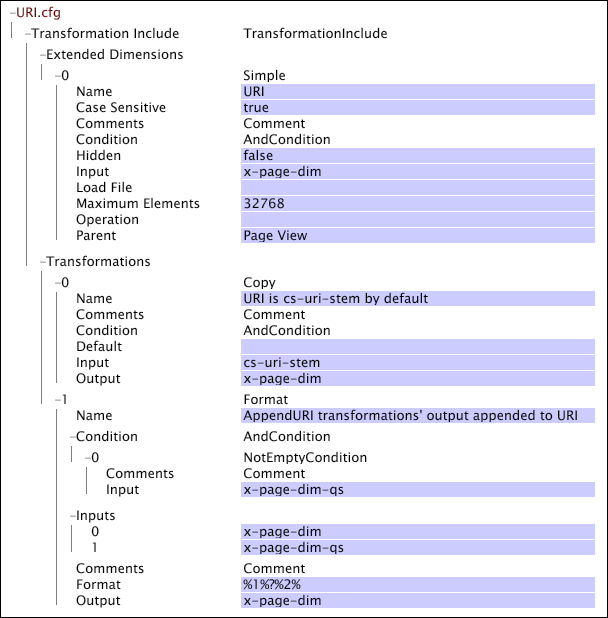

# Web-spezifische Einstellungen für Umwandlungen{#web-specific-settings-for-transformation}

{{eol}}

Informationen zu webspezifischen Einstellungen, die in Datensatzumwandlungsdateien definiert sind Einschließen von Dateien, die mit Adobe-Profilen für Site bereitgestellt werden.

Die durch diese Einstellungen definierten Bedingungen, Dimensionen und Parameter werden während der Umwandlungsphase der Datensatzerstellung erstellt.

* [Seitenansicht-Bedingung](../../../home/c-dataset-const-proc/c-config-web-data/c-web-spec-transf.md#section-cc2807a12a88492f8b64a43234a1f835)
* [URI-Dimension](../../../home/c-dataset-const-proc/c-config-web-data/c-web-spec-transf.md#section-348f7e9099d049d197a7cdcbc8a6c234)
* [Referrer-Dimension](../../../home/c-dataset-const-proc/c-config-web-data/c-web-spec-transf.md#section-8a97ec34d18b4814b5f95495ac4f8638)
* [Sitzungsparameter](../../../home/c-dataset-const-proc/c-config-web-data/c-web-spec-transf.md#section-0a209b0c504041a5801f7f71a963c8b1)

## Seitenansicht-Bedingung {#section-cc2807a12a88492f8b64a43234a1f835}

Die [!DNL Page View Condition] ist ein Bedingungsvorgang, der bestimmt, ob ein bestimmter Protokolleintrag (d. h. eine Seitenanfrage) in die Daten zum Seitenansichtsverlauf eines Besuchers aufgenommen werden soll. Wenn der Protokolleintrag die [!DNL Page View Condition], wird es zu einem Element der zählbaren Dimension &quot;Seitenansicht&quot;. Wenn ein Protokolleintrag die [!DNL Page View Condition], sind die Datenfelder weiterhin für andere Dimensionen verfügbar. Zusätzlich zur Dimension &quot;Seitenansicht&quot;können die folgenden Dimensionen durch die Ergebnisse der [!DNL Page View Condition]:

* **[!DNL URI]und [!DNL Page]:** Diese Dimensionen sind direkt von der [!DNL Page View Condition]. Wenn die angegebene Seite die Variable [!DNL Page View Condition,] sie ist nicht in den Dimensionen &quot;URI&quot;oder &quot;Seite&quot;enthalten.

* **[!DNL Visitor Page Views]und [!DNL Session Page Views]:** Die Dimensionen &quot;Besucherseitenansichten&quot;und &quot;Sitzungsseitenansichten&quot;stellen die Anzahl der Seiten dar, die ein Besucher in oder in einer bestimmten Sitzung aufgerufen hat. Seiten, die von der [!DNL Page View Condition] sind nicht Teil dieser Zählung.

* **Sitzungsnummer:** Die [!DNL Page View Condition] wirkt sich indirekt auf die Dimension Sitzungsnummer aus. Die Dimension Sitzungsnummer wird vor der [!DNL Page View Condition]; daher bei der Erwägung, [!DNL Session Number] in Bezug auf die [!DNL Page Views]können Sitzungen ohne Seitenansichten stattfinden.

Ihre standardmäßige Implementierung von [!DNL Site] enthält [!DNL Transformation Dataset Include] Datei, in der die zählbare Dimension &quot;Seitenansicht&quot;und die zugehörige [!DNL Page View Condition] definiert werden.

Informationen zu zählbaren Dimensionen finden Sie unter [Erweiterte Dimensionen](../../../home/c-dataset-const-proc/c-ex-dim/c-abt-ex-dim.md).

**So bearbeiten Sie die Konfigurationseinstellungen für die Seitenansichtsbedingung**

1. Öffnen Sie die [!DNL Profile Manager] in Ihrem Datensatzprofil und öffnen Sie die [!DNL Dataset\Transformation\Traffic\Page View.cfg] -Datei.

   >[!NOTE]
   >
   >Wenn Sie Ihre Implementierung von [!DNL Site]angegeben ist, kann sich die Datei, in der diese Konfigurationseinstellungen vorhanden sind, von dem beschriebenen Speicherort unterscheiden.

1. Überprüfen oder bearbeiten Sie die Werte der Parameter [!DNL Page View Condition] nach Bedarf. Verwenden Sie das folgende Beispiel als Anleitung. In dieser Datei wird die [!DNL Page View Condition] wird durch eine [!DNL Copy] Umwandlung. Beachten Sie, dass diese Datei auch die Definition der zählbaren Dimension &quot;Seitenansicht&quot;enthält.

   

   >[!NOTE]
   >
   >Informationen zu zählbaren Dimensionen finden Sie unter [Erweiterte Dimensionen](../../../home/c-dataset-const-proc/c-ex-dim/c-abt-ex-dim.md). Informationen zum [!DNL Copy] Transformation, siehe [Datenumwandlungen](../../../home/c-dataset-const-proc/c-data-trans/c-abt-transf.md).

1. Speichern Sie die Datei durch Rechtsklick **[!UICONTROL (modified)]** Klicken Sie oben im Fenster auf **[!UICONTROL Save]**.

1. Damit die lokal vorgenommenen Änderungen wirksam werden, finden Sie im [!DNL Profile Manager]klicken Sie mit der rechten Maustaste auf das Häkchen für die Datei im [!DNL User] und klicken Sie auf **[!UICONTROL Save to]** > *&lt;**[!UICONTROL profile name]**>*, wobei der Profilname der Name des Datensatzprofils oder das geerbte Profil ist, zu dem die Datensatzaufnahme-Datei gehört.

   >[!NOTE]
   >
   >Speichern Sie die geänderte Konfigurationsdatei nicht in einem der von Adobe bereitgestellten internen Profile, da Ihre Änderungen bei der Installation von Updates für diese Profile überschrieben werden.

## URI-Dimension {#section-348f7e9099d049d197a7cdcbc8a6c234}

Wenn Sie mit [!DNL Site]müssen Sie die URI-Dimension definieren, deren Elemente die URI-Elemente der angezeigten Website-Seiten sind. Ihre Standardimplementierung umfasst eine [!DNL Transformation Dataset Include] -Datei, in der die URI-einfache Dimension definiert ist.

Informationen zu einfachen Dimensionen finden Sie unter [Erweiterte Dimensionen](../../../home/c-dataset-const-proc/c-ex-dim/c-abt-ex-dim.md).

**So bearbeiten Sie die Konfigurationseinstellungen für die URI-Dimension**

1. Öffnen Sie die [!DNL Profile Manager] in Ihrem Datensatzprofil und öffnen Sie die [!DNL Dataset\Transformation\Traffic\URI.cfg] -Datei.

   >[!NOTE]
   >
   >Wenn Sie Ihre Implementierung von [!DNL Site]angegeben ist, kann sich die Datei, in der diese Konfigurationseinstellungen vorhanden sind, von dem beschriebenen Speicherort unterscheiden.

1. Überprüfen oder bearbeiten Sie die Werte der Parameter der Datei nach Bedarf. Verwenden Sie das folgende Beispiel und Informationen als Anleitungen.

Die Konfigurationseinstellungen für die URI-Dimension umfassen die folgenden beiden Parameter:

* **Groß-/Kleinschreibung:** True oder false. Wenn &quot;true&quot;, wird die Groß-/Kleinschreibung bei der Identifizierung eindeutiger Seiten berücksichtigt. Der Standardwert ist &quot;true&quot;.
* **Maximale Elemente:** Die maximale Anzahl von Elementen (d. h. URIs) für die URI-Dimension. Der Standardwert lautet 32768.

   >[!NOTE]
   >
   >Eine Änderung dieses Werts kann zu schwerwiegenden Leistungsproblemen führen. Ändern Sie diesen Wert nicht, ohne die Adobe zu konsultieren.

* Speichern Sie die [!DNL URI.cfg] Datei durch Rechtsklick **[!UICONTROL (modified)]** Klicken Sie oben im Fenster auf **[!UICONTROL Save]**.

* Damit die lokal vorgenommenen Änderungen wirksam werden, finden Sie im [!DNL Profile Manager]klicken Sie mit der rechten Maustaste auf das Häkchen für die Datei im [!DNL User] und klicken Sie auf **[!UICONTROL Save to]** > *&lt;**[!UICONTROL profile name]**>*, wobei der Profilname der Name des Datensatzprofils oder das geerbte Profil ist, zu dem die Datensatzaufnahme-Datei gehört.

   >[!NOTE]
   >
   >Speichern Sie die geänderte Konfigurationsdatei nicht in einem der von Adobe bereitgestellten internen Profile, da Ihre Änderungen bei der Installation von Updates für diese Profile überschrieben werden.

## Referrer-Dimension {#section-8a97ec34d18b4814b5f95495ac4f8638}

Wenn Sie mit [!DNL Site]müssen Sie die Dimension Referrer definieren, deren Elemente aus den Domänen der zweiten Ebene der Referrer der ersten Protokolleinträge in allen Sitzungen bestehen. Ihre Standardimplementierung umfasst eine [!DNL Transformation Dataset Include] Datei, in der die einfache Dimension Referrer definiert ist.

Informationen zu einfachen Dimensionen finden Sie unter [Erweiterte Dimensionen](../../../home/c-dataset-const-proc/c-ex-dim/c-abt-ex-dim.md).

**So bearbeiten Sie die Konfigurationseinstellungen für die Dimension &quot;Referrer&quot;**

1. Öffnen Sie die [!DNL Profile Manager] in Ihrem Datensatzprofil und öffnen Sie die [!DNL Dataset\Transformation\Traffic\Referrer.cfg] -Datei.

   >[!NOTE]
   >
   >Wenn Sie Ihre Implementierung von [!DNL Site]angegeben ist, kann sich die Datei, in der diese Konfigurationseinstellungen vorhanden sind, von dem beschriebenen Speicherort unterscheiden.

1. Überprüfen oder bearbeiten Sie die Werte der Parameter der Datei nach Bedarf. Verwenden Sie das folgende Beispiel und Informationen als Anleitungen.

   

   Die Konfigurationseinstellungen für die Dimension &quot;Referrer&quot;umfassen den Parameter &quot;Maximale Elemente&quot;, der die maximale Anzahl von Elementen (d. h. Referrern) für die Dimension &quot;Referrer&quot;angibt. Der Standardwert lautet 32768.

   >[!NOTE]
   >
   >Im obigen Beispiel wird die Variable [!DNL Maximum Elements] -Parameter auf 0 gesetzt. Wenn dieser Parameter auf 0 gesetzt ist, verwendet der Data Workbench-Server den internen Standardwert 32768.

1. Speichern Sie die [!DNL Referrer.cfg] Datei durch Rechtsklick **[!UICONTROL (modified)]** Klicken Sie oben im Fenster auf **[!UICONTROL Save]**.

1. Damit die lokal vorgenommenen Änderungen wirksam werden, finden Sie im [!DNL Profile Manager]klicken Sie mit der rechten Maustaste auf das Häkchen für die Datei im [!DNL User] und klicken Sie auf **[!UICONTROL Save to]** > *&lt;**[!UICONTROL profile name]**>*, wobei der Profilname der Name des Datensatzprofils oder das geerbte Profil ist, zu dem die Datensatzaufnahme-Datei gehört.

   >[!NOTE]
   >
   >Speichern Sie die geänderte Konfigurationsdatei nicht in einem der von Adobe bereitgestellten internen Profile, da Ihre Änderungen bei der Installation von Updates für diese Profile überschrieben werden.

## Sitzungsparameter {#section-0a209b0c504041a5801f7f71a963c8b1}

Wenn Sie mit [!DNL Site]können Sie Parameter angeben, die die Grenzen einer Besuchersitzung auf einer Website definieren. Diese Parameter sind nur gültig, wenn sie in einer [!DNL Transformation Dataset Include] in der [!DNL Site] Implementierung.

Die folgenden Parameter sind insofern eindeutig, als sie Mitglieder von sein können [!DNL Transformation Dataset Include] -Datei [!DNL Parameters] -Vektor oder sie können als einzelne Parameter im [!DNL Transformation.cfg]-Datei. Ein Parameter kann genau einmal definiert werden. Daher werden diese Parameter entweder im [!DNL Transformation.cfg]oder in der Datei [!DNL Parameters] -Vektor des Datensatzes enthält die -Datei - nicht in beiden Dateien.
**Maximale Sitzungsdauer und Sitzungs-Timeout**

Maximale Sitzungsdauer und Sitzungs-Timeout sind Zeichenfolgenparameter, die die Dauer der Sitzung eines Besuchers definieren. Diese Parameter funktionieren mit dem Parameter Interne Domänen , um die Sitzungslänge zu bestimmen.

Die maximale Sitzungsdauer gibt die längste Sitzungsdauer an, bevor eine neue Sitzung gestartet wird. Dadurch wird verhindert, dass Webseiten mit automatischer Inhaltsaktualisierung Sitzungen erstellen, die beliebig lang sind. Wenn der Referrer eines Klicks auf einen der Einträge im Parameter &quot;Interne Domänen&quot;festgelegt ist, wird dieser Timeout verwendet, um das Ende einer Sitzung zu definieren. Keine Sitzung darf die angegebene maximale Sitzungsdauer überschreiten, unabhängig von der Anzahl der darin enthaltenen Klicks. Der empfohlene Wert beträgt 48 Stunden.

Sitzungs-Timeout gibt die Zeit an, die zwischen den Protokolleinträgen eines bestimmten Besuchers verstreichen muss, um das Ende einer Sitzung und den Beginn einer neuen Sitzung zu bestimmen (d. h. die typische Zeitüberschreitung, die zur Definition einer Benutzersitzung verwendet wird). Der empfohlene Wert für diesen Parameter beträgt 30 Minuten. Wenn der Referrer eines Klicks nicht auf einen der Referrer im Parameter &quot;Interne Domänen&quot;festgelegt ist, wird diese Zeitüberschreitung zur Definition der Sitzung verwendet. Wenn cs (referrer-domain) für einen Protokolleintrag in der Liste der internen Domänen enthalten ist, bestimmt die maximale Sitzungsdauer, ob der aktuelle Protokolleintrag Teil einer vorhandenen Sitzung oder des Beginns einer neuen Sitzung ist.

Stellen Sie sich eine Situation vor, in der ein Besucher während des Site-Durchsuchens für einen längeren Zeitraum als das Sitzungs-Timeout von seinem Computer weg angerufen wird. Nach seiner Rückkehr durchsuchte er weiter, wo er aufgehört hatte. Da der Besucher die Site nie verlässt oder seinen Browser schließt, ist die cs (Referrer-Domäne) seines nächsten Klicks mit der internen Domäne identisch. Die ursprüngliche Sitzung bleibt aktiv, solange die Einstellung Maximale Sitzungsdauer nicht erreicht wird. Wenn die Domäne der Site als interne Domäne aufgelistet ist und die maximale Zeitüberschreitung nicht erreicht wird, wird die Interaktion des Besuchers als einzelne Sitzung und nicht als zwei separate Sitzungen angezeigt. Wenn der Besucher jedoch zu seinem Computer zurückkehrt und sein nächster Klick einen externen (oder leeren) Referrer aufweist, beginnt eine neue Sitzung.

>[!NOTE]
>
>Die [!DNL Sessionize] Transformation [!DNL Timeout Condition] spielt auch eine Rolle bei der Bestimmung der Länge einer Besuchersitzung. Wenn Sitzungs-Timeout und die maximale Sitzungsdauer nicht zutreffen, wird die [!DNL Timeout Condition] wird überprüft, um festzustellen, ob ein Protokolleintrag als Beginn einer neuen Sitzung betrachtet werden soll. Weitere Informationen finden Sie unter [Datenumwandlungen](../../../home/c-dataset-const-proc/c-data-trans/c-abt-transf.md).

**So bearbeiten Sie die Parameter &quot;Maximale Sitzungsdauer&quot;und &quot;Sitzungs-Timeout&quot;**

Wenn Sie mit [!DNL Site], enthält Ihre Standardimplementierung wahrscheinlich eine [!DNL Transformation Dataset Include] -Datei, in der die Namen und empfohlenen Werte dieser Parameter angegeben sind.

1. Öffnen Sie die [!DNL Profile Manager] in Ihrem Datensatzprofil und navigieren Sie zu [!DNL Dataset\Transformation\Traffic\Session Parameters.cfg].

   >[!NOTE]
   >
   >Wenn Sie Ihre Implementierung von [!DNL Site]angegeben ist, kann sich die Datei, in der diese Parameter definiert sind, von dem beschriebenen Speicherort unterscheiden.

1. Bearbeiten Sie die Werte der Parameter nach Bedarf. Stellen Sie sicher, dass Sie die gewünschten Einheiten (Minuten, Stunden usw.) angeben.

   

1. Speichern Sie die [!DNL Session Parameters.cfg] Datei durch Rechtsklick **[!UICONTROL (modified)]** oben im Fenster und klicken Sie auf **[!UICONTROL Save]**.

1. Damit die lokal vorgenommenen Änderungen wirksam werden, finden Sie im [!DNL Profile Manager]klicken Sie mit der rechten Maustaste auf das Häkchen für die Datei im [!DNL User] und klicken Sie auf **[!UICONTROL Save to]** >  **[!UICONTROL profile name]**, wobei der Profilname der Name des Datensatzprofils oder das geerbte Profil ist, zu dem die Datensatzaufnahme-Datei gehört.

   >[!NOTE]
   >
   >Speichern Sie die geänderte Konfigurationsdatei nicht in einem der von Adobe bereitgestellten internen Profile, da Ihre Änderungen bei der Installation von Updates für diese Profile überschrieben werden.

**[!DNL Internal Domains]**

[!DNL Internal Domains] ist ein Vektorparameter, der Hosts auf Domänenebene (interne Referrer) auflistet, die als Teil einer bestimmten Website behandelt werden sollten. Diese Hosts werden aus der Dimension der verweisenden Stelle entfernt (bei der es sich um eine Liste der externen Referrer-Informationen handelt). Wenn cs (Referrer-Domäne) mit einer der im Satz der internen Domänen aufgelisteten Zeichenfolgen übereinstimmt, wird die Sitzungs-Timeout-Funktion ignoriert und die maximale Sitzungsdauer wird verwendet, um die Sitzungslänge zu bestimmen.

Der Parameter &quot;Interne Domänen&quot;kann auch verwendet werden, um den Start einer neuen Sitzung zu verhindern, wenn Besucher zwischen mehreren Domänen eines Unternehmens wechseln, die auf eine Weise zugeordnet sind, die das Sitzungs-Timeout überschreitet. Angenommen, ein Unternehmen hat Teile seiner Website auf zwei Domänen aufgeteilt: einer protokolliert wird ( [!DNL xyz.com]) und der andere nicht protokolliert wird ( [!DNL xyz-unlogged.com]). Wenn diese Sites so integriert sind, dass der nahtlose Traffic über die beiden Domänen hinweg erleichtert wird, ist es nicht wünschenswert, bei jedem Wechsel des Besuchers von einer [!DNL xyz-unlogged.com] zurück zur [!DNL xyz.com] Domäne. Auflistung [!DNL xyz-unlogged.com] als interne Domäne verhindert, dass Sitzungen aufgrund des Traffics auf diesen beiden Domänen in mehrere Sitzungen aufgeteilt werden, solange die Einstellung Maximale Sitzungsdauer nicht erreicht wird.

**So fügen Sie eine interne Domäne hinzu**

Wenn Sie mit [!DNL Site]enthält Ihre Standardimplementierung eine [!DNL Transformation Dataset Include] zur Definition des Parameters Interne Domänen . In dieser Datei wird der Parameter benannt. Geben Sie einfach die internen Domänen ein, die Sie einbeziehen möchten, und speichern Sie die aktualisierte Datei.

1. Öffnen Sie die [!DNL Profile Manager] in Ihrem Datensatzprofil und navigieren Sie zu [!DNL Dataset\Transformation\Traffic\Internal Domains.cfg.]

   >[!NOTE]
   >
   >Wenn Sie Ihre Implementierung von [!DNL Site]festgelegt ist, kann sich die Datei, in der der Parameter Interne Domänen definiert ist, vom beschriebenen Speicherort unterscheiden.

1. Rechtsklick **[!UICONTROL Value]** für den Vektorparameter &quot;Interne Domänen&quot;und klicken Sie auf **[!UICONTROL Add new]** > **[!UICONTROL Value]**.

1. Bearbeiten Sie die Werte nach Bedarf.

   

1. Speichern Sie die [!DNL Internal Domains.cfg] Datei durch Rechtsklick **[!UICONTROL (modified)]** oben im Fenster und klicken Sie auf **[!UICONTROL Save]**.

1. Damit die lokal vorgenommenen Änderungen wirksam werden, finden Sie im [!DNL Profile Manager]klicken Sie mit der rechten Maustaste auf das Häkchen für die Datei im [!DNL User] und klicken Sie auf **[!UICONTROL Save to]** > *&lt;**[!UICONTROL profile name]**>*, wobei der Profilname der Name des Datensatzprofils oder das geerbte Profil ist, zu dem die Datensatzaufnahme-Datei gehört.

   >[!NOTE]
   >
   >Speichern Sie die geänderte Konfigurationsdatei nicht in einem der von Adobe bereitgestellten internen Profile, da Ihre Änderungen bei der Installation von Updates für diese Profile überschrieben werden.
