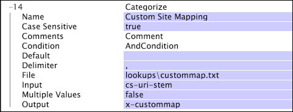
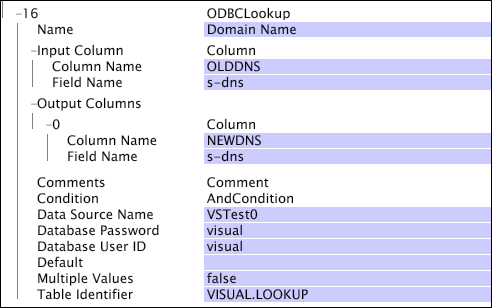

# Definieren von Lookup-Umwandlungen{#defining-lookup-transformations}

Informationen zu den Transformationen, mit denen Sie Nachschlagedaten in den Datensatz integrieren können.

Beachten Sie, dass nicht alle Typen in beiden Phasen des Datensatzerstellungsprozesses verwendet werden können.

* [Kategorisieren](../../../../home/c-dataset-const-proc/c-data-trans/c-int-lookup-data/c-def-lookup-transf.md#section-8474376c14e54d14ae73749696ada468)
* [FlatFileLookup](../../../../home/c-dataset-const-proc/c-data-trans/c-int-lookup-data/c-def-lookup-transf.md#section-e09b2eeb96444a859b14f03cdaab31f2)
* [ODBCLookup](../../../../home/c-dataset-const-proc/c-data-trans/c-int-lookup-data/c-def-lookup-transf.md#section-4dcc3747e42e45c0a057e85f308a83cc)

## Kategorisieren {#section-8474376c14e54d14ae73749696ada468}

Die [!DNL Categorize]-Transformation verwendet eine zweispaltige Nachschlagetabelle, die aus Musterzeichenfolgen-/Wertpaaren besteht. Während dieser Transformation liest der Data Workbench-Server jeden Ereignis-Datensatz nacheinander und vergleicht den Inhalt eines angegebenen Felds im Datensatz mit jeder der in der ersten Spalte der Suchtabelle aufgeführten Musterzeichenfolgen. Wenn das angegebene Feld mit einer der Musterzeichenfolgen übereinstimmt, schreibt der Data Workbench-Server den Wert (in der zweiten Spalte zu finden), der mit dieser Musterzeichenfolge verknüpft ist, in ein angegebenes Ausgabefeld im Datensatz.

Die Zeichenfolgen in der ersten Spalte der Suchtabelle können optional mit dem Zeichen &quot;^&quot;und/oder mit dem Zeichen &quot;$&quot;Beginn werden, um die Übereinstimmung am Anfang und/oder am Ende zu erzwingen. Diese Transformation akzeptiert keine regulären Ausdruck zum Definieren von Übereinstimmungsbedingungen in der ersten Spalte. Wenn der Eingabewert ein Vektor von Zeichenfolgen ist, wird jede Zeichenfolge durch die Transformation ausgeführt und das Ergebnis/die Ergebnisse werden an einen Ausgabezeichenfolgen-Vektor angehängt.

Eine [!DNL Categorize]-Transformation ist im Allgemeinen einfacher und schneller als die Verwendung einer [!DNL Regular Expression]-Transformation, um dasselbe zu erreichen.

>[!NOTE]
>
>Beim in [!DNL Categorize] verwendeten Teilzeichenfolgentest wird die Groß-/Kleinschreibung beachtet, sofern nicht anders mit dem Parameter [!DNL Case Sensitive] angegeben.

<table id="table_1773344FAAE34BD4919CC4414249FDEE"> 
 <thead> 
  <tr> 
   <th colname="col1" class="entry"> Parameter </th> 
   <th colname="col2" class="entry"> Beschreibung </th> 
   <th colname="col3" class="entry"> Standard </th> 
  </tr> 
 </thead>
 <tbody> 
  <tr> 
   <td colname="col1"> Name </td> 
   <td colname="col2"> Beschreibender Name der Transformation. Sie können hier einen beliebigen Namen eingeben. </td> 
   <td colname="col3"> </td> 
  </tr> 
  <tr> 
   <td colname="col1"> Groß-/Kleinschreibung </td> 
   <td colname="col2"> Wahr oder falsch. Gibt an, ob beim Unterzeichenfolgentest die Groß-/Kleinschreibung beachtet wird. </td> 
   <td colname="col3"> true (wahr) </td> 
  </tr> 
  <tr> 
   <td colname="col1"> Kommentare </td> 
   <td colname="col2"> Optional. Anmerkungen zur Transformation. </td> 
   <td colname="col3"> </td> 
  </tr> 
  <tr> 
   <td colname="col1"> Bedingung </td> 
   <td colname="col2"> Die Bedingungen, unter denen diese Umwandlung angewendet wird. </td> 
   <td colname="col3"> </td> 
  </tr> 
  <tr> 
   <td colname="col1"> Standard </td> 
   <td colname="col2"> Der Standardwert, der verwendet wird, wenn der Bedingungstest erfolgreich verläuft und kein Eintrag in der Kategorisierungsdatei mit der Eingabe übereinstimmt oder das Eingabefeld im angegebenen Protokolleintrag nicht definiert ist. </td> 
   <td colname="col3"> </td> 
  </tr> 
  <tr> 
   <td colname="col1"> Trennzeichen </td> 
   <td colname="col2"> 
String, der zum Trennen der Spalten in der Lookup-Datei verwendet wird. Muss ein einzelnes Zeichen lang sein. 
 
 Wenn Sie die Strg-Taste gedrückt halten und mit der rechten Maustaste in den Trennzeichner-Parameter klicken, wird das Menü  Einfügen angezeigt. Dieses Menü enthält eine Liste von Sonderzeichen, die häufig als Trennzeichen verwendet werden. 
 </td> 
   <td colname="col3"> </td> 
  </tr> 
  <tr> 
   <td colname="col1"> Mehrfachwerte </td> 
   <td colname="col2"> Wahr oder falsch. Wenn "true", werden mehrere Zeilen in der Datei mit der Eingabe übereinstimmen, wird bei jeder Übereinstimmung ein Wert an den Ausgabevektor der Zeichenfolgen angehängt. Bei "false"wird nur die erste übereinstimmende Zeile in der Datei in der Ausgabe verwendet. Im letzteren Fall, wenn die Eingabe ein Vektor ist, ist die Ausgabe auch ein Vektor der entsprechenden Länge. Wenn die Eingabe eine einfache Zeichenfolge ist, ist die Ausgabe auch eine einfache Zeichenfolge. </td> 
   <td colname="col3"> false (falsch) </td> 
  </tr> 
  <tr> 
   <td colname="col1"> Datei </td> 
   <td colname="col2"> Pfad und Dateiname der Kategorisierungsdatei. Relative Pfade beziehen sich auf den Installationsordner für den Data Workbench-Server. Diese Datei befindet sich normalerweise im Ordner "Suchen"im Installationsordner des Data Workbench-Servers. </td> 
   <td colname="col3"> </td> 
  </tr> 
  <tr> 
   <td colname="col1"> Eingabe </td> 
   <td colname="col2"> Die Kategorisierungsdatei stimmt mit ihren Unterzeichenfolgen mit dem Wert in diesem Feld überein, um die übereinstimmende Zeile in der Datei zu identifizieren. </td> 
   <td colname="col3"> </td> 
  </tr> 
  <tr> 
   <td colname="col1"> Ausgabe </td> 
   <td colname="col2"> Der Name des mit dem Ergebnis verknüpften Felds. </td> 
   <td colname="col3"> </td> 
  </tr> 
 </tbody> 
</table>

**Überlegungen zur Kategorisierung**

* Änderungen an Lookup-Dateien in [!DNL Categorize]-Konvertierungen, die in der [!DNL Transformation.cfg]-Datei oder in einer [!DNL Transformation Dataset Include]-Datei definiert sind, erfordern eine Konvertierung des Datensatzes. Suchdateien für [!DNL Categorize]-Konvertierungen, die in der [!DNL Log Processing.cfg]-Datei oder einer [!DNL Log Processing Dataset Include]-Datei definiert sind, unterliegen nicht dieser Einschränkung. Weitere Informationen zur erneuten Verarbeitung Ihrer Daten finden Sie unter [Wiederaufbereitung und Verarbeitung](../../../../home/c-dataset-const-proc/c-reproc-retrans/c-unst-reproc-retrans.md).

* [!DNL Categorize] Konvertierungen, die in der  [!DNL Log Processing.cfg] Datei oder in einer  [!DNL Log Processing Dataset Include] Datei definiert sind, laden ihre Lookup-Dateien erneut, sobald sich die Lookup-Dateien ändern. Änderungen werden nicht rückwirkend angewendet, sondern gelten für alle Protokolldaten, die nach der Änderung gelesen werden.

In diesem Beispiel wird die Verwendung der [!DNL Categorize]-Transformation zur Integration von Nachschlagedaten mit Ereignis-Daten veranschaulicht, die aus dem Website-Traffic erfasst wurden. Nehmen wir an, eine bestimmte Website hat Geschäftsbereiche, und es ist erforderlich, dass Sie Vergleiche auf Grundlage des Traffic-Flusses und des durch die verschiedenen Abschnitte generierten Wertes anstellen und durchführen können. Sie können eine Lookup-Datei erstellen, in der die Unterzeichenfolgen zur Identifizierung dieser verschiedenen Bereiche Liste werden.

Die Lookup-Datei [!DNL Lookups\custommap.txt] enthält die folgende Tabelle:

| /products/ | Produkte |
|---|---|
| ^/Sport/ | Sport |
| ^/News/ | Nachrichten |
| ... | ... |

Diese Kategorisierungsdatei ordnet alles, was die Zeichenfolge &quot;/products/&quot;enthält, dem Wert &quot;Produkte&quot;zu, alles was mit &quot;/sports/&quot;beginnt, dem Wert &quot;Sports&quot;und alles, was mit &quot;/news/&quot;beginnt, dem Wert &quot;News&quot;zu. Die folgende Kategorisierungstransformation verwendet den Wert im Feld &quot;cs-uri-stamm&quot;als Zeichenfolge, in der wir nach einer übereinstimmenden Teilzeichenfolge suchen. Das Ergebnis der Transformation wird in das Feld x-customMap platziert.

Unter der Annahme, dass der Parameter &quot;Mehrere Werte&quot;auf &quot;false&quot;gesetzt ist, würde das Beispiel die folgenden Werte für x-customMap bei den aufgeführten Werten für cs-uri-stamm erzeugen.

| [!DNL cs-uri-stem] | [!DNL x-custommap] |
|---|---|
| [!DNL /sports/news/today.php] | Sport |
| [!DNL /sports/products/buy.php] | Produkte |
| [!DNL /news/headlines.php] | Nachrichten |
| [!DNL /news/products/subscribe.php] | Produkte |

Die Ausgabe basiert auf der Reihenfolge der Unterzeichenfolgen in der Abfragedatei. Beispiel: Der cs-uri-stamm [!DNL /sports/products/buy.php] gibt &quot;Produkte&quot;zurück. Obwohl der URI-Stamm-Beginn mit &quot;/sports/&quot;, wird die Zeichenfolge &quot;/products/&quot;vor &quot;/sports/&quot;in der Lookup-Datei aufgeführt. Wenn der Parameter &quot;Mehrere Werte&quot;auf &quot;true&quot;gesetzt wurde, gibt es einen zusätzlichen Wert für x-customMap, da das letzte Beispiel zwei Zeilen in der Suchtabelle entsprechen würde: Produkte und Nachrichten.

## FlatFileLookup {#section-e09b2eeb96444a859b14f03cdaab31f2}

Die [!DNL FlatFileLookup]-Transformation verwendet eine Suchtabelle, die aus einer beliebigen Anzahl von Spalten und Zeilen besteht (auch wenn Sie sich daran erinnern, dass sie sich im Speicher befindet). Während dieser Art der Transformation liest der Data Workbench-Server jeden Ereignis-Datensatz nacheinander und vergleicht den Inhalt eines angegebenen Felds im Datensatz mit jedem der Werte in einer angegebenen Spalte der Suchtabelle. Wenn eine Übereinstimmung vorliegt, schreibt der Data Workbench-Server einen oder mehrere Werte aus der übereinstimmenden Zeile in der Suchtabelle in eines oder mehrere festgelegte Ausgabefelder im Ereignis-Datensatz.

Die bei dieser Transformation verwendete Nachschlagetabelle wird aus einer reduzierten Datei gefüllt, deren Speicherort Sie beim Definieren der Transformation angeben.

<table id="table_772B8ABF3B44493F99069010DDB5F77A"> 
 <thead> 
  <tr> 
   <th colname="col1" class="entry"> Parameter </th> 
   <th colname="col2" class="entry"> Beschreibung </th> 
   <th colname="col3" class="entry"> Standard </th> 
  </tr> 
 </thead>
 <tbody> 
  <tr> 
   <td colname="col1"> Name </td> 
   <td colname="col2"> Beschreibender Name der Transformation. Sie können hier einen beliebigen Namen eingeben. </td> 
   <td colname="col3"> </td> 
  </tr> 
  <tr> 
   <td colname="col1"> Kommentare </td> 
   <td colname="col2"> Optional. Anmerkungen zur Transformation. </td> 
   <td colname="col3"> </td> 
  </tr> 
  <tr> 
   <td colname="col1"> Bedingung </td> 
   <td colname="col2"> Die Bedingungen, unter denen diese Umwandlung angewendet wird. </td> 
   <td colname="col3"> </td> 
  </tr> 
  <tr> 
   <td colname="col1"> Standard </td> 
   <td colname="col2"> Der Standardwert, der verwendet wird, wenn die Bedingung erfüllt ist und kein Eintrag in der Abfragedatei mit der Eingabe übereinstimmt. </td> 
   <td colname="col3"> </td> 
  </tr> 
  <tr> 
   <td colname="col1"> Trennzeichen </td> 
   <td colname="col2"> 
String, der zum Trennen der Spalten in der Lookup-Datei verwendet wird. Muss ein einzelnes Zeichen lang sein. 
 
 Wenn Sie die Strg-Taste gedrückt halten und mit der rechten Maustaste in den Trennzeichner-Parameter klicken, wird das Menü  Einfügen angezeigt. Dieses Menü enthält eine Liste von Sonderzeichen, die häufig als Trennzeichen verwendet werden. 
 </td> 
   <td colname="col3"> </td> 
  </tr> 
  <tr> 
   <td colname="col1"> Datei </td> 
   <td colname="col2"> Pfad und Dateiname der Lookup-Datei. Relative Pfade beziehen sich auf den Installationsordner für den Data Workbench-Server. Diese Datei befindet sich normalerweise im Ordner "Suchen"im Installationsordner von Data Workbench Server. </td> 
   <td colname="col3"> </td> 
  </tr> 
  <tr> 
   <td colname="col1"> Kopfzeile </td> 
   <td colname="col2"> Wahr oder falsch. Gibt an, dass die erste Zeile in der Tabelle eine Kopfzeile ist, die bei der Verarbeitung ignoriert werden soll. </td> 
   <td colname="col3"> </td> 
  </tr> 
  <tr> 
   <td colname="col1"> Eingabe </td> 
   <td colname="col2">  Spaltenname  ist der Name der Spalte, die für die Zuordnung der Eingabe zu der (den) Zeile(n) in der Datei verwendet wird. Wenn "Kopfzeile"den Wert "true"hat, kann dies der Name einer Spalte in der Lookup-Datei sein. Andernfalls muss es sich um die auf null basierende Spaltennummer handeln, mit der abgeglichen werden soll.  Feldnamen  ist der Name des Felds, das zum Suchen der Zeile in der Abfragedatei verwendet wird. </td> 
   <td colname="col3"> </td> 
  </tr> 
  <tr> 
   <td colname="col1"> Mehrfachwerte </td> 
   <td colname="col2"> 
Wahr oder falsch. Bestimmt, ob ein einzelner Wert (eine übereinstimmende Zeile) oder mehrere Werte zurückgegeben werden sollen (einer für jede übereinstimmende Zeile). 
 
 
Hinweis:  Wenn  Mehrere Werte auf "false"gesetzt sind, müssen Sie sicherstellen, dass nicht mehrere Übereinstimmungen vorhanden sind. Wenn mehrere Übereinstimmungen auftreten, gibt es keine Garantie, welche Übereinstimmung zurückgegeben wird. 
 
 </td> 
   <td colname="col3"> </td> 
  </tr> 
  <tr> 
   <td colname="col1"> Ausgaben </td> 
   <td colname="col2"> 
Ein Vektor von Spaltenobjekten (Ergebnisse), in dem jedes Objekt durch Spalten- und Feldnamen definiert wird. 
 
  Spaltennamen  ist die Spalte, aus der der Ausgabewert abgerufen wird. Wenn  "Kopfzeile"true ist, kann dies der Name einer Spalte in der Lookup-Datei sein. Andernfalls muss es sich um die auf null basierende Spaltennummer handeln, mit der abgeglichen werden soll. 
 
  Feldnamen  ist der Name des Felds, das zum Erfassen der Ausgabe verwendet wird. Beachten Sie, dass dies ein Vektor von Ergebnissen sein kann, einer für jede Zeile, die identifiziert wird, wenn der Parameter "Mehrere Werte"wahr ist. 
 </td> 
   <td colname="col3"> </td> 
  </tr> 
 </tbody> 
</table>

**Überlegungen zu[!DNL FlatFileLookup]**

* Beim Abgleichen des Eingabefelds mit der Nachschlagedatei wird immer zwischen Groß- und Kleinschreibung unterschieden.
* Änderungen an Lookup-Dateien in [!DNL FlatFileLookup]-Konvertierungen, die in der [!DNL Transformation.cfg]- oder [!DNL Transformation Dataset Include]-Datei definiert sind, erfordern eine Konvertierung des Datensatzes. Suchdateien für [!DNL FlatFileLookup]-Konvertierungen, die in der [!DNL Log Processing.cfg]- oder [!DNL Log Processing Dataset Include]-Datei definiert sind, unterliegen nicht dieser Einschränkung. Weitere Informationen zur erneuten Verarbeitung Ihrer Daten finden Sie unter [Wiederaufbereitung und Verarbeitung](../../../../home/c-dataset-const-proc/c-reproc-retrans/c-unst-reproc-retrans.md).

* [!DNL FlatFileLookup] -Konvertierungen in der  [!DNL Log Processing.cfg] Datei oder in den  [!DNL Log Processing Dataset Include] Dateien laden ihre Lookup-Dateien neu, sobald sich die Lookup-Dateien ändern. Änderungen werden nicht rückwirkend angewendet, sondern gelten für alle Protokolldaten, die nach der Änderung gelesen werden.

In diesem Beispiel wird die Verwendung der [!DNL FlatFileLookup]-Transformation zur Integration von Nachschlagedaten mit Ereignis-Daten veranschaulicht, die aus dem Website-Traffic erfasst wurden. Angenommen, Sie möchten Website-Partner isolieren, die Routing-Traffic zur Website betreiben, und ihre Partner-IDs in benutzerfreundlichere Namen umwandeln. Anschließend können Sie die benutzerfreundlichen Namen verwenden, um erweiterte Dimensionen und Visualisierungen zu erstellen, die der Geschäftsbeziehung klarer zugeordnet sind als die Site-zu-Site-Beziehung, die für den Routing-Traffic verwendet wird.

Die Beispieltransformation durchsucht das Feld cs(Werber-Abfrage) nach dem PartnerID-Namens-Wert-Paar. Wenn Sie sich dort befinden, wird die Abfragedatei [!DNL Lookups\partners.txt] verwendet, um den PartnerID-Wert mit den Werten in der Tabellenspalte [!DNL Partner] zu vergleichen. Wenn sich eine Zeile befindet, erhält das Ausgabefeld x-partner-name den Namen aus der Spalte [!DNL PrintName] der angegebenen Zeile.

Wenn die Suchtabelle die folgenden Informationen enthält:

| ID | Partner | Gestartet | PrintName |
|---|---|---|---|
| 1 | P154 | 21.08.1999 | Yahoo |
| 2 | P232 | 10. Juli 2000 | Microsoft |
| 3 | P945 | 12. Januar 2001 | Amazon |

Die folgenden Beispiele würden sich wie folgt verändern:

* Wenn cs(Werber)(PartnerID) P232 zurückgegeben hat, erhält das Feld x-partner-name den Wert &quot;Microsoft&quot;.
* Wenn cs(Werber)(PartnerID) P100 zurückgegeben hat, erhält das Feld x-partner-name den Wert &quot;Kein Partner&quot;.
* Wenn cs(Werber)(PartnerID) nichts zurückgegeben hat, erhält das Feld x-partner-name den Wert &quot;Kein Partner&quot;, wie im Parameter Default angegeben.

## ODBCLookup {#section-4dcc3747e42e45c0a057e85f308a83cc}

Die [!DNL ODBCLookup]-Transformation funktioniert wie eine [!DNL FlatFileLookup]-Transformation. Der einzige Unterschied besteht darin, dass die bei dieser Transformation verwendete Nachschlagetabelle aus einer ODBC-Datenbank und nicht aus einer einfachen Datei gefüllt wird.

>[!NOTE]
>
>[!DNL ODBCLookup] Transformationen können nur während der Umwandlungsphase des Dataset-Aufbaus ausgeführt werden. Wenn möglich, empfiehlt Adobe die Verwendung der Transformation [!DNL FlatFileLookup] anstelle der Transformation [!DNL ODBCLookup]. [!DNL FlatFileLookup] Transformationen sind von Natur aus zuverlässiger, da sie nicht von der Verfügbarkeit eines externen Systems abhängen. Außerdem besteht weniger Risiko, dass die Suchtabelle geändert wird, wenn sie sich in einer flachen Datei befindet, die Sie lokal steuern.

<table id="table_B903DB291BCC4F44B09D54300216D288"> 
 <thead> 
  <tr> 
   <th colname="col1" class="entry"> Parameter </th> 
   <th colname="col2" class="entry"> Beschreibung </th> 
   <th colname="col3" class="entry"> Standard </th> 
  </tr> 
 </thead>
 <tbody> 
  <tr> 
   <td colname="col1"> Name </td> 
   <td colname="col2"> Beschreibender Name der Transformation. Sie können hier einen beliebigen Namen eingeben. </td> 
   <td colname="col3"> </td> 
  </tr> 
  <tr> 
   <td colname="col1"> Kommentare </td> 
   <td colname="col2"> Optional. Anmerkungen zur Transformation. </td> 
   <td colname="col3"> </td> 
  </tr> 
  <tr> 
   <td colname="col1"> Bedingung </td> 
   <td colname="col2"> Die Bedingungen, unter denen diese Umwandlung angewendet wird. </td> 
   <td colname="col3"> </td> 
  </tr> 
  <tr> 
   <td colname="col1"> Datenquellenname </td> 
   <td colname="col2"> Ein DSN, das von einem Administrator des Data Workbench-Servercomputers, auf dem der Datensatz verarbeitet wird, bereitgestellt wird und sich auf die Datenbank bezieht, aus der Daten geladen werden sollen. </td> 
   <td colname="col3"> </td> 
  </tr> 
  <tr> 
   <td colname="col1"> Datenbankkennwort </td> 
   <td colname="col2">Das Kennwort, das beim Herstellen einer Verbindung zur Datenbank verwendet wird. Wenn im Ordner  Data Source Administrator ein Kennwort für das DSN konfiguriert wurde, kann dies leer bleiben. Jedes hier bereitgestellte Kennwort setzt das für das DSN konfigurierte Kennwort in  Datenquellen-Administrator außer Kraft. </td> 
   <td colname="col3"> </td> 
  </tr> 
  <tr> 
   <td colname="col1"> Benutzer-ID der Datenbank </td> 
   <td colname="col2">Die beim Herstellen einer Verbindung zur Datenbank zu verwendende Benutzer-ID. Wenn im Ordner  Data Source Administrator eine Benutzer-ID für das DSN konfiguriert wurde, kann dies leer bleiben. Jede hier bereitgestellte Benutzer-ID setzt die Benutzer-ID außer Kraft, die für das DSN im Ordner  Data Source Administrator konfiguriert wurde. </td> 
   <td colname="col3"> </td> 
  </tr> 
  <tr> 
   <td colname="col1"> Standard </td> 
   <td colname="col2"> Der Standardwert, der verwendet wird, wenn die Bedingung erfüllt ist und kein Eintrag in der Abfragedatei mit der Eingabe übereinstimmt. </td> 
   <td colname="col3"> </td> 
  </tr> 
  <tr> 
   <td colname="col1"> Eingabespalte </td> 
   <td colname="col2">  Spaltenname  ist der Spaltenname oder SQL-Ausdruck für die Daten, die mit der Eingabe abgeglichen werden.  Feldnamen  ist der Name des Felds, das die zu suchenden Daten enthält. </td> 
   <td colname="col3"> </td> 
  </tr> 
  <tr> 
   <td colname="col1"> Mehrfachwerte </td> 
   <td colname="col2"> 
Wahr oder falsch. Bestimmt, ob ein einzelner Wert (eine übereinstimmende Zeile) oder mehrere Werte zurückgegeben werden sollen (einer für jede übereinstimmende Zeile). 
 
 
Hinweis:  Wenn  Mehrere Werte auf "false"gesetzt sind, müssen Sie sicherstellen, dass nicht mehrere Übereinstimmungen vorhanden sind. Wenn mehrere Übereinstimmungen auftreten, gibt es keine Garantie, welche Übereinstimmung zurückgegeben wird. 
 
 </td> 
   <td colname="col3"> </td> 
  </tr> 
  <tr> 
   <td colname="col1"> Ausgabespalten </td> 
   <td colname="col2"> 
Ein Vektor von Spaltenobjekten (Ergebnisse), bei dem jedes Objekt durch Spalten- und Feldnamen definiert wird. 
 
  Spaltennamen  ist der Name des SQL-Ausdrucks für die Spalte, aus der der Ausgabenwert abgerufen wird.  Feldnamen  ist der Name des Felds, das zum Erfassen der Ausgabe verwendet wird. 
 </td> 
   <td colname="col3"> </td> 
  </tr> 
  <tr> 
   <td colname="col1">  Tabellenkennung </td> 
   <td colname="col2"> Ein SQL-Ausdruck, der die Tabelle oder Ansicht benennt, aus der Daten geladen werden sollen. Eine typische Tabellenkennung ist das form SCHEMA.TABLE. </td> 
   <td colname="col3"> </td> 
  </tr> 
 </tbody> 
</table>

* Die Parameter &quot;Datenquellenname&quot;, &quot;[!DNL Database User ID]&quot;, &quot;[!DNL Database Password]&quot;und &quot;Tabellenbezeichner&quot;entsprechen den Parametern der gleichen Namen, die für ODBC-Datenquellen beschrieben werden. Siehe [ODBC-Datenquellen](../../../../home/c-dataset-const-proc/c-log-proc-config-file/c-odbc-data-sources.md#concept-5f2cf635081d44beab826ef5ec8cf4e3).

* Im Gegensatz zu ODBC-Datenquellen ist für [!DNL ODBCLookup]-Transformationen keine zunehmende ID-Spalte erforderlich. Siehe [ODBC-Datenquellen](../../../../home/c-dataset-const-proc/c-log-proc-config-file/c-odbc-data-sources.md#concept-5f2cf635081d44beab826ef5ec8cf4e3). Das liegt daran, dass sich der Inhalt der Suchtabelle während der aktiven Ausführung des Datensatzes in keiner Weise ändern darf. Änderungen an einer Suchtabelle oder Ansicht können erst erkannt werden, wenn eine Umgestaltung erfolgt. Weitere Informationen zur erneuten Verarbeitung Ihrer Daten finden Sie unter [Wiederaufbereitung und Verarbeitung](../../../../home/c-dataset-const-proc/c-reproc-retrans/c-unst-reproc-retrans.md).

Angenommen, Sie möchten veraltete DNS-Datensätze in die aktualisierten Datensätze konvertieren. Beide Datensätze werden in einer SQL-Datenbank gespeichert. Zur Durchführung dieser Aufgabe würden Sie auf eine Nachschlagetabelle verweisen, die aus der Datenbank generiert wird, und die veralteten DNS-Datensätze ersetzen.

Unsere Beispieltransformation durchsucht die Protokolleinträge nach dem s-dns-Feld und, falls vorhanden, wird die Suchtabelle VISUAL.LOOKUP verwendet, um den s-dns-Eintrag mit den Einträgen in der Spalte [!DNL OLDDNS] der Tabelle zu vergleichen. Befindet sich eine Zeile in der Tabelle, erhält das Ausgabefeld s-dns den aktualisierten DNS-Eintrag aus der Spalte [!DNL NEWDNS] der angegebenen Zeile.

