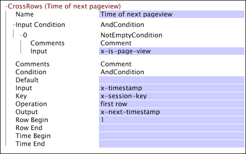

# CrossRows{#crossrows}

{{eol}}

Wie andere Umwandlungen wird auch die CrossRows-Transformation auf die Datenzeilen (Protokolleinträge) in Ihren Protokollquellen angewendet.

Für jede Datenzeile nimmt die Umwandlung den Wert des angegebenen Eingabefelds an, führt eine Reihe von Verarbeitungsschritten durch und zeichnet das Ergebnis im von Ihnen angegebenen Ausgabefeld auf. Wenn die Variable [!DNL CrossRows] Die Transformation funktioniert mit einer Datenzeile (diese Zeile wird als Ausgabezeile bezeichnet). Diese Zeile sowie eine oder mehrere andere Datenzeilen (diese Zeilen werden als Eingabezeilen bezeichnet), die mit derselben Tracking-ID verknüpft sind, werden berücksichtigt. Daher basiert der Wert des Ausgabefelds für jede Ausgabezeile für eine bestimmte Tracking-ID auf den Werten des Eingabefelds für eine oder mehrere Eingabezeilen.

Die Transformation bietet mehrere Bedingungen und Einschränkungen, mit denen Sie die Eingabezeilen für die Transformation beschränken können. Sie können diese Beschränkungen in Bezug auf die Bedingungen des Data Workbench-Servers ausdrücken (siehe [Bedingungen](../../../../../home/c-dataset-const-proc/c-conditions/c-abt-cond.md)), einen Bereich von Eingabezeilen, die relativ zur Ausgabezeile sind, oder einen Bereich, der in Bezug auf die Zeit der Ausgabezeile liegt. Für die Eingabezeilen, die die Bedingungen und Einschränkungen der Transformation erfüllen, können Sie einen Vorgang (z. B. SUM) anwenden, der den Wert des Ausgabefelds bestimmt.

>[!NOTE]
>
>Um zu arbeiten, wird die [!DNL CrossRows] Für die Transformation müssen die Daten in der Zeit geordnet und nach der Tracking-ID in den Quelldaten gruppiert werden. Daher [!DNL CrossRows] funktioniert nur, wenn im [!DNL Transformation.cfg] oder in einer [!DNL Transformation Dataset Include] -Datei.

Beachten Sie beim Überprüfen der Beschreibungen der Parameter in der folgenden Tabelle Folgendes:

* Die Ausgabezeile ist die Datenzeile, an der die Umwandlung zu einem bestimmten Zeitpunkt arbeitet.
* Eingabezeilen sind alle anderen Datenzeilen (vor, nach oder einschließlich der Ausgabenzeile), deren Werte des Eingabefelds als Eingaben für die Transformation dienen. Eingabezeilen unterliegen den Parametern Eingabebedingung, Schlüssel, Zeilenbeginn, Zeilenende, Zeitbeginn und Zeitende .

<table id="table_152851484AFF4C50AF736DC62FAA43E3"> 
 <thead> 
  <tr> 
   <th colname="col1" class="entry"> Parameter </th> 
   <th colname="col2" class="entry"> Beschreibung </th> 
   <th colname="col3" class="entry"> Standard </th> 
  </tr> 
 </thead>
 <tbody> 
  <tr> 
   <td colname="col1"> Name </td> 
   <td colname="col2"> Deskriptiver Name der Transformation. Hier können Sie einen beliebigen Namen eingeben. </td> 
   <td colname="col3"> </td> 
  </tr> 
  <tr> 
   <td colname="col1"> Kommentare </td> 
   <td colname="col2"> Optional. Anmerkungen zur Transformation. </td> 
   <td colname="col3"> </td> 
  </tr> 
  <tr> 
   <td colname="col1"> Bedingung </td> 
   <td colname="col2"> Beschränkt die Ausgabe der Transformation auf bestimmte Protokolleinträge. Wenn die Bedingung für einen bestimmten Protokolleintrag nicht erfüllt ist, bleibt das Feld im Ausgabeparameter unverändert. Die Eingabe kann weiterhin verwendet werden, um andere Protokolleinträge zu beeinflussen. </td> 
   <td colname="col3"> </td> 
  </tr> 
  <tr> 
   <td colname="col1"> Eingabe </td> 
   <td colname="col2"> Der Name des Felds aus der Eingabezeile, das als Eingabe verwendet werden soll. </td> 
   <td colname="col3"> </td> 
  </tr> 
  <tr> 
   <td colname="col1"> Eingabebedingung </td> 
   <td colname="col2"> Akzeptiert die Eingabe für die Umwandlung nur aus bestimmten Eingabezeilen. Wenn die Eingabebedingung für eine bestimmte Eingabezeile nicht erfüllt ist, wird das Eingabefeld aus dieser Zeile ignoriert und hat keine Auswirkungen auf andere Ausgabezeilen. Das Ausgabefeld aus dieser Zeile wird jedoch weiterhin gemäß der angegebenen Bedingung geändert. </td> 
   <td colname="col3"> </td> 
  </tr> 
  <tr> 
   <td colname="col1"> Schlüssel </td> 
   <td colname="col2"> 
Optional. Der Name des Felds, das als Schlüssel verwendet werden soll. 
 
 Wenn ein Schlüssel angegeben ist, sind die Eingabezeilen für eine bestimmte Ausgabezeile auf den aufeinander folgenden Zeilenblock beschränkt, der denselben Schlüsselwert wie die Ausgabezeile hat. Diese Einschränkung wird zusätzlich zu allen anderen Einschränkungen gewährt, die von anderen Parametern der  CrossRows Umwandlung. 
 
 Wenn Sie beispielsweise mit Web-Daten arbeiten und das Feld x-session-key (das für jede Sitzung einen eindeutigen Wert hat) zum Schlüssel machen, sind die Eingabezeilen für die Transformation auf jene Zeilen beschränkt, die denselben x-session-key-Wert wie die Ausgabezeile haben. Daher erwägen Sie nur die Eingabezeilen, die Seitenansichten darstellen, die während derselben Sitzung wie die Ausgabezeile auftreten. 
 </td> 
   <td colname="col3"> </td> 
  </tr> 
  <tr> 
   <td colname="col1"> Vorgang </td> 
   <td colname="col2"> 
Ein Vorgang, der für jede Ausgabezeile auf alle Eingabezeilen angewendet wird, die alle Bedingungen erfüllen, die durch die Parameter "Eingabebedingung", "Schlüssel", "Zeilenbeginn", "Zeilenende", "Zeitbeginn"und "Zeitende"definiert sind, um eine Ausgabe zu generieren: 
     <ul id="ul_C01CCF73A9544BCFB7B1105042FEF2DD"> 
      <li id="li_2D1A192970904499AB9F4431D51106D7"> ALL übernimmt alle Werte des Eingabefelds aus den Eingabezeilen und gibt sie als Vektor aus. </li> 
      <li id="li_B8863724AD924DE5BDBC987143548257"> SUM interpretiert die Werte des Eingabefelds aus den Eingabezeilen als Zahlen und fasst sie zusammen. </li> 
      <li id="li_BF930069DCEA4E0B80893C3C06CAE100"> DIE ERSTE ZEILE gibt den Wert des Eingabefelds aus der ersten Eingabezeile aus. </li> 
      <li id="li_04B9E2D88C0847E28101FC830C18D8E2"> DIE LETZTE ZEILE gibt den Wert des Eingabefelds aus der letzten Eingabezeile aus. </li> 
     </ul> 
 </td> 
   <td colname="col3"> </td> 
  </tr> 
  <tr> 
   <td colname="col1"> Ausgabe </td> 
   <td colname="col2"> Der Name des Ausgabefelds. </td> 
   <td colname="col3"> </td> 
  </tr> 
  <tr> 
   <td colname="col1"> Zeilenbeginn/Zeilenende </td> 
   <td colname="col2"> 
Optional. Gibt einen Bereich von Eingabezeilen relativ zur Ausgabenzeile an. Beispielsweise schließt der Wert für Zeilenbeginn "0"alle Zeilen vor der Ausgabenzeile aus. Bei einem Zeilenanfang von "1"wird auch die Ausgabezeile ausgeschlossen. Häufige Bereiche sind: 
     <ul id="ul_B030F32A5146430BA50DD4FAB4A527B0"> 
      <li id="li_30DFB8C0265349C295943A1CB8077B86"> Beginn 0: Diese Zeile und alle nachfolgenden Zeilen. </li> 
      <li id="li_9090C2E94E394351867BC5B78F27B41C"> Beginn 1: Alle nachfolgenden Zeilen. </li> 
      <li id="li_F870DC913E3F45BA94EE2EC04D344DE0"> Ende 0: Diese Zeile und alle vorherigen Zeilen. </li> 
      <li id="li_B8A576E419744D84AB1298E5155B583E"> Ende -1: Alle vorherigen Zeilen. </li> 
      <li id="li_CD2307A262D34542A2860FF07005CAD7"> Anfang -1, Ende -1: Die vorherige Zeile. </li> 
      <li id="li_6BF30B7BB7CC40A68B2332A3C11DD3B5"> Anfang 1, Ende 1: Die nächste Zeile. </li> 
     </ul> 
 </td> 
   <td colname="col3"> Alle Zeilen </td> 
  </tr> 
  <tr> 
   <td colname="col1"> Zeitbeginn/Zeitende </td> 
   <td colname="col2"> 
Optional. Gibt einen Zeitraum an, der relativ zur Zeit der Ausgabelzeile ist. Beispielsweise umfasst das Zeitende von 30 Minuten alle Zeilen, die innerhalb von 30 Minuten nach der Ausgabenzeile stattfinden. Ein Zeitbeginn von -30 Minuten umfasst alle Zeilen, die innerhalb von 30 Minuten vor der Ausgabenzeile stattfinden. 
 
 Die verfügbaren Zeiteinheiten sind Tage, Wochen, Stunden, Minuten, ms (Millisekunden), Zecken (100 Nanosekunden) und ns (Nanosekunden). 
 </td> 
   <td colname="col3"> Alle Zeiten </td> 
  </tr> 
 </tbody> 
</table>

Die [!DNL CrossRows] wird in diesem Beispiel auf Zeilen von Webdaten angewendet, um für jede Seitenansicht den Zeitpunkt der nächsten Seitenansicht zu ermitteln. Weil wir wissen, dass [!DNL CrossRows] wird nur während der Transformationsphase des Datensatzerstellungsprozesses angewendet, werden die Datenzeilen nach Besucher (jeder Besucher verfügt über eine eindeutige Tracking-ID) und Uhrzeit sortiert.

Das Eingabefeld x-timestamp gilt nur für jene Eingabezeilen, in denen das Feld x-is-page-view ausgefüllt ist (das angibt, dass die Datenzeile eine Seitenansicht darstellt). Das Feld x-session-key (das für jede Sitzung einen eindeutigen Wert hat) wird für den Parameter key angegeben. Daher sind die Eingabezeilen (Protokolleinträge) für die Umwandlung auf den zusammenhängenden Zeilenblock beschränkt, der denselben Wert wie die Ausgabezeile hat. Anders ausgedrückt: Eine Eingabezeile muss eine Seitenansicht darstellen, die während derselben Sitzung wie die Seitenansicht in der Ausgabenzeile auftritt, damit sie für die Transformation berücksichtigt wird. Der erste Zeilenvorgang nimmt den Wert des Ausgabefelds aus der ersten Eingabezeile an, die die [!DNL Input] Bedingung und mit demselben x-session-key-Wert wie die Ausgabezeile.

[!DNL CrossRows] wird in einer Zeit ausgeführt, die proportional zur Größe der Eingaben und der Ausgabegröße ist. Das bedeutet, dass es bei den Vorgängen SUM, FIRST ROW und LAST ROW nicht weniger effizient ist als bei anderen Umwandlungen. Für ALLE ist die Situation komplexer, da es möglich ist, [!DNL CrossRows] , um für jede Datenzeile (Protokolleintrag) eine Datenmenge auszugeben, die proportional zur Gesamtanzahl der Zeilen (Protokolleinträge) für eine bestimmte Tracking-ID ist.
