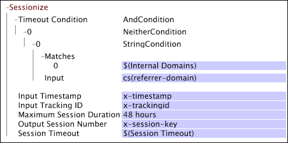

# Sessionize{#sessionize}

Wenn Sie mit Daten arbeiten, die aus dem Website-Traffic erfasst wurden, können Sie mithilfe der Sessionize-Transformation bestimmen, wie Sitzungen definiert werden.

Die Umwandlung nimmt als Eingabe einen Zeitstempel und eine Tracking-ID und gibt für jeden Protokolleintrag eine Sitzungsnummer aus. Die Sitzungsnummer ist &quot;1&quot;für die erste Sitzung mit einer angegebenen Tracking-ID, &quot;2&quot;für die zweite Sitzung mit derselben Tracking-ID usw. Die Ausgabe kann direkt als Sitzungsschlüssel verwendet werden, da sie für jede Sitzung einen eindeutigen Wert aufweist.

>[!NOTE]
>
>Für die Umwandlung von [!DNL Sessionize] ist es erforderlich, dass die Daten in der Zeit sortiert und nach der Tracking-ID in den Quelldaten gruppiert werden. Daher funktioniert [!DNL Sessionize] nur, wenn sie in der Datei [!DNL Transformation.cfg] oder in der Datei [!DNL Transformation Dataset Include] definiert ist.

<table id="table_34984DF9340149C0A5016F08EABAD158"> 
 <thead> 
  <tr> 
   <th colname="col1" class="entry"> Parameter </th> 
   <th colname="col2" class="entry"> Beschreibung </th> 
   <th colname="col3" class="entry"> Standard </th> 
  </tr> 
 </thead>
 <tbody> 
  <tr> 
   <td colname="col1"> Name </td> 
   <td colname="col2"> Deskriptiver Name der Transformation. Hier können Sie einen beliebigen Namen eingeben. </td> 
   <td colname="col3"> </td> 
  </tr> 
  <tr> 
   <td colname="col1"> Kommentare </td> 
   <td colname="col2"> Optional. Anmerkungen zur Transformation. </td> 
   <td colname="col3"> </td> 
  </tr> 
  <tr> 
   <td colname="col1"> Bedingung </td> 
   <td colname="col2"> Die Bedingungen, unter denen diese Umwandlung angewendet wird. </td> 
   <td colname="col3"> </td> 
  </tr> 
  <tr> 
   <td colname="col1"> Zeitstempel der Eingabe </td> 
   <td colname="col2"> Das Feld, das die Werte des zu verwendenden Zeitstempels enthält. </td> 
   <td colname="col3"> x-timestamp </td> 
  </tr> 
  <tr> 
   <td colname="col1"> Eingabe-Tracking-ID </td> 
   <td colname="col2"> 
Das Feld, das die Werte der zu verwendenden Tracking-ID enthält. Der Wert muss eine 64-Bit-Zahl (16-stellige Zahl) oder eine kleinere Hexadezimalzahl oder eine Dezimalzahl von 16 Stellen oder weniger sein. 
 
 
Hinweis: Wenn Sie für die Tracking-ID ein anderes Feld als x-trackingid verwenden möchten, müssen Sie das Feld zuerst hash. Siehe <a href="../../../../../home/c-dataset-const-proc/c-data-trans/c-transf-types/c-standard-transf/c-hash.md#concept-9c353923264941c3aea4428fed66d369"> Hash</a>. 
 
 </td> 
   <td colname="col3"> x-trackingid </td> 
  </tr> 
  <tr> 
   <td colname="col1"> 
Maximale Sitzungsdauer 
 </td> 
   <td colname="col2">Die längste Sitzungsdauer vor dem Start einer neuen Sitzung. (Dadurch wird verhindert, dass Webseiten mit automatischer Inhaltsaktualisierung Sitzungen erstellen, die beliebig lang sind.) Wenn die  Timeout-Bedingung erfüllt ist und der Referrer eines Klicks auf einen der Einträge im Parameter "Interne Domänen"festgelegt ist, wird die maximale Sitzungsdauer verwendet, um das Ende einer Sitzung zu definieren. Keine Sitzung darf die angegebene maximale Sitzungsdauer überschreiten, unabhängig von der Anzahl der darin enthaltenen Klicks. Der empfohlene Wert beträgt 48 Stunden. Weitere Informationen zu den Parametern für die maximale Sitzungsdauer und interne Domänen finden Sie unter <a href="../../../../../home/c-dataset-const-proc/c-config-web-data/c-config-web-data.md#concept-9a306b65483a484bb3f6f3c1d7e77519"> Konfigurationseinstellungen für Webdaten</a>. </td> 
   <td colname="col3"> 48 Stunden </td> 
  </tr> 
  <tr> 
   <td colname="col1"> Sitzungsnummer der Ausgabe </td> 
   <td colname="col2"> Das Feld, in dem die Sitzungsnummer gespeichert wird. Dieses Feld hat für jede Sitzung einen eindeutigen Wert für jeden Besucher. </td> 
   <td colname="col3"> </td> 
  </tr> 
  <tr> 
   <td colname="col1"> Sitzungs-Timeout </td> 
   <td colname="col2"> 
Die Zeit, die zwischen den Protokolleinträgen eines bestimmten Besuchers verstreichen muss, um das Ende einer Sitzung und den Beginn einer neuen Sitzung zu bestimmen (d. h. die typische Zeitüberschreitung, die zur Definition einer Benutzersitzung verwendet wird). Der empfohlene Wert für diesen Parameter beträgt 30 Minuten. Wenn die Timeout-Bedingung nicht erfüllt ist und der Referrer eines Klicks nicht auf einen der Referrer im Parameter "Interne Domänen"festgelegt ist, wird die Sitzung mit Sitzungs-Timeout definiert. 
 
 Wenn die Timeout-Bedingung erfüllt ist und cs (Referrer-Domäne) für einen Protokolleintrag in der Liste der internen Domänen enthalten ist, bestimmt die maximale Sitzungsdauer, ob der aktuelle Protokolleintrag Teil einer vorhandenen Sitzung oder Beginn einer neuen Sitzung ist. 
 
 Weitere Informationen zum Parameter "Sitzungs-Timeout"finden Sie unter <a href="../../../../../home/c-dataset-const-proc/c-config-web-data/c-config-web-data.md#concept-9a306b65483a484bb3f6f3c1d7e77519"> Konfigurationseinstellungen für Webdaten</a>. 
 </td> 
   <td colname="col3"> 30 Minuten </td> 
  </tr> 
  <tr> 
   <td colname="col1"> Timeout-Bedingung </td> 
   <td colname="col2"> Die Bedingung, die erfüllt sein muss, damit ein Protokolleintrag als Beginn einer neuen Sitzung betrachtet werden kann. Beachten Sie, dass die Zeit zwischen dem Protokolleintrag und dem vorherigen Protokolleintrag mindestens dem Wert des Sitzungs-Timeout-Parameters entsprechen muss. </td> 
   <td colname="col3"> </td> 
  </tr> 
 </tbody> 
</table>

Eine neue Sitzung beginnt, wenn eine der folgenden Situationen eintritt:

* Die Tracking-ID ändert sich.
* Die Zeit seit dem letzten Protokolleintrag entspricht mindestens dem Wert des Sitzungs-Timeout-Parameters und die Timeout-Bedingung ist erfüllt.
* Die Zeit seit dem ersten Protokolleintrag der letzten Sitzung überschreitet den Wert des Parameters Maximale Sitzungsdauer .

>[!NOTE]
>
>Wenn Sie die maximale Sitzungsdauer und die Sitzungszeitüberschreitung bereits als Parameter in der Datei [!DNL Session Parameters.cfg] definiert haben, geben Sie in der Konfiguration keine Werte für diese ein. Sie können auf die Parameter verweisen, indem Sie *$(Parametername)* eingeben, wie im folgenden Beispiel gezeigt. Weitere Informationen zu diesen Parametern finden Sie unter [Konfigurationseinstellungen für Webdaten](../../../../../home/c-dataset-const-proc/c-config-web-data/c-config-web-data.md#concept-9a306b65483a484bb3f6f3c1d7e77519).

Die Umwandlung von [!DNL Sessionize] in diesem Beispiel nimmt als Eingabe die Felder x-timestamp und x-trackingid an und zeichnet die Sitzungsnummer für jeden Protokolleintrag im Feld x-session-key auf. Der [!DNL Timeout Condition] der Transformation basiert auf einer [!DNL Neither] -Bedingung: Wenn das Feld cs(referrer-domain) für einen Protokolleintrag mit einem Mitglied des Parameters &quot;Interne Domänen&quot;übereinstimmt, wird die Bedingung als &quot;false&quot;ausgewertet. Beachten Sie die Verweise auf die Parameter &quot;Interne Domänen&quot;und &quot;Sitzungs-Timeout&quot;.

Weitere Informationen zu [!DNL NeitherCondition] finden Sie unter [Bedingungen](../../../../../home/c-dataset-const-proc/c-conditions/c-abt-cond.md). Informationen zu den Parametern für interne Domänen und Sitzungs-Timeout finden Sie unter [Konfigurationseinstellungen für Webdaten](../../../../../home/c-dataset-const-proc/c-config-web-data/c-config-web-data.md#concept-9a306b65483a484bb3f6f3c1d7e77519).

