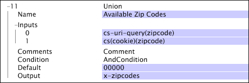

# Vereinigung{#union}

{{eol}}

Die Umwandlung der Union nimmt eine Reihe von Eingaben auf und erzeugt einen Vektor von Zeichenfolgen als Ausgabe.

Wenn einer der Eingaben selbst ein Vektor ist, wird jedes Element im Eingabevektor mit einem Element im Ausgabekvektor verknüpft (d. h. die Transformation erstellt keinen Vektor von Vektoren).

| Parameter | Beschreibung | Standard |
|---|---|---|
| Name | Deskriptiver Name der Transformation. Hier können Sie einen beliebigen Namen eingeben. |  |
| Kommentare | Optional. Anmerkungen zur Transformation. |  |
| Bedingung | Die Bedingungen, unter denen diese Umwandlung angewendet wird. |  |
| Standard | Der Standardwert, der verwendet wird, wenn die Bedingung erfüllt ist und der Eingabewert nicht verfügbar ist. |  |
| Eingaben | Ein oder mehrere Eingabewerte. |  |
| Ausgabe | Der Name des Ausgabefelds. |  |

In diesem Beispiel werden Datenfelder aus dem Website-Traffic verwendet, um eine Liste der Postleitzahlen zu erstellen, die mit den Besuchern der Website verknüpft sind (d. h. innerhalb jedes Protokolleintrags). Die Daten bieten zwei mögliche Quellen für diese Informationen: einen in der cs-uri-Abfrage und den anderen in einer [!DNL zipcode] -Feld des Cookies. Wenn keines dieser Felder eine Postleitzahl enthält, wird der Standardwert 0000 verwendet.

Diese beiden Werte können zwar in einem einzigen Protokolleintrag verfügbar sein, Sie können aber festlegen, welcher Wert bei der Erstellung einer Dimension auf der Grundlage der Transformationsausgabe verwendet werden soll. In einem typischen Anwendungsfall würden Sie eine einfache Dimension erstellen, die entweder den ersten oder den letzten der aufgefundenen Werte annimmt. Informationen zum Erstellen einfacher Dimensionen finden Sie unter [Erweiterte Dimensionen](../../../../../home/c-dataset-const-proc/c-ex-dim/c-abt-ex-dim.md).
