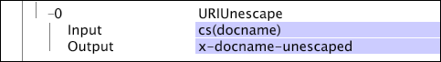

# UnescapeURI{#unescapeuri}

Bei der Umwandlung des Unescape-URI werden alle Zeichen in einer Zeichenfolge, die maskiert wurden, freigeschaltet.

>[!NOTE]
>
>Escapezeichen ersetzen die unsicheren Zeichen in einer URI-Zeichenfolge. Sie werden durch ein Triplet dargestellt, das aus einem Prozentzeichen gefolgt von zwei Hexadezimalziffern besteht (z. B. %20).

| Parameter | Beschreibung | Standard |
|---|---|---|
| Name | Deskriptiver Name der Transformation. Hier können Sie einen beliebigen Namen eingeben. |  |
| Kommentare | Optional. Anmerkungen zur Transformation. |  |
| Bedingung | Die Bedingungen, unter denen diese Umwandlung angewendet wird. |  |
| Standard | Der Standardwert, der verwendet wird, wenn die Bedingung erfüllt ist und der Eingabewert nicht verfügbar ist. |  |
| Eingabe | Die URI-Zeichenfolge, deren Escape-Sequenz aufgehoben werden soll. |  |
| Ausgabe | Der Name des Felds, in dem die nicht maskierte Zeichenfolge gespeichert werden soll. |  |

Die folgende Transformation hebt die Escape-Sequenz für den document-Wert in einem HTTP-Header-Feld auf und speichert die Ausgabe im Feld x-docname-unescaped:

Wenn der documentName-Wert

* [!DNL mysite.net/lending%20and%20leasing%20forms/document%20library/credit%20application.doc]

würde der Wert von x-docname-unescape

* [!DNL mysite.net/lending and leasing forms/document library/credit application.doc]
