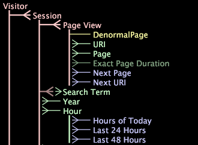

# Datensatzschema{#dataset-schema}

Die Benutzeroberfläche des DataSet-Schemas zeigt die erweiterten Dimensionen (zählbare, einfache, viele- bis numerische, denormale und Zeitdimensionen) an, die in jeder Transformation DataSet-Konfigurationsdatei definiert sind, sowie die Beziehungen zwischen diesen Dimensionen.

Darüber hinaus zeigt die [!DNL Dataset Schema]-Schnittstelle alle von Ihnen definierten abgeleiteten Dimensionen sowie alle erweiterten Dimensionen, die für das Ausblenden konfiguriert sind.

In diesem Abschnitt werden die folgenden Themen behandelt:

* [So interpretieren Sie den Dimensionstyp mithilfe der Benutzeroberfläche des DataSet-Schemas](../../../../home/c-dataset-const-proc/c-dataset-config-tools/c-dataset-config-int/c-dataset-schema.md#section-16a0a12b11334c07bec558c0b7d260b1)
* [So zeigen Sie die Standardvisualisierung für eine Dimension an](../../../../home/c-dataset-const-proc/c-dataset-config-tools/c-dataset-config-int/c-dataset-schema.md#section-1bbb73a5cbb34ffb844eb1932db85318)
* [So zeigen Sie eine bestimmte Visualisierung für eine Dimension an](../../../../home/c-dataset-const-proc/c-dataset-config-tools/c-dataset-config-int/c-dataset-schema.md#section-d46626df90bc4c44ae60c4b71eaeac7f)

## So interpretieren Sie den Typ der Dimension mithilfe der DataSet-Schema-Schnittstelle {#section-16a0a12b11334c07bec558c0b7d260b1}

In der folgenden Tabelle werden die Dimensionstypen und die Farbtypen, in denen ihre Namen in der [!DNL Dataset Schema]-Schnittstelle angezeigt werden, Liste. Übergeordnete Elemente für die Musterabmessungen (aus dem obigen Beispiel) werden ebenfalls vermerkt.

<table id="table_20D1A9EAAED247338476C475C63255F5"> 
 <thead> 
  <tr> 
   <th colname="col1" class="entry"> Dimension </th> 
   <th colname="col2" class="entry"> Farbe </th> 
   <th colname="col3" class="entry"> Dimension und Übergeordnetes Beispiel </th> 
  </tr> 
 </thead>
 <tbody> 
  <tr> 
   <td colname="col1"> Zählbar </td> 
   <td colname="col2"> Rosa </td> 
   <td colname="col3"> 
Besucher - In diesem Schema ist Besucher eine zählbare Dimension für die Stammebene. 
 
 Sitzung - übergeordnetes Element ist Besucher. 
 </td> 
  </tr> 
  <tr> 
   <td colname="col1"> Denormal </td> 
   <td colname="col2"> Gelb </td> 
   <td colname="col3"> DenormalPage - parent ist die Page-Ansicht. </td> 
  </tr> 
  <tr> 
   <td colname="col1"> Abgeleitet </td> 
   <td colname="col2"> Blau </td> 
   <td colname="col3"> Nächste Seite - übergeordnetes Element ist Ansicht der Seite. </td> 
  </tr> 
  <tr> 
   <td colname="col1"> Viele-zu-viele </td> 
   <td colname="col2"> Rosa und Grün (Der Stamm des übergeordneten Elements ist rosa, während der Dimensionsname grün ist.) </td> 
   <td colname="col3"> Suchbegriff - übergeordnetes Element ist Sitzung. </td> 
  </tr> 
  <tr> 
   <td colname="col1"> Numerisch </td> 
   <td colname="col2"> Grün </td> 
   <td colname="col3"> Exakte Seitendauer - übergeordnetes Element ist die Ansicht der Seite In diesem Beispiel ist die exakte Seitendauer eine verborgene numerische Dimension. Siehe Dimensionstyp "Ausgeblendet"in dieser Tabelle. </td> 
  </tr> 
  <tr> 
   <td colname="col1"> Einfach </td> 
   <td colname="col2"> Grün </td> 
   <td colname="col3"> Seite - übergeordnetes Element ist die Ansicht der Seite. </td> 
  </tr> 
  <tr> 
   <td colname="col1"> Zeit </td> 
   <td colname="col2"> Grün </td> 
   <td colname="col3"> Stunde - Elternteil ist Sitzung. </td> 
  </tr> 
  <tr> 
   <td colname="col1"> Verborgen </td> 
   <td colname="col2"> Ausgeblendete Dimensionen sind eine dunklere Version der entsprechenden Farbe des Dimensionstyps. Eine verborgene numerische Dimension ist beispielsweise ein dunklerer, weniger helles Grün. </td> 
   <td colname="col3"> Exakte Seitendauer - übergeordnetes Element ist die Ansicht der Seite. </td> 
  </tr> 
 </tbody> 
</table>

## So zeigen Sie die Standardvisualisierung für eine Dimension {#section-1bbb73a5cbb34ffb844eb1932db85318} an

* Klicken Sie in der [!DNL Dataset Schema]-Schnittstelle auf die gewünschte Dimension. Die Standardvisualisierung wird angezeigt. Wenn die Standardvisualisierung beispielsweise eine Tabelle mit Sitzungen und der ausgewählten Dimension ist und Sie auf die URI-Dimension klicken, zeigt Data Workbench eine Tabelle mit URI nach Sitzungen an.

>[!NOTE]
>
>Wenn Sie die angezeigte Standardvisualisierung ändern möchten, lesen Sie das Kapitel &quot;Konfigurierbare Benutzeroberfläche und Funktionen&quot;im *Data Workbench-Benutzerhandbuch*.

## So zeigen Sie eine bestimmte Visualisierung für eine Dimension {#section-d46626df90bc4c44ae60c4b71eaeac7f} an

* Klicken Sie in der [!DNL Dataset Schema]-Schnittstelle mit der rechten Maustaste auf die gewünschte Dimension und klicken Sie auf **[!UICONTROL Add Visualization]** > *&lt;**[!UICONTROL visualization type]***.
