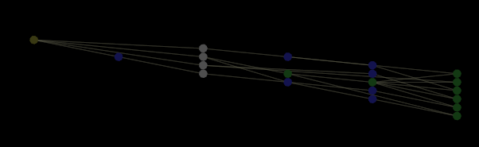

# Abhängigkeitszuordnungen{#dependency-maps}

Abhängigkeitskarten ermöglichen Ihnen die Visualisierung und Verwaltung der Konfiguration der Komponenten Ihres Profils.

* **Datensatzkomponenten:** Protokollquellen, Filter, Felder, Konvertierungen und erweiterte Dimensionen, die in den Dateien [!DNL Log Processing.cfg], [!DNL Transformation.cfg]und [!DNL dataset include] Dateien Ihres Datensatzes definiert sind.

* **Komponenten des Abfragemodells:** Metriken, Dimensionen und Filter, die in den Ordnern Dimensionen, Metriken und Filter definiert sind.
* **Arbeitsbereiche und Visualisierungen:** Arbeitsbereiche, Berichte, Menüoptionen und globale Ebenen.

Weitere Informationen zum Arbeiten mit Abfragemodellkomponenten, Arbeitsbereichen und Visualisierungen in Abhängigkeitskarten finden Sie im *Data Workbench-Benutzerhandbuch*.

Profilkomponenten werden durch farbige Punkte (Nodes) in der Map dargestellt. Die Linien, die die Knoten verbinden, stellen Abhängigkeiten dar, d.h. wie die Komponenten miteinander verbunden sind. Eine Linie zwischen zwei Knoten bedeutet, dass eine Ausgabe des Knotens auf der linken Seite eine Eingabe des Knotens auf der rechten Seite ist, das heißt, der rechte Knoten hängt vom linken Knoten ab.

## Anzeigen von Datenaset-Komponenten {#section-3e51c09c23cc40aeade2e6ad0fa7c8d2}

1. Klicken Sie mit der rechten Maustaste in die Abhängigkeitskarte und klicken Sie auf **[!UICONTROL Display]**.
1. Auswählen **[!UICONTROL Dataset]**. Ein X wird links von [!DNL Dataset]angezeigt.

Weitere Informationen zu den anderen Anzeigeoptionen finden Sie im *Data Workbench-Benutzerhandbuch*.

Die folgende Abbildung zeigt eine Abhängigkeitszuordnung, deren Knoten die Protokollquellen, Felder, Transformationen und erweiterten Dimensionen eines Datensatzes darstellen.

* Ein gelb-grüner Knoten stellt eine oder mehrere Protokollquellen oder einen Filter dar, die im Datensatz definiert sind. Ein Knoten für eine Protokollquelle erscheint immer am weitesten links in der Map.
* Eine graue Node stellt ein Feld dar, das im Parameter &quot;Felder&quot;in einer [!DNL Log Processing.cfg] oder einer [!DNL Log Processing Include]Datei aufgeführt ist.

* Eine blaue Node stellt eine Transformation dar.
* Ein grüner Knoten stellt eine erweiterte Dimension dar.

>[!NOTE]
>
>Wenn Ihr Datensatz über eine einzige Protokollquelle verfügt, zeigt die Zuordnung die Protokollquelle an: Name der *Protokollquelle*. Wenn Ihr Datensatz über mehrere Protokollquellen verfügt, zeigt die Zuordnung die *Anzahl* der Protokollquellen an, wobei Zahl die Anzahl der Protokollquellen ist. Wenn Ihr Datensatz beispielsweise drei Protokollquellen enthält, zeigt Ihre Zuordnung 3 Protokollquellen an.

Wenn Sie nicht alle Knoten auf der Karte sehen können, können Sie die Karte verschieben, vergrößern oder verkleinern, um die gesamte Karte anzuzeigen oder sich auf einen bestimmten Abschnitt zu konzentrieren. Weitere Informationen zum Zoomen finden Sie im Kapitel Arbeiten mit Visualisierungen im *Data Workbench-Benutzerhandbuch*.

Wenn Sie auf eine Node klicken, werden alle Nodes, die von dieser Node abhängen, sowie alle Nodes, von denen diese Node abhängig ist, hervorgehoben und ihre Namen werden angezeigt.

>[!NOTE]
>
>Ein hervorgehobener Pfad in einer Abhängigkeitszuordnung stellt keine Auswahl dar.

Wenn Sie mit der rechten Maustaste auf eine Node klicken, können Sie Informationen zu den einzelnen Komponenten auf der Map anzeigen und Menüoptionen auswählen, mit denen Sie weitere Details zur Komponente anzeigen oder die Komponente bearbeiten können. Darüber hinaus können Sie Textsuchen durchführen und Leistungsinformationen für Transformationen und erweiterte Dimensionen anzeigen.

Weitere Informationen zu diesen Funktionen für Abhängigkeitskarten finden Sie im Kapitel &quot;Verwaltungsschnittstellen&quot;des *Data Workbench-Benutzerhandbuchs*.
