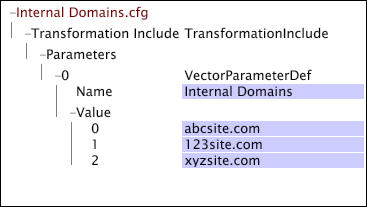

# Vektorparameter{#vector-parameters}

Vektorparameter enthalten mehrere Werte für eine einzelne Variable.

Sie können Vektorparameter nur als einziges Element eines Vektors referenzieren. Dieses Beispiel zeigt eine [!DNL Transformation Dataset Include]-Datei, die einen Vektorparameter definiert. Der Vektorparameter &quot;Interne Domänen&quot;besteht aus drei Werten.

Beachten Sie, dass der Vektorparameter das einzige Element ist, das für den Vektor [!DNL Matches] in der Bedingung [!DNL String Match] aufgeführt ist.

Weitere Informationen zu internen Domänen finden Sie unter [Konfigurationseinstellungen für Webdaten](../../../../home/c-dataset-const-proc/c-config-web-data/c-config-web-data.md#concept-9a306b65483a484bb3f6f3c1d7e77519). Weitere Informationen zur Bedingung [!DNL String Match] finden Sie unter [Bedingungen](../../../../home/c-dataset-const-proc/c-conditions/c-abt-cond.md).
