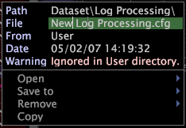

# Erstellen neuer Datensatzaufnahme-Dateien{#creating-new-dataset-include-files}

Schritte zum Erstellen einer neuen Datensatzaufnahme-Datei.

Sie sollten eine neue Datensatzaufnahme-Datei erstellen, um eine der folgenden Datensatzkonfigurationsaufgaben auszuführen:

* Angabe neuer Datenfelder, die von der Protokollverarbeitung zur Transformation übergeben werden sollen.
* Definieren von Umwandlungen mit einer der folgenden Aufgaben:

   * Vorhandene Protokollfelder aktualisieren.
   * Erstellen Sie neue Felder, die von der Protokollverarbeitung an die Transformation übergeben werden sollen oder die zur Definition erweiterter Dimensionen verwendet werden.

      Informationen zu den verfügbaren Transformationstypen finden Sie unter [Datenumwandlungen](../../../../home/c-dataset-const-proc/c-data-trans/c-abt-transf.md).

      >[!NOTE]
      >
      >Wenn Sie Umwandlungen in einem neuen Datensatz mit Include-Dateien definieren, achten Sie darauf, die Reihenfolge der Ein- und Ausgabedaten zu berücksichtigen. Informationen zur Reihenfolge der Umwandlungen finden Sie unter [Konventionen zum Erstellen von Umwandlungen](../../../../home/c-dataset-const-proc/c-data-trans/c-con-transf.md#concept-01998eebb7e347c58255fb442f2613b6).

* Erstellen erweiterter Dimensionen Informationen zu den verfügbaren Dimensionstypen finden Sie unter [Erweiterte Dimensionen](../../../../home/c-dataset-const-proc/c-ex-dim/c-abt-ex-dim.md).

1. Öffnen Sie bei der Arbeit in Ihrem Datensatzprofil [!DNL Profile Manager] und klicken Sie auf **[!UICONTROL Dataset]** , um die vorhandenen Datensatzaufnahme-Dateien anzuzeigen.

   * Um die [!DNL Log Processing Dataset Include]-Dateien anzuzeigen, klicken Sie auf **[!UICONTROL Log Processing]**.

   * Um die [!DNL Transformation Dataset Include]-Dateien anzuzeigen, klicken Sie auf **[!UICONTROL Transformation]**.

1. Erstellen Sie eine neue [!DNL Log Processing] - oder [!DNL Transformation Dataset Include] -Datei, indem Sie einen der folgenden Schritte ausführen:

   * Klicken Sie in der Spalte [!DNL User] für den Protokollverarbeitungsordner auf **[!UICONTROL Create]** > **[!UICONTROL New Log Processing]**. Eine Datei mit dem Namen [!DNL New Log Processing.cfg] wird im Verzeichnis angezeigt.

   * Klicken Sie in der Spalte [!DNL User] für den Ordner &quot;Transformation&quot;auf **[!UICONTROL Create]** > **[!UICONTROL New Transformation]**. Eine Datei mit dem Namen [!DNL New Transformation.cfg] wird im Verzeichnis angezeigt.

1. Benennen Sie die neue Datei um, indem Sie mit der rechten Maustaste in der Spalte [!DNL User] auf ihr Häkchen klicken und den neuen Namen im Parameter Datei eingeben.

   

1. Klicken Sie mit der rechten Maustaste auf das Häkchen für die umbenannte Datei und klicken Sie auf **[!UICONTROL Open]** > **[!UICONTROL from the workbench]**. Das Konfigurationsfenster wird angezeigt.
1. Bearbeiten Sie die Parameter in der Konfigurationsdatei entsprechend. Beschreibungen der verfügbaren Parameter finden Sie unter [Datensatzaufnahme-Dateien zur Protokollverarbeitung](../../../../home/c-dataset-const-proc/c-dataset-inc-files/c-types-dataset-inc-files/c-log-proc-dataset-inc-files/c-log-proc-dataset-inc-files.md#concept-999475a22519432e98844622ca95b6ab) oder [Datensatzaufnahme-Dateien zur Transformation](../../../../home/c-dataset-const-proc/c-dataset-inc-files/c-types-dataset-inc-files/c-trans-dataset-inc-files.md#concept-c64aa78ed9ce40b8a0f4932c82ff5ace) .
1. Um Ihre Änderungen zu speichern, klicken Sie mit der rechten Maustaste auf **[!UICONTROL (modified)]** oben im Fenster und klicken Sie auf **[!UICONTROL Save]**.
1. Damit die lokal vorgenommenen Änderungen wirksam werden, klicken Sie in der Spalte [!DNL Profile Manager] mit der rechten Maustaste auf das Häkchen für die Datei in der Spalte [!DNL User] und klicken Sie dann auf **[!UICONTROL Save to]** > *&lt;**[!UICONTROL profile name]***, wobei der Profilname der Name des Datensatzprofils oder das geerbte Profil ist, zu dem die Datensatzaufnahme gehört. Die Neuverarbeitung oder Umformatierung der Daten beginnt nach der Synchronisierung des Datensatzprofils.

   >[!NOTE]
   >
   >Speichern Sie die geänderte Konfigurationsdatei nicht in einem der von Adobe bereitgestellten internen Profile, da Ihre Änderungen bei der Installation von Updates für diese Profile überschrieben werden.

Informationen zum Bearbeiten einer von Ihnen erstellten Datensatzaufnahme-Datei finden Sie unter [Bearbeiten vorhandener Datensatzaufnahme-Dateien](../../../../home/c-dataset-const-proc/c-dataset-inc-files/c-work-dataset-inc-files/t-edit-ex-dataset-inc-files.md#task-456c04e38ebc425fb35677a6bb6aa077).
