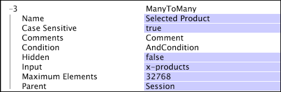

# Viele-zu-viele-Dimensionen{#many-to-many-dimensions}

Eine Viele-zu-viele-Dimension hat eine Viele-zu-viele-Beziehung zu ihrer übergeordneten zählbaren Dimension.

Sie können sich eine Viele-zu-viele-Dimension als Darstellung eines Satzes von Werten für jedes Element in seiner übergeordneten Dimension vorstellen. Beispielsweise ist die Dimension &quot;Suchbegriff&quot;eine Dimension auf Sitzungsebene (sie hat eine übergeordnete Dimension &quot;Sitzung&quot;). Es stellt den Satz von Suchbegriffen dar, die mit jeder Sitzung in der Sitzungsdimension verknüpft sind. Ein einzelner Suchbegriff kann in einer beliebigen Anzahl von Sitzungen verwendet werden, und eine einzelne Sitzung kann null oder mehr Suchbegriffe enthalten. Daher steht die Dimension &quot;Suchbegriff&quot;in einer Viele-zu-viele-Beziehung zur Dimension &quot;Sitzung&quot;.

Viele-zu-viele-Dimensionen werden durch die folgenden Parameter definiert:

<table id="table_A6D495008DFF4DD28A3ECD718D775E54"> 
 <thead> 
  <tr> 
   <th colname="col1" class="entry"> Parameter </th> 
   <th colname="col2" class="entry"> Beschreibung </th> 
   <th colname="col3" class="entry"> Standardeinstellung </th> 
  </tr> 
 </thead>
 <tbody> 
  <tr> 
   <td colname="col1"> Name </td> 
   <td colname="col2"> Beschreibender Name der Dimension, wie er dem Benutzer in Data Workbench angezeigt wird. Der Dimensionsname darf keinen Bindestrich (-) enthalten. </td> 
   <td colname="col3"> </td> 
  </tr> 
  <tr> 
   <td colname="col1"> Kommentare </td> 
   <td colname="col2"> Optional. Anmerkungen zur erweiterten Dimension. </td> 
   <td colname="col3"> </td> 
  </tr> 
  <tr> 
   <td colname="col1"> Bedingung </td> 
   <td colname="col2"> Die Bedingungen, unter denen die Beziehung zwischen dem übergeordneten Element und dem Wert des Eingabefelds erstellt werden soll. </td> 
   <td colname="col3"> </td> 
  </tr> 
  <tr> 
   <td colname="col1"> Verborgen </td> 
   <td colname="col2"> Bestimmt, ob die Dimension in der Data Workbench-Oberfläche angezeigt wird. Standardmäßig ist dieser Parameter auf false festgelegt. Wenn die Dimension beispielsweise nur als Grundlage für eine Metrik verwendet werden soll, können Sie diesen Parameter auf "true"setzen, um die Dimension aus der Datenbasis-Anzeige auszublenden. </td> 
   <td colname="col3"> false (falsch) </td> 
  </tr> 
  <tr> 
   <td colname="col1"> Eingabe </td> 
   <td colname="col2"> 
Der Wert, der sich auf die übergeordnete Dimension bezieht (Übergeordnet). Wenn dieses Feld ein Vektor von Zeichenfolgen ist, hat jedes Element des Vektors seine eigene Beziehung zum übergeordneten Element. 
 
 
Hinweis:  Wenn der Eingabewert für jeden Protokolleintrag für ein Element der übergeordneten Dimension leer ist, bezieht sich kein Element der Viele-zu-viele-Dimension auf dieses Element der übergeordneten Dimension. 
 
 </td> 
   <td colname="col3"> </td> 
  </tr> 
  <tr> 
   <td colname="col1"> Übergeordnet </td> 
   <td colname="col2"> Der Name der übergeordneten Dimension. Jede zählbare Dimension kann eine übergeordnete Dimension sein. </td> 
   <td colname="col3"> </td> 
  </tr> 
 </tbody> 
</table>

In diesem Beispiel wird die Definition einer Viele-zu-viele-Dimension anhand von Ereignisdaten veranschaulicht, die aus dem Website-Traffic erfasst wurden. Diese Viele-zu-viele-Dimension mit der Bezeichnung &quot;Ausgewähltes Produkt&quot;bezieht sich auf Sitzungen mit den Produkten, die der Besucher während dieser Sitzung gekauft hat. Das Feld &quot;x-products&quot;enthält einen Wertevektor, der jeweils mit einer Seitenansicht verknüpft ist, die wiederum mit einer Sitzung verknüpft ist.

Durch Erstellen einer solchen Transformation können Sie eine Visualisierung in Data Workbench erstellen, die die Beziehung zwischen der ausgewählten Produktdimension und der Anzahl der Sitzungen darstellt, an denen jedes Produkt beteiligt ist.
