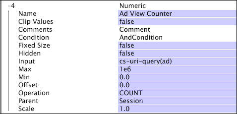

# Numerische Dimensionen{#numeric-dimensions}

Eine numerische Dimension besteht aus geordneten, numerischen Elementen und hat eine Eins-zu-viele-Beziehung mit der übergeordneten zählbaren Dimension.

Eine numerische Dimension stellt eine Darstellung der numerischen Eigenschaften der Elemente der übergeordneten Dimension dar. Wenn Sie beispielsweise mit Webdaten arbeiten, können Sie die numerische Dimension Sitzungsumsatz definieren, die einen Umsatz in Dollar für jede Sitzung in der Dimension Sitzung definiert. Jede Sitzung hat einen einzigen Umsatzbetrag, doch mehrere Sitzungen können denselben Umsatzbetrag aufweisen. Daher weist die Dimension Sitzungsumsatz eine Eins-zu-viele-Beziehung mit der Dimension Sitzung auf.

Numerische Dimensionen werden häufig verwendet, um Metriken zu definieren, die Werte summieren, Vorkommen einer Bedingung zählen oder einen Mindest- oder Höchstwert ermitteln. Beispielsweise kann eine Metrik mit dem Namen &quot;Umsatz&quot;mithilfe der Dimension Sitzungsumsatz definiert werden: sum(Session_Revenue, Session). Auf diese Weise würde die Umsatzmetrik den Gesamtumsatz für die ausgewählten Sitzungen ermitteln.

Numerische Dimensionen können keine übergeordneten Elemente anderer Dimensionen sein.

Numerische Dimensionen werden durch die folgenden Parameter definiert:

<table id="table_15B849DD0BFC4D57AD6CF28898901324"> 
 <thead> 
  <tr> 
   <th colname="col1" class="entry"> Parameter </th> 
   <th colname="col2" class="entry"> Beschreibung </th> 
   <th colname="col3" class="entry"> Standard </th> 
  </tr> 
 </thead>
 <tbody> 
  <tr> 
   <td colname="col1"> Name </td> 
   <td colname="col2"> Deskriptiver Name der Dimension, wie er in Data Workbench angezeigt wird. Der Dimensionsname darf keinen Bindestrich (-) enthalten. </td> 
   <td colname="col3"> </td> 
  </tr> 
  <tr> 
   <td colname="col1"> Clip-Werte </td> 
   <td colname="col2"> Wahr oder falsch. Gibt an, ob der Eingabewert (nach Operation ) zwischen den Werten von Min und Max abgeschnitten werden soll. Wenn die Cliplesätze "true"sind, wird der Wert auf diesen Bereich gekürzt. Wenn die Clip-Werte "false"sind, wird für das Element der übergeordneten Dimension kein Wert zurückgegeben. </td> 
   <td colname="col3"> </td> 
  </tr> 
  <tr> 
   <td colname="col1"> Kommentare </td> 
   <td colname="col2"> Optional. Hinweise zur erweiterten Dimension. </td> 
   <td colname="col3"> </td> 
  </tr> 
  <tr> 
   <td colname="col1"> Bedingung </td> 
   <td colname="col2"> Die Bedingungen, unter denen das Eingabefeld zur Erstellung der numerischen Dimension beiträgt. </td> 
   <td colname="col3"> </td> 
  </tr> 
  <tr> 
   <td colname="col1"> Feste Größe </td> 
   <td colname="col2"> Wahr oder falsch. Steuert die Anzahl der Elemente in einer Dimension (Kardinalität). Wenn "true", sind alle Elemente von "Min."bis "Max."in der Dimension enthalten. Bei "false"wächst die Größe der Dimension mit dem Hinzufügen von Werten. </td> 
   <td colname="col3"> false (falsch) </td> 
  </tr> 
  <tr> 
   <td colname="col1"> Verborgen </td> 
   <td colname="col2"> Bestimmt, ob die Dimension in der Data Workbench-Benutzeroberfläche angezeigt wird. Standardmäßig ist dieser Parameter auf false gesetzt. Wenn die Dimension beispielsweise nur als Grundlage einer Metrik verwendet werden soll, können Sie diesen Parameter auf "true"setzen, um die Dimension aus der Data Workbench-Anzeige auszublenden. </td> 
   <td colname="col3"> false (falsch) </td> 
  </tr> 
  <tr> 
   <td colname="col1"> Eingabe </td> 
   <td colname="col2"> 
Der Wert, der für den angegebenen Vorgang oder den Eingabewert verwendet werden soll, für den Sie Vorfälle zählen möchten. 
 
 Wenn dieses Feld ein Vektor von Zeichenfolgen ist, erfolgt die Auswertung für jedes Element im Vektor. Ein Vektor mit der Länge 3 und der Operation COUNT addiert beispielsweise 3 zur Zählung. 
 </td> 
   <td colname="col3"> </td> 
  </tr> 
  <tr> 
   <td colname="col1"> Min </td> 
   <td colname="col2"> Untergrenze für das Endergebnis der Dimension. </td> 
   <td colname="col3"> 0 </td> 
  </tr> 
  <tr> 
   <td colname="col1"> Max. </td> 
   <td colname="col2"> Obergrenze für das Endergebnis der Dimension. </td> 
   <td colname="col3"> 1e6 </td> 
  </tr> 
  <tr> 
   <td colname="col1"> Versatz </td> 
   <td colname="col2"> Siehe Skalierung in dieser Tabelle. </td> 
   <td colname="col3"> 0 </td> 
  </tr> 
  <tr> 
   <td colname="col1"> Vorgang </td> 
   <td colname="col2"> 
Folgende Vorgänge sind verfügbar: 
 
 
     <ul id="ul_E04733E5E8824A2BAAB90D9356078D99"> 
      <li id="li_CAEE9167D45540BEAC538345F250B509"> COUNT: Die Gesamtzahl der nicht leeren Werte im Feld  Eingabe wird für alle Protokolleinträge verwendet, die die Bedingung der Dimension erfüllen. Wenn das Feld  Eingabe ein Vektorfeld ist, wird die Gesamtzahl der nicht leeren Werte in jedem Protokolleintrag gezählt. </li> 
      <li id="li_64A4D671E78642BD9A9334F8098450B9"> ERSTE NONBLANK: Der erste nicht leere Eingabewert wird verwendet, unabhängig davon, ob er aus dem ersten Protokolleintrag stammt. Wenn  Input ein Vektorfeld ist, wird die erste Zeile im Vektor für den relevanten Protokolleintrag verwendet. Wenn der Wert keine Zahl ist, wird kein Wert verwendet. </li> 
      <li id="li_C967964729BD4A638FF78D8883CE513F"> ERSTE ZEILE: Der Wert für den ersten Protokolleintrag, der sich auf das übergeordnete Dimensionselement bezieht, wird verwendet, auch wenn die Eingabe leer ist. Wenn  Input ein Vektorfeld ist, wird die erste Zeile im Vektor für den relevanten Protokolleintrag verwendet. Wenn dieser Wert leer ist oder keine Zahl ist oder der relevante Protokolleintrag die Bedingung der Dimension nicht erfüllt, wird kein Wert verwendet. </li> 
      <li id="li_74171B17F480478B8547E1A361B22DA4"> LETZTES NONBLANK: Der letzte nicht leere Eingabewert wird verwendet, unabhängig davon, ob er aus dem letzten Protokolleintrag stammt. Wenn  Input ein Vektorfeld ist, wird die erste Zeile im Vektor für den relevanten Protokolleintrag verwendet. Wenn der Wert keine Zahl ist, wird kein Wert verwendet. </li> 
      <li id="li_1253ECF507BD4BBF97CBB2FA12915045"> LETZTE ZEILE: Der Wert für den letzten Protokolleintrag im Zusammenhang mit dem übergeordneten Dimensionselement wird verwendet, auch wenn die Eingabe leer ist. Wenn  Input ein Vektorfeld ist, wird die erste Zeile im Vektor für den relevanten Protokolleintrag verwendet. Wenn dieser Wert leer ist oder keine Zahl ist oder der relevante Protokolleintrag die Bedingung der Dimension nicht erfüllt, wird kein Wert verwendet. </li> 
      <li id="li_20819E3944544F98853D6A02814F47B2"> SUM: Es wird die Gesamtzahl aller numerischen Werte im Feld  Eingabe für alle Protokolleinträge verwendet, die die Bedingung der Dimension erfüllen. Wenn keine derartigen Protokolleinträge oder keine numerischen Werte gefunden werden, wird der numerische Wert 0 verwendet. </li> 
      <li id="li_086C2E57604B4645A9203A984C6F9A04">MIN oder MAX: Der numerische Minimal- oder Maximalwert, der im Feld  Eingabe für alle Protokolleinträge gefunden wird, die die Bedingung der Dimension erfüllen, wird verwendet. Wenn keine derartigen Protokolleinträge oder keine numerischen Werte vorhanden sind, wird kein Wert verwendet. </li> 
     </ul> 
 
 
Hinweis:  Sie sollten einen Vorgang angeben, um sicherzustellen, dass die Dimension wie gewünscht definiert ist. 
 
 </td> 
   <td colname="col3"> </td> 
  </tr> 
  <tr> 
   <td colname="col1"> Übergeordnet </td> 
   <td colname="col2"> Der Name der übergeordneten Dimension. Jede zählbare Dimension kann eine übergeordnete Dimension sein. </td> 
   <td colname="col3"> </td> 
  </tr> 
  <tr> 
   <td colname="col1"> Skalieren </td> 
   <td colname="col2"> 
Um den ordinalen Wert der Dimension zu erhalten, wird das Ergebnis des Vorgangs wie folgt transformiert: 
 
 (scale * input) + offset 
 </td> 
   <td colname="col3"> 1.0 </td> 
  </tr> 
 </tbody> 
</table>

>[!NOTE]
>
>Wenn [!DNL Operation] keinen Wert liefert oder [!DNL Clip Values] &quot;false&quot;lautet und der Wert nicht zwischen [!DNL Min] und [!DNL Max] liegt, ist kein Element der numerischen Dimension mit dem Element der übergeordneten Dimension verknüpft.

In diesem Beispiel wird die Definition einer numerischen Dimension anhand von Ereignisdaten veranschaulicht, die aus dem Website-Traffic erfasst wurden. Diese numerische Dimension mit dem Namen &quot;Anzeigenanzeigezähler&quot;zählt, wie oft der Besucher eine Anzeige während einer bestimmten Sitzung sieht. Es wird davon ausgegangen, dass alle Werberessourcen vom Webserver mit ad= im Rahmen der cs-uri-Abfrage angefordert werden. In diesem Beispiel ist die Anzahl der Besucheraktionen, die dem Besucher angezeigt werden, der Wert des Interesses, nicht der tatsächliche Wert im Feld.

