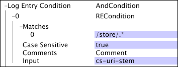

# Parameter für die Protokollverarbeitung{#log-processing-parameters}

Links zu zusätzlichen Informationen über bestimmte Parameter in der Datei &quot;Log Processing.cfg&quot;.

<!--
c_data_filters.xml
-->

## Datenfilter {#data-filters}

Die in der Datei [!DNL Log Processing.cfg] definierten Filter umfassen Folgendes:

* Endzeit
* Hash-Schwellenwert
* Startzeit

Die durch diese Parameter definierte Filterung erfolgt, nachdem Protokolleinträge die Decoder verlassen haben und nach Transformationen, aber vor ihrer Auswertung durch [!DNL Log Entry Condition]. Im Allgemeinen führt eine Änderung dieser Parameter zu Änderungen an der Zusammensetzung des Datensatzes.

Die empfohlene Technik für die Verwendung von [!DNL Sensor]-Datenquellen zum Erstellen eines Datensatzes, der einen bestimmten Zeitraum abdeckt, besteht in der Verwendung der Parameter für die Startzeit und Endzeit für den Datensatz.

Die Verwendung der Parameter &quot;Startzeit&quot;und &quot;Endzeit&quot;wird anderen Verfahren vorgezogen, z. B. dem Verschieben von Protokolldateien, um sie nach Ordner zu trennen. Durch Festlegen der Start- und Endzeiten für den Datensatz verwendet der Data Workbench-Server automatisch nur die Protokolleinträge, die innerhalb des angegebenen Intervalls aufgetreten sind. Wenn die Endzeit in der Vergangenheit liegt, aktualisiert der Data Workbench-Server den Datensatz in der Regel mit demselben Satz von Protokolleinträgen, selbst wenn der Datensatz beispielsweise durch Hinzufügen einer neuen Umwandlung aktualisiert wird.

<!--
c_log_entry_con.xml
-->

## Protokolleintrag

Es handelt sich im Wesentlichen um einen Filtervorgang für die verfügbaren Protokolleinträge. Wenn [!DNL Log Entry Condition] den Wert &quot;false&quot;zurückgibt, wird der Protokolleintrag aus dem verfügbaren Satz an Protokolleinträgen herausgefiltert.

Das [!DNL Log Entry Condition] wird mithilfe von Bedingungsvorgängen beschrieben (siehe [Bedingungen](../../../home/c-dataset-const-proc/c-conditions/c-abt-cond.md)) und kann eines der von [!DNL Sensor] erfassten Eingabefelder (siehe *Data Workbench [!DNL Sensor] Guide* ) oder alle erweiterten Felder verwenden, die durch in der [!DNL Log Processing.cfg]-Datei enthaltene Umwandlungen erzeugt werden, um die Testbedingungen zu definieren. [!DNL Log Entry] -Bedingungen werden während der Protokollverarbeitung angewendet und können optional während der Transformation angewendet werden.

Dieses Beispiel zeigt die Verwendung von [!DNL log entry condition] für Website-Daten. Sie können [!DNL Log Entry Condition] verwenden, um Datensätze zu erstellen, die sich auf einen bestimmten Teil der Website oder auf Besucher konzentrieren, die bestimmte Aktionen auf der Site ausführen.

Der [!DNL Log Entry Condition] in diesem Beispiel erstellt einen Datensatz, der nur die Protokolleinträge enthält, die Teil des Stores der Site sind. Durch Verwendung von [!DNL RECondition test] mit dem entsprechenden Muster [!DNL "/store/.*"] und dem Feld [!DNL cs-uri-stem] als Eingabe für den regulären Ausdruck werden nur Webseiten in den Datensatz aufgenommen, die mit der Zeichenfolge [!DNL "/store/"] beginnen.

<!--
c_key_split.xml
-->

## Schlüsselaufteilung {#key-split}

Die Anzahl der Tracking-IDs im Datensatz wird künstlich erhöht, aber die Gesamtzahl der vom Data Workbench-Server verarbeiteten Protokolleinträge wird nicht künstlich erhöht, wodurch die Gesamtzahl der zählbaren Ereignisse im Datensatz beibehalten wird. Nachdem die Daten für ein einzelnes Element aufgeteilt wurden, werden die Daten für immer mit zwei verschiedenen Tracking-IDs verknüpft und können nicht verknüpft werden.

Wenn Sie beispielsweise mit Webdaten arbeiten, stellt jede Tracking-ID einen Unique Visitor dar. Wenn Sie die Schlüsselaufteilung aktivieren, werden die Besucher in Ihrem Datensatz mit großen Mengen von Ereignisdaten in mehrere Besucher aufgeteilt. Während die Anzahl der Besucher im Datensatz künstlich erhöht ist, wird die Gesamtanzahl der zählbaren Ereignisse wie Seitenansichten oder Buchungen nicht künstlich erhöht. Nach der Aufteilung können die Daten für die Unterbesucher nicht mehr zugeordnet werden.

Schlüsselaufteilung verwendet einen probabilistischen Algorithmus. Infolgedessen gibt es einen Kompromiss zwischen der Speichernutzung, der Fehlerwahrscheinlichkeit, dem Schwellenwert für die Schlüsselaufteilung ( [!DNL Split Key Bytes]) und der Datensatzgröße. Mit den empfohlenen Einstellungen (wie unten aufgeführt) ist die Fehlerrate niedrig. Bei Elementen, deren Ereignisdaten den Schwellenwert für die Schlüsselaufteilung überschreiten, werden etwa 1 von 22.000 (in der Regel weniger als 1 pro Datensatz) Daten abgeschnitten und nicht aufgeteilt.

Die empfohlenen Werte für jeden Parameter (ohne und mit Schlüsselaufteilung) sind in der folgenden Tabelle aufgeführt.

| Parameter | Keine Schlüsselaufteilung | Schlüsselaufteilung |
|---|---|---|
| Group Maximum Key Bytes | 1e6 | 2e6 |
| Aufteilen des Schlüsselspeicherplatzes | 6e6 | 6e6 |
| Geteilte Schlüsselbyte | 0 | 1e6 |
| Split Key Space Ratio | 10 | 10 |

[!DNL Group Maximum Key Bytes] gibt die maximale Menge an Ereignisdaten an, die für eine einzelne Tracking-ID verarbeitet werden können. Daten, die diesen Grenzwert überschreiten, werden aus dem Prozess der Datensatzerstellung gefiltert. [!DNL Split Key Bytes] stellt die Anzahl der Bytes dar, in denen eine einzelne Tracking-ID in mehrere Elemente aufgeteilt wird. Elemente werden entsprechend einer Wahrscheinlichkeitsverteilung bei ungefähr dieser Anzahl von Byte aufgeteilt. [!DNL Split Key Space Ratio] und  [!DNL Split Key Bucket Space] steuern Sie die Speicherauslastung und die Fehlerrate der Schlüsselaufteilung.

>[!NOTE]
>
>[!DNL Group Maximum Key Bytes],  [!DNL Split Key Bytes],  [!DNL Split Key Space Ratio] und  [!DNL Split Key Bucket Space] alle müssen deklariert werden, damit die Schlüsselaufteilung ordnungsgemäß funktioniert. Ändern Sie nicht die Werte dieser Parameter, ohne die Adobe zu konsultieren.
