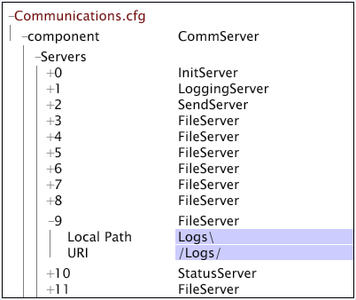

# Data Workbench-Serverdatei-Servereinheit konfigurieren{#configuring-a-data-workbench-server-file-server-unit}

Informationen zu Insight Server-Dateiservereinheiten und dem Dateiserverkonfigurationsprozess.

<!--
c_abt_file_svr_units.xml
-->

Sie können den Data Workbench-Server (InsightServer64.exe) so konfigurieren, dass er als File Server Unit (FSU) ausgeführt wird, indem Sie die Parameter im Knoten **[!UICONTROL Log Sources]** > **[!UICONTROL Log Server]** der [!DNL Log Processing.cfg] Datei ausfüllen. Wenn der Data Workbench-Server für die Ausführung als FSU konfiguriert ist, speichert er Quelldateien ( [!DNL .vsl] Dateien, Textdateien oder XML-Dateien), auf die von mehreren Verarbeitungsservern (DPUs) schnell zugegriffen werden kann. Wenn die DPUs in einem Data Workbench-Servercluster auf das FSU zugreifen, um die Protokolldateien zu lesen, teilen sie die Protokolldateien unter sie auf und stellen sicher, dass dieselbe Datei nicht mehr als einmal verarbeitet wird.

>[!NOTE]
>
>Beim Einrichten einer FSU, die einen Data Workbench-Servercluster mit fünf bis zehn DPU bereitstellt, sollten Sie den Master-Server des Clusters zur FSU machen.

Weitere Informationen zum Installieren eines Data Workbench-Serverclusters finden Sie im *Handbuch zur Installation und Verwaltung von Serverprodukten*.

<!--
c_file_svr_config_proc.xml
-->

Wenn der Speicherort ein Remote-Speicherort ist, stellt der Data Workbench-Servercomputer, der die Daten verarbeitet, eine Verbindung zum angegebenen Remotecomputer her, um die Protokolle zu lesen.

Auf dem Datenbasis-Servercomputer, der als FSU ausgeführt werden soll, können die [!DNL Access Control.cfg] DPUs eine Verbindung zum FSU herstellen und die [!DNL Communications.cfg] Datei ordnet den Speicherort der Remote-Datendateien zu. Die Prozessschritte zum Konfigurieren eines FSU lauten wie folgt:

1. Geben Sie in der [!DNL Log Processing.cfg] Datei auf Ihrem Master Data Workbench-Server den Typ der Datenquelle und den Speicherort der Quelle an. Siehe [Angabe der Datenquelle](../../../home/c-dataset-const-proc/c-log-proc-config-file/c-ins-svr-file-svr-unit.md#section-d2b545db7ab142ffb4be32e040395383).

1. Bearbeiten Sie in der [!DNL Access Control.cfg] Datei auf dem FSU die Berechtigungen, damit die DPUs eine Verbindung zum FSU herstellen können, um die Protokolldaten zu lesen. Siehe [Bearbeiten der Berechtigungen in der Datei-Servereinheit](../../../home/c-dataset-const-proc/c-log-proc-config-file/c-ins-svr-file-svr-unit.md#section-b4a54b591b4e4435a728a67f194057ef).

1. Bearbeiten Sie in der [!DNL Communications.cfg] Datei im FSU die Einstellungen für die [!DNL LoggingServer] und die [!DNL FileServer] Einträge, um den Speicherort der Protokolldateien anzugeben. Siehe [Speicherort der Protokolldateien](../../../home/c-dataset-const-proc/c-log-proc-config-file/c-ins-svr-file-svr-unit.md#section-f9a649bf1b2544feb10ad8820384edb0)angeben.

1. Wenn Sie Ihr DataSet-Profil für die Ausführung auf einem Data Workbench-Server-Cluster konfigurieren, müssen Sie außerdem das FSU des Clusters zum Server machen, auf dem alle Profilabmessungen erstellt werden:
(Nur für Data Workbench-Server-Cluster) Fügen Sie in den Dateien [!DNL Communications.cfg] und [!DNL cluster.cfg] Dateien des FSU Einträge für einen &quot;Normalize-Server&quot;hinzu, um das FSU zum Server im Cluster zu machen, auf dem alle Dimensionen erstellt werden. Siehe [Erstellen eines zentralisierten Normalisierungsservers für einen Cluster](../../../home/c-dataset-const-proc/c-log-proc-config-file/c-ins-svr-file-svr-unit.md#section-2c1f57b683f94cc193bc069e886bba28).

Anweisungen zum Konfigurieren eines Datensatzprofils, das von einem Data Workbench-Servercluster verarbeitet werden soll, finden Sie im *Server Products Installations- und Administrationshandbuch*.

>[!NOTE]
>
>In den folgenden Anweisungen wird davon ausgegangen, dass sich alle Protokolldateien im Standardordner befinden. Wenn Sie Protokolle in einem anderen Ordner speichern oder mehrere Protokollpfade erstellen möchten, wenden Sie sich an Adobe Consulting Services, um Ihre spezifische Konfiguration zu besprechen.

## Datenquelle angeben {#section-d2b545db7ab142ffb4be32e040395383}

Beim Festlegen von Remote-Datenquellen für ein Dataset müssen Sie den Typ der Datenquelle und den Speicherort der Protokolldateien auf Ihrem Master-Data Workbench-Server angeben.

**So legen Sie die Datenquelle und ihren Speicherort fest**

1. Open the [!DNL Log Processing.cfg] file. Siehe [Bearbeiten der Konfigurationsdatei](../../../home/c-dataset-const-proc/c-log-proc-config-file/t-edit-log-proc-config-file.md#task-6a2fa1b735cb4eefad730f0a3a7858e5)für die Protokollverarbeitung.

1. Fügen Sie eine [!DNL Sensor]-, Protokolldatei- oder XML-Datenquelle hinzu. See [Log Files](../../../home/c-dataset-const-proc/c-log-proc-config-file/c-log-sources.md#concept-3d4fb817c057447d90f166b1183b461e).

1. Füllen Sie den Parameter &quot;Protokollpfade&quot;aus. Siehe [Sensordateien](../../../home/c-dataset-const-proc/c-log-proc-config-file/c-log-sources.md#concept-b25f11c477b54032a15b6117b3bf9009), [Protokolldateien](../../../home/c-dataset-const-proc/c-log-proc-config-file/c-log-sources.md#concept-3d4fb817c057447d90f166b1183b461e)oder [XML-Protokollquellen](../../../home/c-dataset-const-proc/c-log-proc-config-file/c-log-sources.md#concept-c7b154e93748447b986e97f6ef688887). Achten Sie darauf, einen gültigen URI anzugeben.

1. Führen Sie die in der folgenden Tabelle definierten Parameter für den Protokollserver aus:

<table id="table_5881B8DEFF984BC7A620CEEA3A637912"> 
 <thead> 
  <tr> 
   <th colname="col1" class="entry"> Parameter </th> 
   <th colname="col2" class="entry"> Beschreibung </th> 
  </tr> 
 </thead>
 <tbody> 
  <tr> 
   <td colname="col1"> Name </td> 
   <td colname="col2"> Name, der den Remote-Dateiserver identifiziert. </td> 
  </tr> 
  <tr> 
   <td colname="col1"> SSL-Server - Allgemeiner Name </td> 
   <td colname="col2"> 
  Server Common Name , der im SSL-Zertifikat des Dateiservers aufgeführt ist. 
 
 Dieser Parameter ist optional, wenn "SSL  verwenden"auf "false"gesetzt ist. 
 </td> 
  </tr> 
  <tr> 
   <td colname="col1"> Adresse </td> 
   <td colname="col2"> 
Adresse des Dateiservercomputers. Kann leer gelassen werden, wenn  Name mit  SSL Server Common Nameübereinstimmt. 
 
 Beispiel:  visual.mycompany.com oder 192.168.1.90. 
 </td> 
  </tr> 
  <tr> 
   <td colname="col1"> Anschluss </td> 
   <td colname="col2"> Anschluss, über den der Data Workbench-Servercomputer mit dem Dateiserver kommuniziert. </td> 
  </tr> 
  <tr> 
   <td colname="col1"> SSL-Client-Zertifikat </td> 
   <td colname="col2"> Name der  SSL-Zertifikatdatei für den Data Workbench-Server ( server_cert.pem). </td> 
  </tr> 
  <tr> 
   <td colname="col1"> SSL verwenden </td> 
   <td colname="col2"> True oder false. True bedeutet, dass der Dateiserver  SSLverwendet. </td> 
  </tr> 
 </tbody> 
</table>

Wenn ein Proxyserver erforderlich ist, damit die DPUs eine Verbindung zum FSU herstellen können, müssen Sie die folgenden Parameter ausführen:

| Parameter | Beschreibung |
|---|---|
| Proxy-Adresse | Die Adresse eines Proxyservers, die der Data Workbench-Server für den Zugriff auf den Dateiserver verwenden muss. |
| Proxy-Kennwort | Optional. Das Kennwort für den Proxyserver. |
| Proxyanschluss | Der Anschluss des Proxyservers. Die Standardeinstellung ist „8080“. |
| Proxy-Benutzername | Optional. Der Benutzername für den Proxyserver. |

Im Folgenden finden Sie ein Beispiel für eine Definition [!DNL Log Server] in der [!DNL Log Processing.cfg] Datei. Protokollquelle Nr. 1 ist eine Protokolldatei-Quelle, die auf einen Ordner mit dem Namen Logs (beachten Sie den im Parameter Log Paths angegebenen URI) auf dem Computer mit dem Namen FSU01 verweist.

## Bearbeiten der Berechtigungen der Einheit &quot;Dateiserver&quot; {#section-b4a54b591b4e4435a728a67f194057ef}

Im vorherigen Prozess haben Sie ein Profil für einen bestimmten Datensatz konfiguriert, um Protokolldateien eines FSU zu lesen. Jetzt müssen Sie die Berechtigungen für das FSU bearbeiten, um Verbindungen von den DPUs zuzulassen, die das Profil ausführen. Die folgenden Schritte führen Sie durch die Bearbeitung der Berechtigungsdatei [!DNL Access Control.cfg].

**So bearbeiten Sie Berechtigungen für das FSU**

1. Öffnen Sie die Datei [!DNL Server Files Manager] für den Data Workbench-Servercomputer, den Sie als FSU einrichten, und klicken Sie auf **[!UICONTROL Access Control]** , um den Inhalt anzuzeigen.

   Weitere Informationen zum Öffnen und Arbeiten mit [!DNL Server Files Manager]Data Workbench finden Sie im *Data Workbench-Benutzerhandbuch*.

1. Klicken Sie im [!DNL Server Files Manager] Fenster auf **[!UICONTROL Access Control]** , um den Inhalt anzuzeigen. Die [!DNL Access Control.cfg] Datei befindet sich in diesem Ordner.

1. Klicken Sie mit der rechten Maustaste auf das Häkchen in der Spalte Servername für [!DNL Access Control.cfg]und klicken Sie dann auf **[!UICONTROL Make Local]**. In der [!DNL Temp] Spalte für wird ein Häkchen angezeigt [!DNL Access Control.cfg].

1. Klicken Sie mit der rechten Maustaste auf das neu erstellte Häkchen unter der [!DNL Temp] Spalte und klicken Sie auf **[!UICONTROL Open]** > **[!UICONTROL in Workstation]**.

1. Klicken Sie im [!DNL Access Control] Fenster auf **[!UICONTROL Access Control Groups]** , um den Inhalt anzuzeigen.

1. Klicken Sie mit der rechten Maustaste auf die numerische Beschriftung für das endgültige [!DNL AccessGroup] in der Liste und klicken Sie auf **[!UICONTROL Add new]** > **[!UICONTROL Group]**.

1. Geben Sie eine [!DNL Name] für die neue ein [!DNL AccessGroup]. Beispiel: Server anschließen.

1. Klicken Sie mit der rechten Maustaste **[!UICONTROL Member]** unter dem neuen [!DNL AccessGroup]und klicken Sie dann auf **[!UICONTROL Add new]** > **[!UICONTROL Member]**.

1. Geben Sie die IP-Adresse für die DPU des Data Workbench-Servers ein, die eine Verbindung zu diesem Dateiserver herstellt.
1. Wiederholen Sie die Schritte 4 und 5 für alle anderen Data Workbench-Server-DPUs, die eine Verbindung zu diesem FSU herstellen, einschließlich der Data Workbench-Server-DPUs in einem Cluster, das auf die Protokolldateien zugreifen muss.
1. Klicken Sie mit der rechten Maustaste **[!UICONTROL Read-Only Access]** unter dem neuen [!DNL AccessGroup]und klicken Sie dann auf **[!UICONTROL Add new]** > **[!UICONTROL URI]**.

1. Geben Sie den Speicherort der gespeicherten Protokolldateien auf dem Dateiservercomputer ein. Verwenden Sie Schrägstriche (/) in der Pfadspezifikation. Der Standardspeicherort ist /Logs/.
1. Klicken Sie mit der rechten Maustaste **[!UICONTROL (modified)]** am oberen Rand des Fensters und klicken Sie dann auf **[!UICONTROL Save]**.

1. Klicken Sie im [!DNL Server Files Manager] Fenster mit der rechten Maustaste auf das Häkchen [!DNL Access Control.cfg] in der [!DNL Temp] Spalte und klicken Sie dann auf **[!UICONTROL Save to]** > **[!UICONTROL server name]** , um die lokal vorgenommenen Änderungen am FSU des Data Workbench-Servers zu speichern.

## Speicherort der Protokolldateien angeben {#section-f9a649bf1b2544feb10ad8820384edb0}

Sie müssen die [!DNL Communications.cfg] Datei im FSU bearbeiten, um den Speicherort der Protokolldateien anzugeben.

**So legen Sie den Speicherort der Protokolldateien fest**

1. Klicken Sie im [!DNL Server Files Manager] Fenster auf **[!UICONTROL Components]** , um den Inhalt anzuzeigen. Die [!DNL Communications.cfg] Datei befindet sich in diesem Ordner.

1. Klicken Sie mit der rechten Maustaste auf das Häkchen in der Spalte Servername für [!DNL Communications.cfg]und klicken Sie dann auf **[!UICONTROL Make Local]**. In der [!DNL Temp] Spalte für wird ein Häkchen angezeigt [!DNL Communications.cfg].

1. Klicken Sie mit der rechten Maustaste auf das neu erstellte Häkchen unter der [!DNL Temp] Spalte und klicken Sie auf **[!UICONTROL Open]** > **[!UICONTROL in Workstation.]**.

1. Klicken Sie im [!DNL Communications.cfg] Fenster auf **[!UICONTROL component]** , um den Inhalt anzuzeigen.

1. Klicken Sie im [!DNL Communications.cfg] Fenster auf **[!UICONTROL Servers]** , um den Inhalt anzuzeigen. Es können mehrere Server angezeigt werden: Dateiserver, Protokollierungsserver, Initserver, Statusserver, Senden-Server oder Replizieren von Servern.

1. (Nur für [!DNL Sensor] Protokollquellen) Suchen Sie die [!DNL LoggingServer][!DNL Sensor] , in der die Protokolldateien geschrieben werden, die vom Data Workbench-Server verarbeitet werden sollen, und klicken Sie dann auf die entsprechende Nummer, um das Menü anzuzeigen. Bearbeiten Sie den Parameter Protokollverzeichnis, um den gewünschten Speicherort der Protokolldateien anzuzeigen. Der Standardprotokollordner ist der Ordner &quot;Protokolle&quot;im Installationsordner des Data Workbench-Servers.

   Ändern Sie keine anderen Parameter für die [!DNL LoggingServer].

   

1. Suchen Sie den FileServer, der den Speicherort der Protokolldateien angibt. Unter &quot;Server&quot;sind möglicherweise mehrere Dateiserver aufgelistet. Daher müssen Sie die Inhalte für viele dieser Server (durch Klicken auf die Servernummer) anzeigen, um den gewünschten Server zu finden.
1. Bearbeiten Sie die Parameter [!DNL Local Path] und URI für FileServer, um den Speicherort der Protokolldateien anzuzeigen. Das folgende Beispiel zeigt, dass sich die Protokolldateien im Ordner &quot;Protokolle&quot;im Installationsordner des Data Workbench-Servers befinden:

   

   >[!NOTE]
   >
   >Wenn die Parameter [!DNL Local Path] und URI wie gezeigt ausgefüllt werden, können Sie von jedem Data Workbench-Server aus auf die Protokolldateien im FSU zugreifen, indem Sie auf [!DNL Logs] den [!DNL Server Files Manager].

1. Klicken Sie mit der rechten Maustaste **[!UICONTROL (modified)]** am oberen Rand des Konfigurationsfensters und klicken Sie dann auf **[!UICONTROL Save]**.

1. Klicken Sie im [!DNL Server Files Manager] Fenster mit der rechten Maustaste auf das Häkchen [!DNL Communications.cfg] in der [!DNL Temp] Spalte und klicken Sie dann auf **[!UICONTROL Save to]** > *&lt;**[!UICONTROL server name]**>* , um die lokal vorgenommenen Änderungen am FSU des Data Workbench-Servers zu speichern.

## Erstellen eines zentralisierten Normalisierungsservers für einen Cluster {#section-2c1f57b683f94cc193bc069e886bba28}

Wenn Sie Ihr DataSet-Profil so konfigurieren, dass es auf einem Data Workbench-Servercluster ausgeführt wird, sollten Sie das FSU des Clusters zum Server machen, auf dem alle Profildimensionen erstellt werden.

Adobe empfiehlt dringend, dass die FSU des Clusters als Master-Server des Clusters und dessen zentralisierten Normalisierungsserver dient.

Um das FSU zum zentralisierten Normalisierungsserver zu machen, müssen Sie die Dateien [!DNL Communications.cfg] und [!DNL Cluster.cfg] Dateien im FSU öffnen und bearbeiten.

**So machen Sie das FSU zum zentralisierten Normalisierungsserver**

1. Fügen Sie einen [!DNL NormalizeServer] Eintrag zur [!DNL Communications.cfg] Datei im FSU hinzu.

   >[!NOTE]
   >
   >Wenn Sie das vollständige Release-Paket für Data Workbench Server Version 5.0 oder höher installiert haben, sollte die [!DNL Communications.cfg] Datei in Ihrem FSU bereits einen [!DNL NormalizeServer] Eintrag enthalten. Gehen Sie wie folgt vor, um zu bestätigen, dass der Eintrag vorhanden ist.

   1. Öffnen Sie die [!DNL Communications.cfg] Datei in Data Workbench, wie unter Speicherort der Protokolldateien [angeben](#section-f9a649bf1b2544feb10ad8820384edb0)beschrieben.

   1. Klicken Sie auf **[!UICONTROL component]** , um den Inhalt anzuzeigen.
   1. Klicken Sie mit der rechten Maustaste **[!UICONTROL Servers]** und klicken Sie auf **[!UICONTROL Add New]** > **[!UICONTROL Centralized Normalization Server]**.

   1. Geben Sie im URI-Parameter für die [!DNL NormalizeServer]Variable [!DNL /Cluster/]ein.

      

   1. Klicken Sie mit der rechten Maustaste **[!UICONTROL (modified)]** am oberen Rand des Fensters und klicken Sie auf **[!UICONTROL Save]**.

   1. Klicken Sie im [!DNL Server Files Manager] Fenster mit der rechten Maustaste auf das Häkchen [!DNL Communications.cfg] in der [!DNL Temp] Spalte und klicken Sie dann auf **[!UICONTROL Save to]** > *&lt;**[!UICONTROL server]**>* Name, um die lokal vorgenommenen Änderungen am Data Workbench-Server-FSU zu speichern.

1. Definieren Sie den zentralisierten Normalisierungsserver in der [!DNL Cluster.cfg] Datei auf dem Master-Server im Data Workbench Server-Cluster.

   >[!NOTE]
   >
   >Wenn das FSU, auf dem Sie Ihren zentralisierten Normalisierungsserver einrichten, nicht der Master-Data-Workbench-Server im Cluster ist, müssen Sie die IP-Adressen der DPUs im Cluster zur [!DNL Cluster Servers] Zugriffsgruppe in der [!DNL Access Control.cfg] Datei des FSU hinzufügen. Anweisungen zum Hinzufügen von Servern zur [!DNL Cluster Servers] Gruppe finden Sie im Abschnitt Aktualisieren der Zugriffssteuerungsdatei für einen Cluster im Handbuch zur Installation und Verwaltung von *Serverprodukten.*

   1. Öffnen Sie die Datei [!DNL Profile Manager] im Datenaset-Profil und klicken Sie dann auf **[!UICONTROL Dataset]** , um den Inhalt anzuzeigen. Die [!DNL Cluster.cfg] Datei befindet sich in diesem Ordner.

   1. Klicken Sie mit der rechten Maustaste auf das Häkchen neben [!DNL Cluster.cfg]und klicken Sie dann auf **[!UICONTROL Make Local]**. Ein Häkchen für diese Datei wird in der [!DNL User] Spalte angezeigt.

   1. Klicken Sie mit der rechten Maustaste auf das neu erstellte Häkchen und klicken Sie auf **[!UICONTROL Open]** > **[!UICONTROL in Notepad]**.

   1. Fügen Sie den Text hinzu, der im folgenden Dateifragment hervorgehoben ist:

      [!DNL Cluster = ClusterConfig:]

      [!DNL Normalize Server = serverInfo:]

      [!DNL Address = string:]

      [!DNL Port = int: 80]

      [!DNL SSL Server Common Name = string: server common name]

      [!DNL Use SSL = bool: false]

      >[!NOTE]
      >
      >Wenn Sie den allgemeinen Namen von FSU für den Parameter SSL Server Common Name eingeben, verwendet das FSU seine [!DNL .address] Datei, um den gemeinsamen Namen aufzulösen. Informationen zur [!DNL .address] Datei finden Sie im *Serverprodukt-Installations- und Administrationshandbuch*.

   1. Speichern Sie die Datei.
   1. Klicken Sie in der [!DNL Profile Manager]Spalte mit der rechten Maustaste auf das Häkchen [!DNL Cluster.cfg] in der [!DNL User] Spalte und klicken Sie dann auf **[!UICONTROL Save to]** > ***[!UICONTROL dataset profile name]*** , um die lokal vorgenommenen Änderungen am Datensatzprofil zu speichern.
