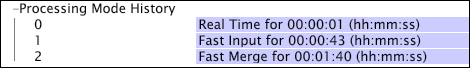

# Vorbereiten der Wiederaufbereitung oder erneuten Umwandlung{#preparing-for-reprocessing-or-retransformation}

Schritte, um sicherzustellen, dass die Wiederaufarbeitung oder Umwandlung reibungslos verläuft und rechtzeitig abgeschlossen wird, damit Benutzer von Data Workbench wieder arbeiten können

1. Stellen Sie die abgelaufene Zeit der vorherigen Verarbeitung oder Transformation fest, indem Sie das [!DNL Processing Mode History]-Profil des Datensatzes in der [!DNL Detailed Status]-Schnittstelle überprüfen.

   1. Öffnen Sie beim Arbeiten im DataSet-Profil die [!DNL Detailed Status]-Schnittstelle.
   1. Klicken Sie auf **[!UICONTROL Processing Status]** > *&lt;**[!UICONTROL dataset profile name]**>* > **[!UICONTROL Processing Mode History]**, um die abgelaufenen Zeiten der vorherigen Verarbeitung oder Transformation Ansicht.

      * Die schnelle Eingabe ist die für die Protokollverarbeitung benötigte Gesamtzeit.
      * &quot;Schnelle Zusammenführung&quot;ist die gesamte für die Transformation benötigte Zeit.
      * Die Summe der beiden Male (Schnelle Eingabe + Schnelle Zusammenführung) ist die Gesamtdauer, die für die Verarbeitung des Datensatzes benötigt wird.

      Das folgende Beispiel zeigt, dass die Protokollverarbeitung etwa 43 Sekunden dauerte, während die Konvertierung weniger als 2 Minuten dauerte.

      

      Weitere Informationen zur [!DNL Detailed Status]-Schnittstelle finden Sie im *Data Workbench-Benutzerhandbuch*.

1. Planen und planen Sie die Wiederaufbereitung. Da Data Workbench-Benutzer während der Protokollverarbeitungszeit keinen Zugriff auf die Daten haben, stellen Sie sicher, dass Sie die Wiederaufbereitung für eine angemessene Zeit planen, z. B. über das Wochenende.
1. Überwachen Sie den Fortschritt der Wiederaufarbeitung und Umgestaltung mithilfe der Felder im [!DNL Processing Legend.] Weitere Informationen zum [!DNL Processing Legend] finden Sie im *Data Workbench Benutzerhandbuch*.
