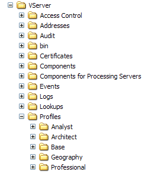

# Installieren des Geography-Profils{#installing-the-geography-profile}

Das mit Data WorkbenchGeography bereitgestellte Geography-Profil ist ein internes Profil, das zusätzliche Funktionen für Ihre Adobe App bietet.

Wie alle anderen von Adobe bereitgestellten internen Profile sollte auch das Profil [!DNL Geography] nicht geändert werden. Alle Anpassungen müssen in Ihrem Datensatz oder in rollenspezifischen Profilen oder anderen von Ihnen erstellten Profilen vorgenommen werden.

Das Profil [!DNL Geography] enthält mehrere Transformationsdatensätze mit Dateien (im Ordner [!DNL Dataset\Transformation\Geography] ), die geografische Dimensionen definieren. Im Folgenden finden Sie eine Liste des Transformationsdatensatzes mit Dateien, die mit dem Profil [!DNL Geography] bereitgestellt werden:

* [!DNL City.cfg]
* [!DNL Coordinates.cfg]
* [!DNL Country.cfg]
* [!DNL DMA.cfg]
* [!DNL Domain.cfg]

Jede der Dateien wird nach der erweiterten Dimension benannt, die sie definiert. Eine zusätzliche Datei, [!DNL IPLookup.cfg], definiert mehrere geografische Datenfelder, die zur Definition von Dimensionen in den anderen Dateien des Transformationsdatensatzes verwendet werden.

Weitere Informationen zu Konvertierungsdatensätzen mit Include-Dateien finden Sie im *Handbuch zur Datensatzkonfiguration*.

**So installieren Sie das  [!DNL Geography] Profil auf dem Data Workbench-Server**

>[!NOTE]
>
>In den folgenden Installationsanweisungen wird davon ausgegangen, dass Sie Data Workbench installiert und eine Verbindung zwischen Data Workbench und dem Data Workbench-Server hergestellt haben, auf dem Sie Data Workbench [!DNL Geography] installieren. Wenn Sie dies noch nicht getan haben, lesen Sie das *Data Workbench-Benutzerhandbuch*.

1. Öffnen Sie den Ordner Profile in der Datei [!DNL .zip] , die Sie nach Adobe erhalten haben.
1. Kopieren Sie den Ordner [!DNL Geography] in den Ordner Profile in Ihrem Installationsordner für den Data Workbench-Server. Sie möchten wie im folgenden Beispiel einen Ordner [!DNL ...\Profiles\Geography] auf Ihrem Data Workbench-Server einfügen. Die Namen der anderen Ordner im Ordner Profile unterscheiden sich möglicherweise von denen, die angezeigt werden.

   

1. Führen Sie die folgenden Schritte aus, um die [!DNL profile.cfg]-Datei für jedes Profil zu aktualisieren, mit dem Sie Data Workbench [!DNL Geography] verwenden möchten.

   1. Öffnen Sie den [!DNL Profile Manager].
   1. Klicken Sie mit der rechten Maustaste auf das Häkchen neben [!DNL profile.cfg] und klicken Sie auf **[!UICONTROL Make Local]**. Ein Häkchen für diese Datei wird in der Spalte [!DNL User] angezeigt.

   1. Klicken Sie mit der rechten Maustaste auf das neu erstellte Häkchen und klicken Sie auf **[!UICONTROL Open]** > **[!UICONTROL from the workbench]**. Das Fenster [!DNL profile.cfg] wird angezeigt.

   1. Klicken Sie im Fenster [!DNL profile.cfg] mit der rechten Maustaste auf **[!UICONTROL Directories]** und klicken Sie auf **[!UICONTROL Add new]** > **[!UICONTROL Directory]**.

      Um das neue Verzeichnis am Ende der Verzeichnisliste hinzuzufügen, klicken Sie mit der rechten Maustaste auf die Nummer oder den Namen des letzten Verzeichnisses in der Liste und klicken Sie auf **[!UICONTROL Add new]** > **[!UICONTROL Directory]**.

   1. Geben Sie den Namen des neuen Ordners ein: [!DNL Geography].
   1. Klicken Sie oben im Fenster mit der rechten Maustaste auf **[!UICONTROL (modified)]** und klicken Sie auf **[!UICONTROL Save]**.

   1. Klicken Sie in der Spalte [!DNL Profile Manager] mit der rechten Maustaste auf das Häkchen für [!DNL profile.cfg] in der Spalte [!DNL User] und klicken Sie dann auf **[!UICONTROL Save to]** > *&lt;**[!UICONTROL profile name]***.

      >[!NOTE]
      >
      >Speichern Sie die geänderte Konfigurationsdatei nicht in einem der von Adobe bereitgestellten internen Profile (einschließlich des Profils [!DNL Geography] ), da Ihre Änderungen bei der Installation von Updates für diese Profile überschrieben werden.
