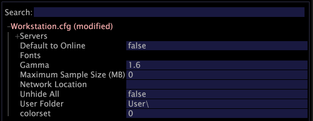

# Konfigurationsoption{#configuration-option}

Mit der Option Konfiguration wird Ihre Datei Insight.cfg geöffnet, die Ihre Verbindungen zu verschiedenen Servern steuert.

**Bearbeiten der Datei Insight.cfg**

1. Ändern Sie die Parameter im Fenster [!DNL Insight.cfg] nach Bedarf. Detaillierte Beschreibungen der Parameter in der Datei [!DNL Insight.cfg] finden Sie unter [Insight-Konfigurationsparameter](../../../home/c-get-started/c-insght-config-param.md#concept-14da97d0756348e885c08ca9e866074b).
1. Klicken Sie zum Speichern Ihrer Konfigurationseinstellungen mit der rechten Maustaste auf **[!UICONTROL Insight.cfg (modified)]** oben im Fenster und klicken Sie auf **[!UICONTROL Save as Insight.cfg]**.

**Hinzufügen neuer Server**

1. Klicken Sie im Fenster [!DNL Insight.cfg] mit der rechten Maustaste auf **[!UICONTROL Servers]** und klicken Sie auf **[!UICONTROL Add new child]** > **[!UICONTROL Server]**.

   

1. Vervollständigen oder ändern Sie die Serverparameter, um der Data Workbench Zugriff auf den gewünschten Server zu gewähren. Detaillierte Beschreibungen der Parameter in der Datei [!DNL Insight.cfg] finden Sie unter [Insight-Konfigurationsparameter](../../../home/c-get-started/c-insght-config-param.md#concept-14da97d0756348e885c08ca9e866074b).
1. Wiederholen Sie Schritt 1 und Schritt 2 für jeden Server, zu dem Sie eine Verbindung konfigurieren möchten.
1. Klicken Sie zum Speichern Ihrer Konfigurationseinstellungen mit der rechten Maustaste auf **[!UICONTROL Insight.cfg (modified)]** oben im Fenster und klicken Sie auf **[!UICONTROL Save as Insight.cfg]**.

Data Workbench versucht, mithilfe der von Ihnen angegebenen Einstellungen eine Verbindung zu den Servern herzustellen. Wenn eine Verbindung hergestellt wurde, wird in [!DNL Servers Manager] ein grüner Knoten angezeigt, wie unten dargestellt. Wenn die Data Workbench keine Verbindung zum Server herstellen kann, wird ein roter Knoten angezeigt.

