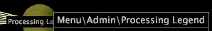

# Anzeigen von Knotendetails{#view-node-details}

Informationen zum Anzeigen von Identifizierungsinformationen zu einer Profil-Komponente.

* Klicken Sie mit der rechten Maustaste auf den gewünschten Knoten und Ansicht der Identifizierungsinformationen oben im Fenster. Die angezeigten Identifizierungsinformationen hängen vom Typ der Komponente ab.

**Protokollquelle**

Der Name der Protokollquelle und der Name der Datei, in der die Protokollquelle definiert ist.

**Feld**

Der Name des Felds.

**Umwandlung**

Der Typ und der Name der Transformation, der Name der Datei, in der die Transformation definiert ist, und die Nummer der Transformation in der Datei.

>[!NOTE]
>
>Leistungsinformationen für die Transformation werden nur angezeigt, wenn die Option [!DNL Show Performance Data] für die Abhängigkeitszuordnung aktiviert ist. Weitere Informationen finden Sie unter [Anzeigen von Leistungsdaten](../../../../../home/c-get-started/c-admin-intrf/c-dataset-mgrs/c-dep-maps/c-disp-perf-data.md#concept-974e2bac3e184f0dab530e63aa4f5ecb).

**Erweiterte Dimension**

Name und Typ der erweiterten Dimension, Name der Datei, in der die Dimension definiert ist, und Nummer der Dimension in der Datei.

>[!NOTE]
>
>Leistungsinformationen für die erweiterte Dimension werden nur angezeigt, wenn die Option [!DNL Show Performance Data] für die Abhängigkeitszuordnung aktiviert ist. Weitere Informationen finden Sie unter [Anzeigen von Leistungsdaten](../../../../../home/c-get-started/c-admin-intrf/c-dataset-mgrs/c-dep-maps/c-disp-perf-data.md#concept-974e2bac3e184f0dab530e63aa4f5ecb).

**Metrik**

Der Name der Metrik.

**Abgeleitete Dimension**

Der Name der abgeleiteten Dimension.

**Filter**

Wenn im Datensatz definiert, der Pfad der Konfigurationsdatei, in der der Filter definiert ist, und der Name des Filters.

**Arbeitsbereiche und Berichte**

Der Pfad der Arbeitsfläche oder des Berichts im Arbeitsbereich- oder Berichtsordner des Profils.

**Menüoptionen**

Der Pfad des Menüelements im Menü-Verzeichnis des Profils.

**So Ansicht von Ein- oder Ausgängen für eine Profil-Komponente**

* Klicken Sie mit der rechten Maustaste auf den gewünschten Knoten und klicken Sie auf **[!UICONTROL Inputs]** oder **[!UICONTROL Outputs]**. Es wird eine Liste von Ein- und Ausgängen angezeigt.
