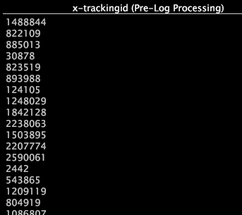

# Feld-Viewer{#field-viewer}

Ein Feld-Viewer ist eine Tabelle mit den Werten eines oder mehrerer Datenfelder.

Die Felder, deren Werte angezeigt werden, sind Eingaben oder Ausgaben der Protokollquellen, Transformationen oder erweiterten Dimensionen eines Datensatzes. Der Name des Felds wird in der Spaltenüberschrift angezeigt, und jede Zeile enthält den Wert des Felds für eine einzelne Zeile mit Quelldaten. Da Sie mit field-Viewern die Werte eines Felds sehen können, sind diese beim Schreiben und Testen [regulärer Ausdrücke](../../../../../home/c-dataset-const-proc/c-reg-exp.md#concept-070077baa419475094ef0469e92c5b9c)hilfreich.

Sie können einen field Viewer als Callout aus einer [!DNL Transformation Dependency] Map oder als Standalone-Visualisierung aus dem [!DNL Admin] Menü öffnen:

* Erstellen eines field Viewers aus einer [!DNL Transformation Dependency] Map. Wenn Sie einen field Viewer von einer [!DNL Transformation Dependency] Map aus öffnen, wird der Viewer automatisch basierend auf der Protokollquelle, Transformation oder Dimension gefüllt, auf die Sie mit der rechten Maustaste klicken. Bei einer Protokollquelle oder einer Transformation sind die Felder im Viewer Eingaben oder Ausgaben der Protokollquelle oder Transformation. Bei einer Dimension sind die Felder Eingaben der Dimension. Sie können Felder nach Bedarf hinzufügen und entfernen.

* Erstellen eines field Viewers als Standalone-Visualisierung. Wenn Sie einen Feld-Viewer als eigenständige Visualisierung öffnen, können Sie eine [!DNL Log Processing Field Viewer] oder eine [!DNL Transformation Field Viewer]erstellen. Der Viewer ist leer und Sie müssen die gewünschten Felder zum Viewer hinzufügen. Für einen [!DNL Log Processing Field Viewer]Vorgang können Sie Felder aus der [!DNL Log Processing.cfg] Datei oder einer beliebigen [!DNL Log Processing Dataset Include] Datei hinzufügen. Für einen [!DNL Transformation Field Viewer]Vorgang können Sie Felder aus der [!DNL Transformation.cfg] Datei oder einer beliebigen [!DNL Transformation Dataset Include] Datei hinzufügen.

>[!NOTE]
>
>Feld-Viewer sind keine Tabellenvisualisierungen; Sie haben daher nicht die Eigenschaften, die mit Tabellen verknüpft sind.

Weitere Informationen zum Hinzufügen und Entfernen von Feldern und zum Filtern in einem Feld-Viewer finden Sie unter [Verwaltungsschnittstellen](../../../../../home/c-get-started/c-admin-intrf/c-admin-intrf.md#concept-855c1a91e1a948969fab592adca15f74).
