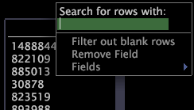

# Filtern in einem Feld-Viewer{#filter-within-a-field-viewer}

Sie können die in einem Feld-Viewer angezeigten Werte filtern, indem Sie nach einem bestimmten Text suchen oder leere Zeilen herausfiltern.

**So filtern Sie in einem Feld-Viewer**

1. Klicken Sie mit der rechten Maustaste in die Spalte des Felds, dessen Werte Sie suchen möchten.
1. I

   Geben Sie im Textfeld unter [!DNL Search for rows with] den zu suchenden Text ein. Sie können auch reguläre Ausdruck für die Musterzuordnung eingeben.

Feldwerte, die den Text enthalten oder dem regulären Ausdruck entsprechen, werden im Feld-Viewer angezeigt. Wenn die Suchergebnisse angezeigt werden, wird der Spaltenname rot markiert.

Weitere Informationen zu regulären Ausdrücken finden Sie im Handbuch *Konfiguration von Datasets*.

**So filtern Sie leere Zeilen aus**

* Klicken Sie mit der rechten Maustaste in die Spalte für das Feld, für das Sie leere Zeilen herausfiltern möchten, und klicken Sie auf **[!UICONTROL Filter out blank rows]**.

Wenn diese Option aktiviert ist, wird links neben der Option ein X angezeigt, und der Spaltenname wird rot markiert.
