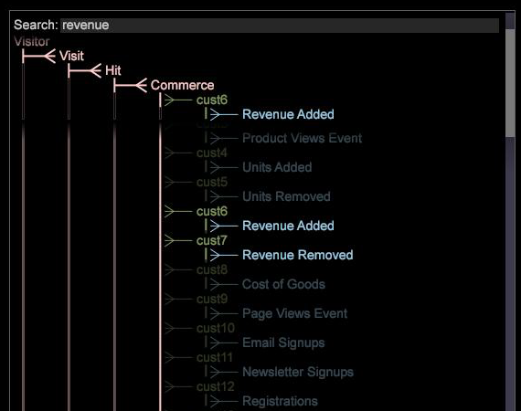

# Oberfläche zum Datensatzschema{#dataset-schema-interface}

Die DataSet-Schema-Oberfläche zeigt die erweiterten Dimensionen (zählbare, einfache, viele- zu viele-, numerische, denormale und Zeitdimensionen) an, die in jeder Konversions-Datensatzkonfigurationsdatei definiert sind, und stellt eine Ansicht der Beziehungen zwischen diesen Dimensionen bereit.

Darüber hinaus zeigt die [!DNL Dataset Schema]-Schnittstelle alle von Ihnen definierten abgeleiteten Dimensionen sowie alle erweiterten Dimensionen, die für das Ausblenden konfiguriert sind.

>[!NOTE]
>
>Sie können im Schema-Diagramm nach Dimensionen suchen. Der Name der Dimensionen, die von der Suchzeichenfolge gefunden werden, wird hervorgehoben, und die Zeilen der übergeordneten Klasse ändern die Farbe für alle Treffer, die in den Untergeordnet untergeordneten Dimensionen gefunden werden. Die zählbaren Dimensionen bleiben beim Bildlauf sichtbar, um eine sichtbare Hierarchie und einen Kontext zu bieten.

**So interpretieren Sie einen Dimensionstyp mithilfe der  [!DNL Dataset Schema] Oberfläche**

In der folgenden Tabelle werden die Dimensionstypen und die Farbtypen, in denen ihre Namen in der [!DNL Dataset Schema]-Schnittstelle angezeigt werden, Liste. Übergeordnete Elemente für die Musterabmessungen (aus dem obigen Beispiel) werden ebenfalls vermerkt.

<table id="table_CF888522626E49A4A10D87085CAB5CC1"> 
 <thead> 
  <tr> 
   <th colname="col1" class="entry"> Dimension </th> 
   <th colname="col2" class="entry"> Farbe </th> 
   <th colname="col3" class="entry"> Dimension und Übergeordnetes Beispiel </th> 
  </tr> 
 </thead>
 <tbody> 
  <tr> 
   <td colname="col1"> Zählbar </td> 
   <td colname="col2"> Rosa </td> 
   <td colname="col3"> 
Besucher - In diesem Schema ist Besucher eine zählbare Dimension für die Stammebene. 
 
Sitzung - übergeordneter Besucher 
 </td> 
  </tr> 
  <tr> 
   <td colname="col1"> Denormal </td> 
   <td colname="col2"> Gelb </td> 
   <td colname="col3"> DenormalPage - parent ist Page-Ansicht </td> 
  </tr> 
  <tr> 
   <td colname="col1"> Abgeleitet </td> 
   <td colname="col2"> Blau </td> 
   <td colname="col3"> Nächste Seite - übergeordnetes Element ist Ansicht der Seite </td> 
  </tr> 
  <tr> 
   <td colname="col1"> Viele-zu-viele </td> 
   <td colname="col2"> Rosa und Grün (Der Stamm des übergeordneten Elements ist rosa, während der Dimensionsname grün ist.) </td> 
   <td colname="col3"> Suchbegriff - übergeordnetes Element ist Sitzung </td> 
  </tr> 
  <tr> 
   <td colname="col1"> Numerisch </td> 
   <td colname="col2"> Grün </td> 
   <td colname="col3"> Exakte Seitendauer - übergeordnetes Element ist die Ansicht der Seite. In diesem Beispiel ist "Exakte Seitendauer"eine verborgene numerische Dimension. Siehe Dimensionstyp "Ausgeblendet"in dieser Tabelle. </td> 
  </tr> 
  <tr> 
   <td colname="col1"> Einfach </td> 
   <td colname="col2"> Grün </td> 
   <td colname="col3"> Seite - übergeordnetes Element: Ansicht der Seite </td> 
  </tr> 
  <tr> 
   <td colname="col1"> Zeit </td> 
   <td colname="col2"> Grün </td> 
   <td colname="col3"> Stunde - übergeordnetes Element ist Sitzung </td> 
  </tr> 
  <tr> 
   <td colname="col1"> Verborgen </td> 
   <td colname="col2"> Ausgeblendete Dimensionen sind eine dunklere Version der entsprechenden Farbe des Dimensionstyps. Eine verborgene numerische Dimension ist beispielsweise ein dunklerer, weniger helles Grün. </td> 
   <td colname="col3"> Exakte Seitendauer - übergeordnetes Element ist die Ansicht der Seite </td> 
  </tr> 
 </tbody> 
</table>

Weitere Informationen zu diesen Dimensionstypen finden Sie im *Handbuch zur Konfiguration von Datasets*.

**So zeigen Sie die Standardvisualisierung für eine Dimension an**

* Klicken Sie in der [!DNL Dataset Schema]-Schnittstelle auf die gewünschte Dimension. Die Standardvisualisierung wird angezeigt. Wenn die Standardvisualisierung beispielsweise eine Tabelle mit Sitzungen und der ausgewählten Dimension ist und Sie auf die URI-Dimension klicken, zeigt Data Workbench eine Tabelle mit URI nach Sitzungen an.

   >[!NOTE]
   >
   >Wenn Sie die angezeigte Standardvisualisierung ändern möchten, finden Sie weitere Informationen unter [Benutzeroberfläche des Dataset-Schemas](../../../home/c-get-started/c-admin-intrf/c-dtst-sch-intrf.md#concept-e147b3a5b542453ca2b121e1c85bb175).

**So zeigen Sie eine bestimmte Visualisierung für eine Dimension an**

* Klicken Sie in der [!DNL Dataset Schema]-Schnittstelle mit der rechten Maustaste auf die gewünschte Dimension und klicken Sie auf **[!UICONTROL Add Visualization]** > *&lt;**[!UICONTROL visualization type]***.
