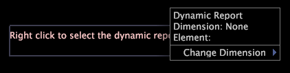

# Anmerkungen in Form dynamischer Titel{#dynamic-title-annotations}

{{eol}}

Mithilfe von Berichten können Sie Berichte dynamisch für die Dimensionselemente generieren, die Sie in einer Lookup-Datei angeben, oder für eine bestimmte Anzahl von Dimensionselementen, z. B. für Benutzer mit den 10 höchsten Bestellzahlen.

Mithilfe einer dynamischen Titelanmerkung können Sie einen Titel in einem dynamischen Bericht anzeigen, der entweder den Namen des Dimensionselements angibt, das derzeit von [!DNL Report] oder den Namen des Dimensionselements, das Sie zur Ansicht ausgewählt haben. Mit dynamischen Anmerkungen zu Titeln können Sie ermitteln, welche Elementdaten im Bericht angezeigt werden, ohne andere Visualisierungen zu ändern oder versehentlich eine Auswahl nach einem bestimmten Element zu sortieren.

>[!NOTE]
>
>Diese Funktion ist nur verfügbar, wenn Sie eine Lizenz erworben haben [!DNL Report]. Weitere Informationen finden Sie unter [!DNL Report], siehe *Data Workbench-Berichtanleitung*.

Weitere Informationen zum dynamischen Generieren von Berichten finden Sie unter *Anleitung zu Insight-Berichten*.

**So richten Sie eine dynamische Titelanmerkung ein**

* Klicken Sie mit der rechten Maustaste in die dynamische Titelanmerkung und klicken Sie auf **[!UICONTROL Change Dimension]** > *&lt;**[!UICONTROL dimension name]**>*.

   

* Um die Informationen zu einem bestimmten Element anzuzeigen, klicken Sie auf **[!UICONTROL Change Element]** und klicken Sie auf das gewünschte Element, um eine Vorschau des Berichts für dieses Element anzuzeigen.

   

   **Exportieren in Microsoft Excel**

   Informationen zum Exportieren von Fenstern finden Sie unter [Exportieren von Fensterdaten](../../../../home/c-get-started/c-wk-win-wksp/c-exp-win-data.md#concept-8df61d64ed434cc5a499023c44197349).
