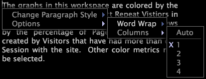

# Textkommentare{#text-annotations}

Textannotationen sind Fenster, in die Sie beliebigen Text eingeben können, um beschreibende Informationen oder Kommentare zu einem Arbeitsbereich hinzuzufügen.

Sie können Textannotationen in einem Arbeitsbereich auf dieselbe Weise verschieben oder bearbeiten wie andere Visualisierungen. Sie können auch das Erscheinungsbild des Textes sowie den Namen, die Bearbeitung oder das Speichern von Textanmerkungen, die Sie zu einem Arbeitsbereich hinzufügen, formatieren. Textanmerkungen können auch nach Microsoft Excel exportiert und von [!DNL Report]dort generiert und verteilt werden.

Weitere Informationen finden Sie [!DNL Reports]im *Insight Report Guide*.

## Text hinzufügen oder bearbeiten {#section-8ecc44e0eeb24c5990050102013c0aed}

* Klicken Sie im Textkörper, um in den Bearbeitungsmodus zu wechseln und mit der Eingabe zu beginnen.

   >[!NOTE]
   >
   >Textannotationen unterstützen grundlegende Bearbeitungsfunktionen wie Ausschneiden (Strg+x), Kopieren (Strg+c), Einfügen (Strg+v), Rückgängigmachen (Strg+Z), Wiederholen (Strg+Umschalt+Z), Auswählen von Abschnitten (Klicken+Ziehen) und Auswählen aller Elemente (Strg+a). Siehe [Arbeiten mit Text in Windows](../../../../home/c-get-started/c-wk-win-wksp/c-work-text-win.md#concept-f1222434bf954767808e94b955945c8d).

## Formatierung auf Absätze anwenden {#section-27744c1589134aa3918aa8787429c0dc}

1. Klicken Sie im Textkörper mit der rechten Maustaste auf den Absatz, den Sie formatieren möchten.
1. Klicken Sie auf **[!UICONTROL Change Paragraph Style]** > *&lt;**[!UICONTROL text style]**>*.

## Formatierung auf Auswahlen anwenden {#section-4032ecbcc0064e5c96504c15b6f481bf}

1. Klicken Sie im Textkörper auf + Ziehen, um den zu formatierenden Text auszuwählen.
1. Klicken Sie mit der rechten Maustaste auf die Auswahl und klicken Sie auf **[!UICONTROL Change Selection Style]** > *&lt;**[!UICONTROL text style]**>*.

## Ändern der Einstellungen für den Zeilenumbruch {#section-56948687d47349fc8ba21e108fd13cc1}

Diese Option steuert, ob und wie der Text in der Anmerkung um die Visualisierungen im Arbeitsbereich umgebrochen wird.

* Klicken Sie mit der rechten Maustaste in den Textkörper, klicken Sie auf **[!UICONTROL Options]** > **[!UICONTROL Word Wrap]**, und klicken Sie dann auf die gewünschte Option:

   * **Keine:** Mit dieser Option wird das Umbrechen von Wörtern aus dieser Anmerkung entfernt.
   * **Beide Seiten:** Mit dieser Option kann der Text in der Anmerkung beide Seiten von Visualisierungen im Arbeitsbereich umschließen.
   * **Beste Seite:** Mit dieser Option kann der Text in der Anmerkung nur um eine Seite der Visualisierungen im Arbeitsbereich umgebrochen werden.

## Spalteneinstellungen ändern {#section-5cd3f3d63cf64119a2fcec371e33b734}

Diese Option steuert die Anzahl der Spalten, in denen der Text in der Anmerkung angezeigt werden soll.

* Klicken Sie mit der rechten Maustaste in den Textkörper, klicken Sie auf **[!UICONTROL Options]** > **[!UICONTROL Columns]**, und klicken Sie dann auf die gewünschte Option:

   * **Auto:** Mit dieser Option wird das für die Breite und Länge des Textes am besten geeignete Spaltenlayout ausgewählt.
   * **1-4:** Mit diesen Optionen können Sie den Text in einer, zwei, drei oder vier Spalten anzeigen.

## Nach Microsoft Excel exportieren {#section-b239057b822348849fd17a83c3a03c22}

Informationen zum Exportieren von Fenstern finden Sie unter [Exportieren von Fensterdaten](../../../../home/c-get-started/c-wk-win-wksp/c-exp-win-data.md#concept-8df61d64ed434cc5a499023c44197349).
