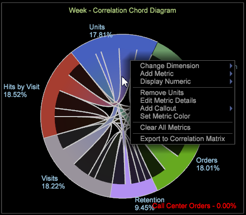

# Chord-Visualisierung{#chord-visualization}

{{eol}}

Mit der Chord-Visualisierung können Sie sowohl den Anteil als auch die Korrelation zwischen Metriken anzeigen, indem Sie größere Akkorde als Hinweis auf eine stärkere Korrelation anzeigen.

Mit der Chord-Visualisierung können Sie Korrelationen zwischen Metriken identifizieren, sodass Sie mögliche Korrelationen hinzufügen und einfach auswerten können. Sie bietet außerdem eine weitere Ansicht von bereits erstellten [Korrelationsmatrix](https://experienceleague.adobe.com/docs/data-workbench/using/client/analysis-visualizations/correlation-analysis/c-correlation-analysis.html). Mit der Chord-Visualisierung können Sie keine positive oder negative Korrelation zwischen den Metriken identifizieren - nur, dass eine Korrelation vorhanden ist. In bestimmten Fällen kann die Bestimmung einer direkten oder umgekehrten Beziehung durch Anwendung von Zählermetriken identifiziert werden.

1. **Öffnen Sie die **[!UICONTROL Chord]**Visualisierung**.

   Klicken Sie im Arbeitsbereich mit der rechten Maustaste auf [!DNL Visualization > Predictive Analytics > Chord].

1. **Eine Dimension aus dem Menü auswählen**.

   Daraufhin wird eine leere Visualisierung geöffnet, in der Sie eine Dimension auswählen können. Der Dimensionsname wird oben in der leeren Akkordvisualisierung angezeigt.

   >[!NOTE]
   >
   >Wenn Sie bereits eine Korrelationsmatrix im Arbeitsbereich geöffnet haben, können Sie sie auch als Chord-Visualisierung rendern.

1. **Zu korrelierende Metriken auswählen**.

   Ziehen Sie Metriken aus der **[!UICONTROL Finder]** durch Klicken auf **[!UICONTROL Ctrl-Alt]** , um Metriken aus der Tabelle in das Diagramm zu ziehen. Nachdem zwei oder mehr Metriken ausgewählt wurden, wird das Diagramm automatisch aktualisiert und zeigt Korrelationsdaten an. Fügen Sie nach Bedarf weitere Metriken hinzu, um Datenpunkte zu korrelieren.

   

   Die Chord-Visualisierung zeigt den Anteil des Ganzen an, der durch den Bereich jedes Segments dargestellt wird. Fügen Sie nach Bedarf weitere Metriken hinzu, um wichtige Beziehungen zu identifizieren und zu untersuchen.

   

1. **Chord-Visualisierung anzeigen**.

   Bewegen Sie den Mauszeiger über die einzelnen Metriken in der Visualisierung, um die Beziehungen anzuzeigen. Im Beispiel wird eine Korrelation zwischen Einheiten und den meisten anderen Metriken angezeigt (mit Ausnahme der **Besuchsdauer** Metrik).

   

   Wenn Sie den Mauszeiger über die **Besuchsdauer** Metrik in der Chord-Visualisierung verwenden, können Sie sehen, dass nur sehr wenig oder höchstens schwache Korrelation zwischen allen anderen Metriken besteht.

   

1. **Einstellungen ändern.** Klicken Sie mit der rechten Maustaste auf die Chord-Visualisierung, um ein Menü zum Ändern der Dimension zu öffnen, die Dimensionen als absolute Zahlen oder Prozentwerte anzuzeigen, die ausgewählte Metrik oder alle Metriken zu entfernen, Farben und Details zu bearbeiten und Werte in eine Korrelationsmatrix zu exportieren.

   
