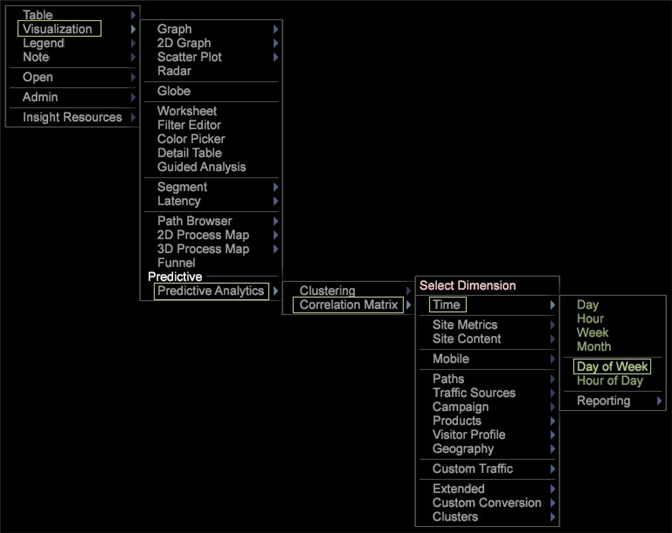
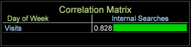
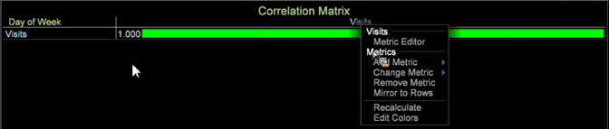

# Korrelationsmatrix{#correlation-matrix}

Statistische Korrelationen messen aussagekräftige Beziehungen, um Chancen durch fortschrittliches Data Mining zu identifizieren.

Mithilfe des Korrelationskoeffizienten [Persons](../../../../home/c-get-started/c-analysis-vis/c-correlation-analysis/c-correlation-pearsons.md#concept-5996cb8c89fd4df5b47b7318e7a1d29c) erhalten Sie in der Korrelationsmatrix relevante Informationen, um die nächsten Schritte in einer Marketing-Kampagne besser zu identifizieren, das Site-Design zu verbessern oder die umfassende Kundenanalyse für zusätzliche Korrelationsabhängigkeiten fortzusetzen.

## Erstellen einer Korrelationsmatrix {#section-87ed12ccc1af4196a1b6534e621c4cbb}

Die Korrelationsmatrix vergleicht Metriken über eine zählbare oder nicht zählbare Dimension. Die Matrix kann dann geändert werden, um Korrelationen innerhalb der Visualisierung durch Farbauswahl hervorzuheben oder als Textkarte, Heatmap oder beides zu rendern.

1. Öffnen Sie eine Korrelationsmatrix.

   Rechtsklick [!DNL Visualization] > [!DNL Predictive Analytics] > [!DNL Correlation Matrix]. Die Dimensionstabelle wird geöffnet.

   

   Wählen Sie eine Dimension aus diesem Menü aus, z. B. [!DNL Time] > [!DNL Day of the Week] . Die Korrelationstabelle wird geöffnet, wobei die Dimension in der Ecke der Matrix identifiziert und die zugehörige Metrik in der Zeile und Spalte platziert wird. Für die Dimension Wochentag ist **[!UICONTROL Visits]** die zugehörige Metrik.

   

   Die Korrelation beträgt 1.000, da Sie eine Metrik mit sich selbst vergleichen (was eine perfekte, aber unbrauchbare Korrelation widerspiegelt).

1. Ändern Sie eine der Metriken.

   Klicken Sie mit der rechten Maustaste und wählen Sie **[!UICONTROL Change Metric]** aus, um eine Metrik in der Zeile oder Spalte zu ändern. Dadurch wird eine Korrelation zwischen zwei Wertmetriken hergestellt.

   Ändern Sie für dieses Beispiel die Metrik **[!UICONTROL Visits]** in der Spalte in **[!UICONTROL Internal Searches]**. Klicken Sie mit der rechten Maustaste und wählen Sie [!DNL Metric] > [!DNL Custom Events] > [!DNL Custom Event 1-10] > [!DNL Internal Searches] aus.

   

1. Fügen Sie der Korrelationsmatrix weitere Metriken hinzu.

   Klicken Sie mit der rechten Maustaste in eine Metrikspalte oder -zeile. Fügen Sie beispielsweise im Menü Metrik [!DNL Metric] > [!DNL Custom Events] > [!DNL Custom Event 1-10] > [!DNL Sign in Error] hinzu.

   

   Die neue Metrik wird in einer Spalte mit einer Korrelationsnummer angezeigt. Sie können weitere Metriken hinzufügen, z. B. **[!UICONTROL Email Signups]**, um die Tabelle zu erstellen.

   

   Oder fügen Sie Zeilen Metriken hinzu, um sie mit Metriken in Spalten zu vergleichen.

   

1. (Optional) Halten Sie eine Metrik ein, indem Sie ein Dimensionselement hinzufügen.

   Klicken Sie mit der rechten Maustaste in den Arbeitsbereich und wählen Sie **[!UICONTROL Table]** aus. Drücken Sie in der Tabelle &quot;Offene Dimension&quot;Strg+Alt und ziehen Sie das Element auf eine Metrik in einer Spalte oder Zeile. Das Element wird neben der Metrik in eckigen Klammern angezeigt.

   Beispielsweise können Sie die Metrik **[!UICONTROL Visits]** einschränken, indem Sie **[!UICONTROL Country]** als **[!UICONTROL New Zealand]** auswählen.

   

   Beachten Sie, dass sich bei der Auswahl eines Dimensionselements die Korrelation in allen Metriken basierend auf dem ausgewählten Dimensionselement ändert. Nur die Besuchsmetrik wird für &quot;Neuseeland&quot;eingeschränkt, sobald das Dimensionsfenster geschlossen wird.

   >[!NOTE]
   >
   >Wenn Sie eine Metrik mit einer Dimensionsbegrenzung ändern (durch Rechtsklicken und Auswählen von **[!UICONTROL Change Metric]**), geht das Dimensionselement, das die Metrik einschränkt, verloren. Sie müssen das Dimensionselement erneut hinzufügen.

1. Erstellen Sie einen [Binärfilter](../../../../home/c-get-started/c-analysis-vis/c-correlation-analysis/c-correlation-binary-filter.md#concept-24e1daff43c540f69019f236976da31c) , um die Metrik weiter einzuschränken. Klicken Sie mit der rechten Maustaste auf die Metrik in der Tabelle und wählen Sie im Menü Binärfilter aus.

## Korrelationsplanung und Analyseziele {#section-cc322da60b7e417ba29e72b0afeb6f79}

Im Folgenden finden Sie allgemeine Ziele zum Erstellen einer Korrelationsmatrix.

**Identifizieren Sie die Beziehung zwischen zwei Metriken mit einer bestimmten Dimension**. In diesem Beispiel wurde die Matrix auf der Kerndimension Wochentag mit den Metriken Besuch, E-Mail-Anmeldungen und Sign-In-Fehler im Vergleich zu internen Suchvorgängen, Anmeldungen und aufgezeigten Survey -Metriken erstellt.

**Entwickeln Sie Hypothesen, um die Analyse** zu fokussieren. Nach der Durchführung einer Korrelationsanalyse besteht der nächste Schritt darin, nach Abhängigkeiten und Korrelationen der Metriken zu suchen. Wenn Sie beispielsweise wissen, dass interne Suchvorgänge sich auf E-Mail-Anmeldungen auswirken, können Sie über einen Pfad diese Beziehung vorhersagen und Marketingkampagnen oder das Navigationsdesign einer Website ändern.

**Identifizieren Sie Metriken, um erweiterte Data-Mining-Algorithmen** einzubeziehen. In den meisten Fällen werden die Schlüsselmetriken identifiziert, da sie mehrere Korrelationen beeinflussen. Sie können diese Schlüsselmetriken nun verwenden und sie auf zusätzliche Data-Mining-Analysen anwenden, um tiefere Einblicke zu erhalten.

## Korrelationsmatrix - Funktionsnotizen {#section-ef3626c665ea468a9ecdad624b4132f5}

**Das Filtern und Auswählen von Dimensionselementen in einer Tabelle erfolgt im Vergleich zu Werten**. Wenn Sie beispielsweise die Dimension Wochentag verwenden und dann auf ein Element dieser Kerndimension klicken, z. B. auf einen bestimmten Tag in der Dimensionstabelle Wochentag klicken, wird eine 1:1-Übereinstimmung zu 100 % gerendert, was keine brauchbare Korrelation bietet. Da die Hauptdimension Tag der Woche war, ändert sich bei jeder Auswahl innerhalb der Dimensionstabelle Tag der Woche die Matrix in eine Eins-zu-Eins-Korrelation.

Die 1:1-Korrelation (wenn eine einzelne Auswahl aus allen Elementen besteht) ist jedoch nur an diesem bestimmten Tag verfügbar. Wenn Sie mehrere Auswahlen vornehmen, bleibt diese nicht notwendigerweise eine 1:1-Korrelation und liefert nicht immer eine 100-prozentige Übereinstimmung, unabhängig von der Auswahl von 1 oder 1+ Tagen der Woche.

**Statistische Korrelationen sind nicht mit dem korrelierten Datenmodell** identisch, dem historischen Verweis von Adobe Analytics-Produkten. Die statistische Korrelation in Data Workbench basiert auf dem [Pearson-Korrelationsmodell](../../../../home/c-get-started/c-analysis-vis/c-correlation-analysis/c-correlation-pearsons.md#concept-5996cb8c89fd4df5b47b7318e7a1d29c).

**Korrelation in einem Streudiagramm anzeigen**. Klicken Sie mit der rechten Maustaste auf den Titel auf einem Streudiagramm und wählen Sie [!DNL Display Correlation] aus dem Menü [!DNL Visualization] aus. Der Korrelationswert wird oben rechts im Streudiagramm angezeigt.

>[!NOTE]
>
>In der Streudiagramm- und Persons-Matrix wird &quot;Berechnungsfehler&quot;angezeigt, wenn die Anwendung die Berechnung der Persons-Korrelation nicht ausführen kann. Dies liegt normalerweise an unzureichenden Daten, was dazu führen kann, dass die Gleichung versucht, sie durch 0 zu teilen.
