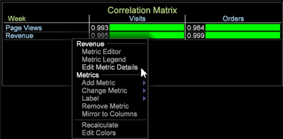

# Binärfilter in der Korrelationsmatrix{#binary-filter-in-the-correlation-matrix}

Mit einem binären Filter in der Korrelationsmatrix können Sie Werte für eine oder beide korrelierte Metriken einschränken, um den Vergleich besser zu fokussieren.

So legen Sie einen Binärfilter für eine Korrelationsmatrix fest:

1. Klicken Sie in der Korrelationsmatrix mit der rechten Maustaste auf einen Metriknamen.
1. Wählen Sie **Metrikdetails bearbeiten** aus.

   

   Das Fenster **[!UICONTROL Edit Correlation Metric Details]** wird geöffnet.

   

1. Richten Sie einen Binärfilter ein.

   Klicken Sie zunächst auf die Einstellung **[!UICONTROL Inactive]** . Es wird umgeschaltet, den Filter auf **[!UICONTROL Active]** festzulegen und die Felder **Vergleich** und **Wert** anzuzeigen.

   Wählen Sie dann einen **[!UICONTROL Comparison]** -Operator und legen Sie dessen **[!UICONTROL Value]** fest, um einen Filter für die ausgewählte Metrik einzurichten.

>[!IMPORTANT]
>
>Der Binärfilter für Data Workbench 6.2 wurde mit neuen Funktionen aktualisiert, sodass Sie jede Korrelationsmatrix mit einem in früheren Versionen erstellten Binärfilter neu erstellen müssen.

## Hinzufügen von Dimension-Elementen {#section-f19f4e0368ca488e92d1e28bcc24417c}

Sie können auch ein Dimensionselement hinzufügen, um eine Metrik einzuschränken. Einer Metrik kann nur ein Element zugeordnet sein.

Klicken Sie mit der rechten Maustaste in den Arbeitsbereich und wählen Sie **Tabelle** aus. Öffnen Sie eine Dimension mit ihren Elementen und ziehen Sie im Fenster Korrelationsmetrikdetails bearbeiten zur Einstellung **[!UICONTROL Element]** oder legen Sie eine Metrik in der Korrelationsmatrix ab.
