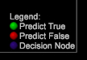

# Entscheidungsstruktur-Optionen{#decision-tree-options}

Das Menü &quot;Entscheidungsstruktur&quot;enthält Funktionen zum Festlegen der positiven Anwendungsfälle, Filter, Blattverteilungsoptionen, Verwirrungsmatrix und anderer erweiterter Optionen.

<table id="table_0CBCCB0856E2469EBE8846B413CAB114"> 
 <thead> 
  <tr> 
   <th colname="col1" class="entry"> Symbolleistenschaltflächen </th> 
   <th colname="col2" class="entry"> Beschreibung </th> 
  </tr>
 </thead>
 <tbody> 
  <tr> 
   <td colname="col1"> Los </td> 
   <td colname="col2"> Klicken Sie auf , um den Algorithmus der Entscheidungsstruktur auszuführen und die Visualisierung anzuzeigen. Dies ist grau ausgegraut, bis Eingaben vorhanden sind. </td> 
  </tr> 
  <tr> 
   <td colname="col1"> Reset </td> 
   <td colname="col2"> Löscht Eingaben und Entscheidungsstruktur und setzt den Prozess zurück. </td> 
  </tr> 
  <tr> 
   <td colname="col1"> Speichern </td> 
   <td colname="col2"><b>Speichern Sie die Entscheidungsstruktur</b>. Sie können die Entscheidungsstruktur in verschiedenen Formaten speichern: 
    <ul id="ul_F7C7836C06D64912893113E8EEA05704"> 
     <li id="li_D2D8451A679243F1BC67C3B80CA5F83F">Predictive Markup Language (<b>PMML</b>), ein XML-basiertes Dateiformat, das von Anwendungen zum Beschreiben und Austauschen von Entscheidungsbaummodellen verwendet wird. </li> 
     <li id="li_88C4B3E050CA4EFC9B7FA8BD446A9C55"><b>Text</b> mit einfachen Spalten und Zeilen mit true oder false, Prozentwerten, Anzahl der Mitglieder und Eingabewerten. </li> 
     <li id="li_3F871B88F3FA41E9B95EFF5A181E3D57">Eine <b>Dimension</b> mit Verzweigungen, die den prognostizierten Ergebniselementen entsprechen. </li> 
    </ul> </td> 
  </tr> 
  <tr> 
   <td colname="col1"> Optionen </td> 
   <td colname="col2"> Siehe Tabelle unten für das Menü Optionen. </td> 
  </tr> 
 </tbody> 
</table>

<table id="table_24D84440D0354C70928E8927624DB255"> 
 <thead> 
  <tr> 
   <th colname="col1" class="entry"> Optionen, Menü </th> 
   <th colname="col2" class="entry"> Beschreibung </th> 
  </tr>
 </thead>
 <tbody> 
  <tr> 
   <td colname="col1"> Positiver Fall festlegen </td> 
   <td colname="col2"> Definiert die aktuelle Arbeitsflächenauswahl als positive Schreibweise des Modells. Löscht die Groß-/Kleinschreibung, wenn keine Auswahl vorhanden ist. </td> 
  </tr> 
  <tr> 
   <td colname="col1"> Populationsfilter einstellen </td> 
   <td colname="col2"> Definiert die aktuelle Workspace-Auswahl als Populationsfilter des Modells und wird von Besuchern gezogen, die diese Bedingung erfüllen. Die Standardeinstellung ist "Alle". </td> 
  </tr> 
  <tr> 
   <td colname="col1"> Beschreibung komplexer Filter anzeigen </td> 
   <td colname="col2"> Zeigt Beschreibungen der definierten Filter an. Klicken Sie auf , um die Filterskripte für den Filter Positive Groß- und Kleinschreibung und Population anzuzeigen. </td> 
  </tr> 
  <tr> 
   <td colname="col1"> Knoten ausblenden </td> 
   <td colname="col2"> Blendet Knoten mit nur einem kleinen Prozentsatz der Bevölkerung aus. Dieser Menübefehl wird nur angezeigt, wenn die Entscheidungsstruktur angezeigt wird. </td> 
  </tr> 
  <tr> 
   <td colname="col1"> Konfusionsmatrix </td> 
   <td colname="col2"> 
Klicken Sie auf  Optionen &gt;  Verwirrungsmatrix , um die Werte für Genauigkeit, Rückruf, Genauigkeit und F-Punktzahl anzuzeigen. Je näher 100 Prozent liegen, desto besser ist das Ergebnis. 
 
Die Verwechslungsmatrix gibt vier Werte für die Genauigkeit des Modells anhand einer Kombination von Werten an: 
     <ul id="ul_D9D512F5D74B44BDBD27B1912DF4CB02"> 
      <li id="li_28C541DF1CB543FEAF2D13C2F329DB52">Tatsächlich positiv (AP) </li> 
      <li id="li_56233006A1544D95A72CE096CA55C1E6">Vorhersage positiv (PP) </li> 
      <li id="li_375FB2D6A0A3418A9AD377C9EBB65386">Tatsächliche Negative (AN) </li> 
      <li id="li_07A5D23A36BA4D448C25C1414836EB8E">Predicted Negative (PN) </li> 
     </ul> 
 
Tipp:  Diese Zahlen werden durch Anwendung des Ergebnisbewertungsmodells der 20 % zurückbehaltenen Testdaten ermittelt, die bereits als wahre Antwort bezeichnet werden. Wenn das Ergebnis größer als 50 Prozent ist, wird es als positiver Fall vorhergesagt (der mit dem definierten Filter übereinstimmt). Dann, Genauigkeit = (TP + TN)/(TP + FP + TN + FN), Recall = TP / (TP + FN) und Precision = TP / (TP + FP). 
 </td> 
  </tr> 
  <tr> 
   <td colname="col1"> Legende anzeigen </td> 
   <td colname="col2">Ermöglicht Ihnen, eine Legende in der Entscheidungsstruktur ein- und auszuschalten. Dieser Menübefehl wird nur angezeigt, wenn die Entscheidungsstruktur angezeigt wird. </td> 
  </tr> 
  <tr> 
   <td colname="col1"> Advanced </td> 
   <td colname="col2"> Klicken Sie auf , um das Menü "Erweitert"zu öffnen, um die Entscheidungsstruktur gründlich zu nutzen. Die Menüoptionen finden Sie in der unten stehenden Tabelle. </td> 
  </tr> 
 </tbody> 
</table>

<table id="table_91E4A74BFB224ABD889147324AC2910F"> 
 <thead> 
  <tr> 
   <th colname="col1" class="entry"> Erweitertes Menü </th> 
   <th colname="col2" class="entry"> Beschreibung </th> 
  </tr>
 </thead>
 <tbody> 
  <tr> 
   <td colname="col1"> Größe des Schulungssatzes </td> 
   <td colname="col2"> 
Steuert die Größe des für die Modellerstellung verwendeten Schulungssatzes. Größere Züge brauchen länger zu trainieren, kleinere Sets brauchen weniger Zeit. 
 </td> 
  </tr> 
  <tr> 
   <td colname="col1"> Eingabe-Normalisierung </td> 
   <td colname="col2"> 
 Ermöglicht dem Benutzer anzugeben, ob die Eingaben im Modell mithilfe der Min-Max- oder Z-Score-Technik normalisiert werden sollen. 
 </td> 
  </tr> 
  <tr> 
   <td colname="col1"> SMOTE-ÜberSampling-Faktor </td> 
   <td colname="col2"> Wenn der positive Fall nicht sehr oft (weniger als 10 Prozent) in der Schulungsprobe auftritt, wird SMOTE verwendet, um zusätzliche Beispiele bereitzustellen. Mit dieser Option kann der Benutzer angeben, wie viele weitere Beispiele mit SMOTE erstellt werden sollen. </td> 
  </tr> 
  <tr> 
   <td colname="col1"> Verteilungsschwellenwert der Leaf-Klasse </td> 
   <td colname="col2"> Ermöglicht Ihnen, den Schwellenwert festzulegen, der während des Baumansatzes für ein Blatt angenommen wird. Standardmäßig müssen alle Mitglieder eines Knotens identisch sein, damit es sich um ein Blatt handelt (vor dem Beschneiden). </td> 
  </tr> 
 </tbody> 
</table>

