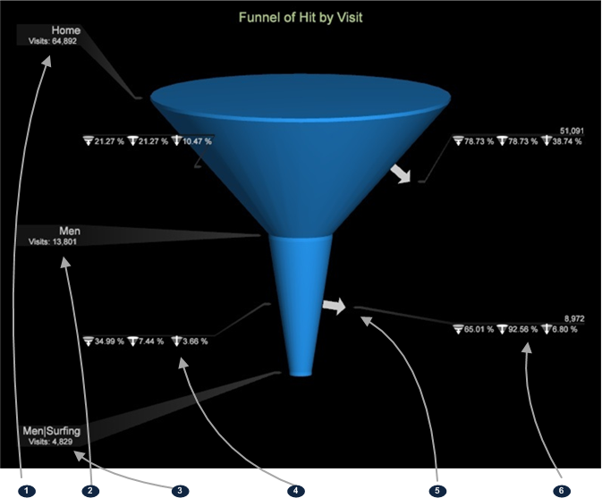

# Trichterfunktionen{#funnel-features}

{{eol}}

Die Trichtervisualisierung umfasst Funktionen zum Erstellen eines Trichters mit mehreren Dimensionen, unformatierten Besucherzahlen, dem Prozentsatz der Besucher bei jedem Schritt und separaten Bereichen.

Hier finden Sie die grundlegenden Funktionen der Trichtervisualisierung.

<table id="table_49A08740CEE74D64B6F9C37CD91F1AE5"> 
 <tbody> 
  <tr> 
   <td colname="col01">  </td> 
   <td colname="col1"> Erstes Element </td> 
   <td colname="col2"> Erster Trichterschritt im Prozess. </td> 
  </tr> 
  <tr> 
   <td colname="col01">  </td> 
   <td colname="col1"> Drittes Element </td> 
   <td colname="col2">Dritter Trichterschritt im Prozess. 

Hinweis: Die ausgewählten Elemente müssen nicht aus derselben Dimension stammen. 

</td> 
  </tr> 
  <tr> 
   <td colname="col01">  </td> 
   <td colname="col1"> Trichteranalyseprozentsatz </td> 
   <td colname="col2"> Prozentsatz, der den definierten Pfad abgeschlossen hat, wird in drei Bereichen angezeigt. </td> 
  </tr> 
  <tr> 
   <td colname="col01">  </td> 
   <td colname="col1"> Fallout-Browser </td> 
   <td colname="col2">Fallout-Pfeil. Klicken Sie mit der rechten Maustaste und wählen Sie  Pfadbrowser hinzufügen um zu sehen, welchen anderen Pfad Besucher eingeschlagen haben. </td> 
  </tr> 
  <tr> 
   <td colname="col01">  </td> 
   <td colname="col1"> Prozent Fallout </td> 
   <td colname="col2">Prozentsätze, die drei Fallout-Bereiche für Benutzer beschreiben, die den Pfad nicht abgeschlossen haben. 
Prozentsätze werden in drei Bereichen dargestellt: 

 Der Prozentsatz des Fallout aus dem Schritt vor diesem Schritt. 

 Der Prozentsatz des Fallout aus dem ersten Schritt im Trichter. 

 Der Prozentsatz des Fallout basierend auf der Gesamtanzahl der Besucher. 
</td> 
  </tr> 
 </tbody> 
</table>

## Trichterschritte {#section-96a6732558dd4740b73541844f06d3ef}

Die Festplatten in einem Trichter stellen die Schritte in der Navigation dar, die Konsolen stellen den Durchbruch von einem Schritt zum nächsten dar und die Pfeile stellen den Fallout dar. Durch Klicken auf einen Kegel werden die Benutzer ausgewählt, die an diesem Punkt durchgefallen sind, und in den aktuellen Workspace-Filter aufgenommen. Durch Klicken auf einen Pfeil werden die Besucher ausgewählt, die abgestürzt sind.

>[!NOTE]
>
>Die Trichtervisualisierung bietet maximal acht Schritte, die angewendet werden können.

## Zusätzliche Trichterfunktionen und -funktionen {#section-22a3582db8114ca8bce77f50bbbf296a}

* **Anpassen von Clip und Ebene des Trichters**. Wählen Sie im Menü Visualisierung die Option Trichter aus. Nachdem der Trichter erstellt wurde, können Sie mit der rechten Maustaste auf den Titel klicken, um den Clip und die Ebene auf eine beliebige zählbare Metrik in Ihrem System anzupassen.

   

* **Mehr Elemente ziehen**. Fügen Sie Ihrem Trichter weitere Elemente hinzu, indem Sie sie per Drag-and-Drop aus der Dimension-Tabelle in den Trichter ziehen und dort ablegen. `<Ctrl>` + `<Alt>` Schlüssel. Sie können mehrere Dimensionen gleichzeitig aus der Tabelle ziehen, indem Sie mehrere Elemente auswählen (mithilfe von `<Ctrl>` + Klicken) und ziehen Sie sie dann mithilfe der `<Ctrl>` + `<Alt>` Schlüssel..
* **Schritt löschen**: Löschen Sie Elemente, indem Sie mit der rechten Maustaste auf den Schritt in der Visualisierung klicken und auf **Ja**.

   

* **Ordnen Sie die Schritte, die Sie zum Trichter gezogen haben, neu an.**. Klicken Sie einfach auf den Schritt, um ihn auszuwählen, und ziehen Sie ihn an eine andere Position, um die Schritte neu anzuordnen.
* **Öffnen eines Pfadbrowsers**. Sie können detailliertere Informationen darüber erhalten, wohin Kunden den Prozess durchlaufen oder verlassen. [Pfad-Browser hinzufügen](../../../../home/c-get-started/c-analysis-vis/c-funnel-visualization/c-path-browser-funnel.md#concept-b0cedf7a28ae422696ded1258c9a4119) Funktion.

* **Weitere Schritte hinzufügen**. Sie können jeder Trichtervisualisierung maximal acht Schritte hinzufügen.
* **Metrik ändern**. Die Metrik kann geändert werden, sodass die Schritte Besuche oder eine andere Metrik bei jedem Schritt zählen. Die verfügbaren Optionen variieren je nach Datensatz.
* **Anzeigen in Tabellenansichten**. Klicken Sie mit der rechten Maustaste auf den Titel, um das Menü &quot;Trichtervisualisierung&quot;anzuzeigen, und klicken Sie auf **[!UICONTROL Show Tabular View]**. In der Tabellenansicht können Sie **[!UICONTROL Show Graph View]** , um zur grafischen Darstellung des Trichters zurückzukehren. Um die Tabellenansicht zu öffnen, klicken Sie mit der rechten Maustaste auf den Titel und wählen Sie im Menü die Option Tabellenansicht anzeigen aus.

* **Sequenzen vergleichen**. Eine effiziente Möglichkeit, zwei ähnliche Sequenzen zu vergleichen, besteht darin, ihre beiden Visualisierungen nebeneinander anzuzeigen. Mit der Funktion Duplizieren können Sie auch die Tabellenansicht und die Diagrammansicht nebeneinander anzeigen. Klicken Sie zum Öffnen mit der rechten Maustaste auf den Titel und wählen Sie im Menü Duplizieren aus.
