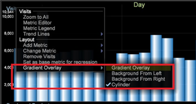

# Ändern der Diagrammanzeige{#change-a-graph-display}

In der Standardeinstellung werden bei Visualisierungen für Diagramme Balken angezeigt. Die Balken können jedoch problemlos als Linien angezeigt werden und umgekehrt.

Beide Anzeigetypen werden im folgenden Beispiel gezeigt.

**So wählen Sie den Anzeigetyp aus**

Klicken Sie mit der rechten Maustaste auf die Dimensionsbeschriftung am unteren Rand des Diagramms und klicken Sie auf **[!UICONTROL Display]** > **[!UICONTROL Draw lines]** oder **[!UICONTROL Display]** > **[!UICONTROL Draw bars]**. Ein X wird links neben dem aktiven Anzeigemodus angezeigt.

**Verlaufsüberlagerung auf einem Diagramm**

Sie können mit der rechten Maustaste klicken und eine **Verlaufsüberlagerung** aus dem Menü auswählen, um die Diagrammelemente besser zu Ansichten.

* **Keine Verlaufsüberlagerung**. Wählen Sie diese Option, um Balken ohne angewendete Verlaufsüberlagerung anzuzeigen.
* **Hintergrund von links**. Wählen Sie diese Option, um die Farbabstufung über alle Balken von links nach rechts anzuzeigen.
* **Hintergrund von rechts**. Wählen Sie diese Option, um die Farbabstufung über alle Balken von rechts nach links anzuzeigen.
* **Zylinder**. Wählen Sie diese Option, um die Farbabstufung von der Mitte der einzelnen Balken bis zum Rand der einzelnen Balken anzuzeigen.
