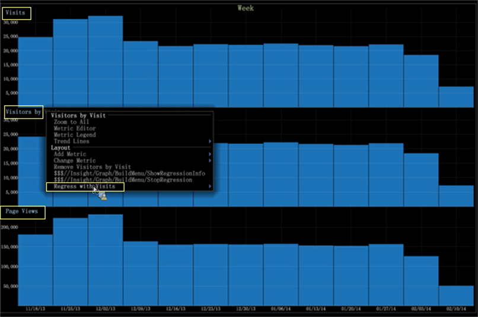

# Regression Analysis Graph{#regression-analysis-graph}

Das Balkendiagramm in Data Workbench enthält jetzt einen Regressionsvergleich für mehrere Metriken über mehrere Diagramme hinweg.

[Mit Balkendiagrammen](https://docs.adobe.com/content/help/en/data-workbench/using/client/analysis-visualizations/graphs/c-graphs.html) in Data Workbench können Sie Metriken in einem Diagramm zu Metriken in einem anderen Diagramm zusammenfassen. Wenn Sie mehrere Diagramme haben, können Sie eine Metrik (als unabhängige Variable) mit einem Diagramm vergleichen, das andere Metriken (als abhängige Variablen) bewertet. Auf diese Weise können Sie die Stärke der Beziehung zwischen einer abhängigen Variablen (die zuerst festgelegte Metrik) und einer Reihe anderer sich ändernder Metriken (Regressionen mit der festgelegten abhängigen Metrik) ermitteln.

Die Regressionsanalyse für eine Visualisierung von Diagrammen ermöglicht es Analysten, &quot;what-if&quot;-Szenarien durchzuführen. Wenn beispielsweise die Besuche auf dieses Niveau steigen, welche Auswirkungen hat diese Steigerung auf den Umsatz?

**Einrichten der Regressionsanalyse**

1. Wählen Sie Diagramm als abhängige Metrik für einen Regressionsvergleich aus.

   Klicken Sie mit der rechten Maustaste auf das Diagramm und wählen Sie **Als Basismetrik für Regression** festlegen.

   

1. Legen Sie andere Metrikdiagramme als unabhängige Variablen fest.

   Klicken Sie mit der rechten Maustaste auf Metrik und wählen Sie **[!UICONTROL Regress with `<base metric name>`]** für andere Metriken aus.

   

1. Zeigen Sie die Regression an, indem Sie mit der rechten Maustaste auf das Diagramm klicken, um den Balken nach oben und unten zu verschieben.

   Wenn Sie mit der rechten Maustaste auf das Diagramm für einen bestimmten Wert klicken, können Sie dann die Regressionsverhältnisse für jede Metrik sehen, basierend auf den Werten nach oben oder unten.

   

   Wenn beispielsweise meine Seitenansichten auf 86.041 sinken, haben die anderen Metriken die folgenden Werte: Besuche bei 12.183 und Besucher bei 12.028 Besuchen.

   

   Wenn die Werte für &quot;Besucher nach Besuchen&quot;auf 26.141 steigen, sind die anderen Metriken &quot;Besuche nach 26.560&quot;und &quot;Seitenansichten&quot;auf 189.091.

