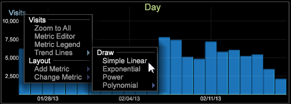

# Trendlinien{#trend-lines}

{{eol}}

Mit Trendlinien können Sie Diagramme überlagern, um Daten zu vergleichen und zu interpretieren.

Ist wie [Streudiagramm](https://experienceleague.adobe.com/docs/data-workbench/using/client/analysis-visualizations/c-scat-plots.html) Visualisierung können Sie nun Trendlinien für eine Diagrammvisualisierung festlegen, um die Änderungsrate basierend auf linearen, exponentiellen, Power- oder polynomalen Linien anzuzeigen. Mit der Funktion Trendlinie können Sie Trendlinien in einem Diagramm überlagern, am häufigsten über eine Zeitdimension.

In diesem Diagrammvergleich können wir beispielsweise sehen, dass Besuche einen Trend nach oben zeigen, Bestellungen aber einen Trend nach unten zeigen.

So fügen Sie eine Trendlinie hinzu

1. Öffnen Sie ein Diagramm und klicken Sie mit der rechten Maustaste auf den Metriknamen in der oberen linken Ecke.
1. Klicken **[!UICONTROL Trend Lines]** und wählen Sie aus den Optionen aus.

   

   Sie können die Trendlinie auswählen, die über dem Diagramm angezeigt werden soll als **Einfache Linear**, **Exponentiell**, **Leistung** oder **Polynomial**. Polynomial erzeugt eine polynomielle Regressions-Trendlinie. Einfache Linear erstellt eine Trendlinie als Änderungsrate entlang der Regressionslinie. Exponentiell berechnet eine Trendlinie als y = b&#42;exp( a&#42;x ) und Leistung als y = b&#42;x`a`.

   Der Trend wird berechnet und im Diagramm gerendert. Daraufhin wird ein Callout mit detaillierten Informationen zur Trendgleichung geöffnet.

   
