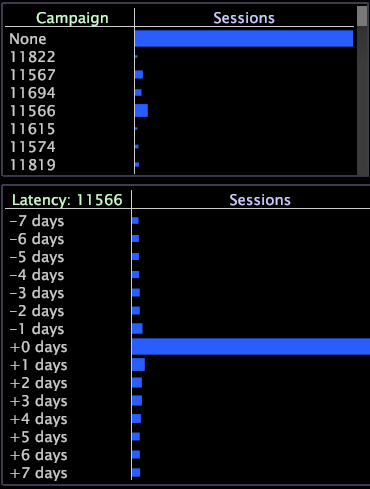

# Latenztabellen{#latency-tables}

{{eol}}

Latenztabellenvisualisierungen sind Tabellen, die eine Latenzdimension enthalten. Hierbei handelt es sich um einen Typ abgeleiteter Dimension, die die seit dem Eintreten eines bestimmten Ereignisses verstrichene Zeit misst.

Sie definieren das Ereignis, indem Sie Auswahlen in einer oder mehreren Visualisierungen treffen und diese Auswahlen mithilfe der Menüoption Ereignis-Kontext festlegen als Ereignis festlegen festlegen festlegen festlegen. Latenztabellen sind besonders nützlich für die Verfolgung von Aktivitäten im Zusammenhang mit einer Kampagne oder einer bestimmten Kundenbestellung, in der Sie nach einer Zeitkorrelation suchen.

In [!DNL Site]enthalten Latenztabellen Informationen zu den Besuchersitzungen, die bis zu sieben Tage vor oder nach dem Ereignis stattgefunden haben. Sie können jedoch Latenztabellen konfigurieren, um Informationen zu verschiedenen zählbaren und zeitbezogenen Dimensionen bereitzustellen. Siehe [Konfigurieren von Latenztabellen](../../../home/c-get-started/c-intf-anlys-ftrs/c-config-ltcy-tbls/c-config-ltcy-tbls.md#concept-7175c3defec64556994f0dfcccb7d15c).

Elemente der übergeordneten Dimension, z. B. eine Sitzung, die Teil des von Ihnen ausgewählten spezifischen Ereignisses sind, haben eine Latenz von null. Allen anderen Elementen werden Latenzen zugewiesen, die den Abstand (in der entsprechenden Zeitdimension) zum Ereignis widerspiegeln.

Das folgende Beispiel zeigt, wie Sie die Latenztabelle verwenden können.

**Wertereignisse im Zusammenhang mit einer Kampagne identifizieren**

Angenommen, Sie möchten die Aktivität von Kunden in den sieben Tagen vor und nach der Antwort auf eine bestimmte Werbekampagne verfolgen. Um die Latenz für eine bestimmte Werbekampagne anzuzeigen, legen Sie die Interessenskampagne als Ereignis für die Latenztabelle fest.

Die Latenz im folgenden Arbeitsbereich basiert auf der Auswahl von Campaign 11566 (die Sitzungen als Reaktion auf diese Kampagne).

Eine Latenz von &quot;+0 Tagen&quot;bezeichnet die Sitzungen als Antwort auf Campaign 11566 sowie alle anderen Sitzungen für dieselben Kunden, die am selben Tag stattgefunden haben.

Eine Latenz von &quot;-2 Tagen&quot;identifiziert die Sitzungen für dieselben Kunden, die zwei Tage vor der Reaktion der Kunden auf die Kampagne stattgefunden haben.

Eine Latenz von &quot;+7 Tagen&quot;identifiziert die Sitzungen für dieselben Kunden, die sieben Tage nach der Antwort auf die Kampagne stattgefunden haben.

Zusätzlich zu den in den folgenden Abschnitten aufgelisteten Verfahren können Sie alle Aufgaben ausführen, die Sie auch in einer Tabelle ausführen können, z. B. Elemente sortieren, Elemente maskieren, eine Serienlegende hinzufügen, Daten exportieren usw. Weitere Informationen finden Sie unter [Tabellen](../../../home/c-get-started/c-analysis-vis/c-tables/c-tables.md#concept-c632cb8ad9724f90ac5c294d52ae667f).

## Erstellen einer Latenztabelle {#section-31a03031d9854ef7acc2462d4f37678d}

Um eine Latenztabelle zu erstellen, müssen Sie zunächst eine Auswahl treffen und diese Auswahl dann als Ereignis festlegen, für das Sie die Latenz verfolgen möchten.

1. Klicken Sie mit der rechten Maustaste in einen Arbeitsbereich und öffnen Sie die gewünschten Visualisierungen, die auf der zählbaren Dimension basieren müssen, die zum Konfigurieren Ihrer Latenztabelle verwendet wird.

   Beispiel: in [!DNL Site] die Visualisierungen müssen sitzungsbasiert sein.

1. Öffnen Sie eine leere Latenztabelle.
1. Treffen Sie eine Auswahl in Ihrem Arbeitsbereich.
1. Klicken Sie mit der rechten Maustaste in die Latenztabelle und klicken Sie auf **[!UICONTROL Set Event]**.

>[!NOTE]
>
>Die von Ihnen ausgewählten Ereignisse bleiben nur bestehen, wenn Sie die Auswahlen als Latenzdimension speichern. Anweisungen finden Sie unter [Wiederverwenden einer Latenzzeit-Dimension](../../../home/c-get-started/c-analysis-vis/c-lat-tbls.md#section-29c6483bf9ba476fb1c24ad1df253f46).

## Latenztabelle wiederverwenden {#section-05f741169d204213b6537dce553e4f73}

Wenn Sie dieselbe Latenztabelle erneut verwenden möchten, können Sie die Latenztabelle lokal speichern oder wenn Sie über die entsprechenden Berechtigungen verfügen, können Sie sie auf dem Server speichern, damit alle Benutzer eines bestimmten Profils darauf zugreifen können.

**So speichern Sie die Latenztabelle für die Verwendung in anderen Arbeitsbereichen**

1. Klicken Sie mit der rechten Maustaste auf den oberen Rand der Visualisierung und klicken Sie auf **[!UICONTROL Save]**. Die [!DNL Save] angezeigt. Der standardmäßige Speicherort ist der Ordner &quot;Benutzer\*Profilname*\Arbeit&quot;.
1. Im [!DNL File name] ein Feld, geben Sie einen beschreibenden Namen für die Visualisierung ein und klicken Sie auf **[!UICONTROL Save]**.

**So rufen Sie die gespeicherte Latenztabelle ab**

1. Klicken Sie mit der rechten Maustaste in den Arbeitsbereich und klicken Sie auf **[!UICONTROL Open]** > **[!UICONTROL File]**. Die [!DNL Open Visualization] angezeigt.
1. Navigieren Sie zur gespeicherten Latenztabelle.
1. Wählen Sie die Visualisierungsdatei für die Latenztabelle aus ( [!DNL *.vw]) und klicken Sie auf **[!UICONTROL Open]**.

## Latenzdimension wiederverwenden {#section-29c6483bf9ba476fb1c24ad1df253f46}

Wenn Sie dieselbe Latenzdimension erneut verwenden möchten, können Sie die Latenzdimension lokal speichern oder wenn Sie über die entsprechenden Berechtigungen verfügen, können Sie sie auf dem Server speichern, damit alle Benutzer eines bestimmten Profils darauf zugreifen können.

Alle von Ihnen erstellten Latenzdimensionen werden im Verzeichnis Dimensionen des Profils gespeichert und sind im [!DNL Change Dimension] Dropdown-Liste in Data Workbench.

**So speichern Sie die Latenzdimension für die Verwendung in anderen Arbeitsbereichen**

1. Klicken Sie mit der rechten Maustaste auf die [!DNL Latency] Spaltenbezeichnung oder eines ihrer Elemente und klicken Sie auf **[!UICONTROL Save Dimension]**. Die [!DNL Save Dimension As] angezeigt.
1. Wählen oder erstellen Sie das entsprechende Unterverzeichnis im Verzeichnis Dimensionen .
1. Im [!DNL File name] -Feld einen beschreibenden Namen für die Dimension eingeben (z. B. [!DNL Latency for Campaign 11565.dim]) und klicken Sie auf **[!UICONTROL Save]**.

**So rufen Sie die gespeicherte Latenzdimension ab**

1. Klicken Sie mit der rechten Maustaste in den Arbeitsbereich und klicken Sie auf **[!UICONTROL Open]** > **[!UICONTROL File]**. Die [!DNL Open Visualization] angezeigt.
1. Navigieren Sie zur Latenzvisualisierung, die Sie im Ordner Benutzer\*Profilname*\Dimensionen gespeichert haben.
1. Wählen Sie die Latenzdimensionsdatei ( [!DNL *.dim]) und klicken Sie auf **[!UICONTROL Open]**.

## Exportieren in Microsoft Excel {#section-3dffa5c3aab14cdaa40c78b81b08fe53}

Informationen zum Exportieren von Fenstern finden Sie unter [Exportieren von Fensterdaten](../../../home/c-get-started/c-wk-win-wksp/c-exp-win-data.md#concept-8df61d64ed434cc5a499023c44197349).

## Exportieren in eine TSV-Datei {#section-fd921f351c994ed0a94f63d3bd5b5a87}

Informationen zum Exportieren von Fenstern finden Sie unter [Exportieren von Fensterdaten](../../../home/c-get-started/c-wk-win-wksp/c-exp-win-data.md#concept-8df61d64ed434cc5a499023c44197349).
